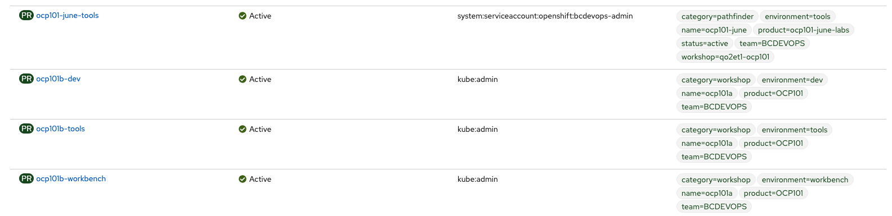
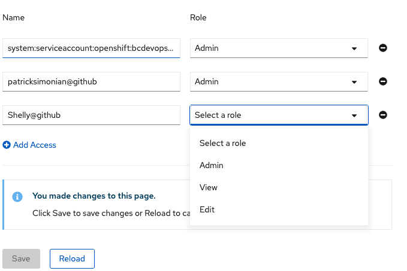

# Adding Team Members

>Depending on the Lab Format, this section may have already been done. If you are not the 'devops' admins for the openshift 101 dev/tools projects you can check to see if you have access to the projects with `oc projects`. If you have access to the openshift 101 project you will see something like this. 
>```shell
>* ocp101-june-dev - OpenShift 101 (dev)
> ocp101-june-tools - OpenShift 101 (tools)
>```


## Team Permissions

Once all projects have been created by the Platform Services team, the team admin
must navigate to each project and assign your users the appropriate permissions. 

As a team, find each project and add the rest of the team members. Feel free to experiment with
the default roles.  



- Once in the project, switch to `Developer view` and then navigate to `Project -> Project Access`

- Select `Add Access` at the bottom


- Add each user based on their GitHub id. Please note that we are using SSO with GitHub login at the moment, don't forget the suffix `@github`!



- Select `Save`


This can also be done on the CLI with the `oc` utility: 

```
oc policy add-role-to-user [role] [username]
```

## Roles

- Admin: This is the most privileged of the default roles. This role allows everything that __Edit__ allow plus the management of __user and service account access__

- Edit: This is the primary role required for developers/devops to do work in a project. It allows the creation/edit/deletion of Openshift Objects including __Secrets__

- View: This is the basic role that provides users with read access to your project. __Secrets are not viewable__ with this privilege.