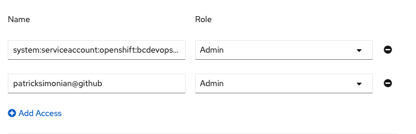

# Adding team members 

## Namespace access (live training)

In the live training, we ask for volunteer admins to help grant access to the training namespaces for all other members of the lab. If you are not one of the 'devops' admins for the openshift 101 dev/tools projects you can check to see if you have access to the projects with the `oc projects` command in your terminal. If you have access to the openshift 101 project you will see something like this:
>```shell
>* d8f105-dev - OpenShift 101 (dev)
> d8f105-tools - OpenShift 101 (tools)
>```

## Namespace access (self-paced training)
If you're doing the self-paced training, you can instead request a temporary project set in the [Product Registry](https://registry.developer.gov.bc.ca/private-cloud/products/all). 

Make sure you're in the 'Private Cloud OpenShift' tab, then click 'Request a new product'. 

Check the box to choose a 'temporary product set'. Please note, your project will be deleted after 30 days, so don't create this until right before you plan to start working on the lab. 

You can skip the remaining steps in this section if you're doing the self paced lab, but take note of the instructions below for adding team members. You may need to do this in the future as people join your team and need access. The registry will automatically provision your access to the 'temporary product set' to your IDIR email, so please use the IDIR login method when accessing OpenShift.  


## Team Permissions (live training)

When the lab begins, our volunteer admins will navigate to each project and assign everyone else the appropriate permissions. 

<kbd></kbd>

- Once in the project, switch to `Developer view` and then navigate to `Project -> Project Access`

- Select `Add Access` at the bottom

<kbd></kbd>

- Add each user based on their GitHub id, granting 'edit' access. Please note that we are using SSO with GitHub login at the moment, don't forget the suffix `@github`!

<kbd></kbd>

- Select `Save`


This can also be done on the CLI with the `oc` utility: 

```
oc policy add-role-to-user [role] [username]
```

## Roles

- Admin: This is the most privileged of the default roles. This role allows everything that __Edit__ allow plus the management of __user and service account access__

- Edit: This is the primary role required for developers/devops to do work in a project. It allows the creation/edit/deletion of Openshift Objects including __Secrets__

- View: This is the basic role that provides users with read access to your project. __Secrets are not viewable__ with this privilege.

Next page - [OCP4 Web Console](./01b_web_console_overview.md)