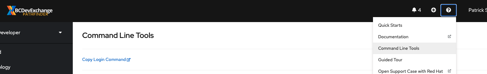
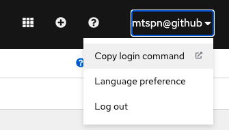

# Lab Setup
Prior to working on labs, the Platform Services team will have created 2
projects:
- ocp101-tools: This namespace/project will have all of the builds related objects
- ocp101-dev: This namespace/project will have all the deployment related objects

One member from your group has been given administrative rights to the projects
and is responsible for adding all other members to each project.

NOTE: the actual name of the namespaces may vary, and `ocp101` may be a sequence of random characters.

---
Assign yourself a unique name to be used during your application deployments.
**Do not copy the application names directly from the lab guides** as you are in a
shared environment with the rest of your team.

For example, if the lab says to create an application named `app1-[username]`, I
would create an app named `app1-stewartshea`.

## Lab Requirements
These labs will require access to the lab ocp environment:
- [Silver Web Console](https://console.apps.silver.devops.gov.bc.ca/)


## Installing OC

You may already have `oc` installed on your machine. Your `oc` version should match the version of the cluster. 

__If you have `oc`__ installed run `oc version`. It should look something like this
```shell
Client Version: openshift-clients-4.6.0-202006250705.p0-176-g5797eaeca
```

__If you do not have `oc` installed__ or your version is incorrect follow these instructions.

1. Option 1:
If you have access to the Openshift cluster you can simply download directly from the console


2. Option 2:
Alternativly, navigate to the [Openshift CLI Mirror](https://mirror.openshift.com/pub/openshift-v4/clients/ocp/) and download the version of `oc` that matches your operating system. 

> For Linux/Mac users that may be working with multiple versions of `oc`, it is helpful to have both versions of `oc` (3.xx/4.xx) on your machine. You can create an `alias` to `oc 3.xx` instead of adding it to your path. This way you can utilize the different versions for different OpenShift environment.

2. Unpack `oc` into a place that is easily reference-able from a command line interface or add it to your `PATH`

## Login with OC command line

1. Use a web browser to open the web console: - [Silver Web Console](https://console.apps.silver.devops.gov.bc.ca/)

2. Click your username in the top right corner of the screen and choose 'copy login command' 



3. Log in again as prompted, then click 'display token'. 

4. Copy the 'oc login' command including the token and servo information. Paste this command into your command-line interface (CLI) and run it to log in.


## Other Requirements

In addition, developers require GIT locally installed and must have a 2FA device to support access to GitHub.


## Command Line Interfaces

You will find many examples `commands` and _tricks_ that highly depend on your OS. These commands were developed on __unix__ based systems. Window's __Command Prompt__ will not work with these examples. You will need to either use __WSL__, __Powershell__, __Gitbash__, or similar.
