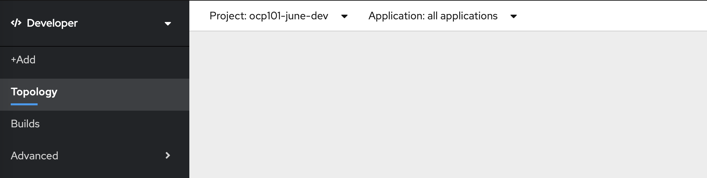
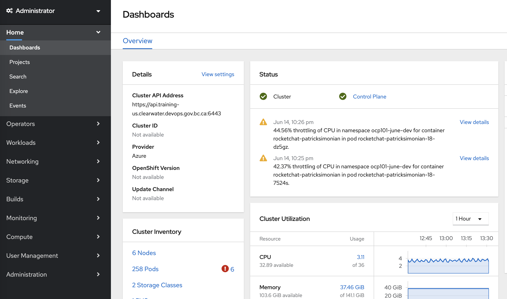

# OCP 4 Web Console

If you have previous experience with Openshift (version 3.11) the web console is going to look very different
to what you are used to. 

## Highlights

The web console separates functions that are runnable in openshift by two personas:
- Developer
- Administrator

### Developer View

Developer View is a simplified view of the web console that is more closely related to the work that
that developers perform. 

### Administrator View

This view is more detailed and provides access to more of the Openshift Infrastructure Objects that are
required to deploy a project

During this workshop you will be interacting with both views.