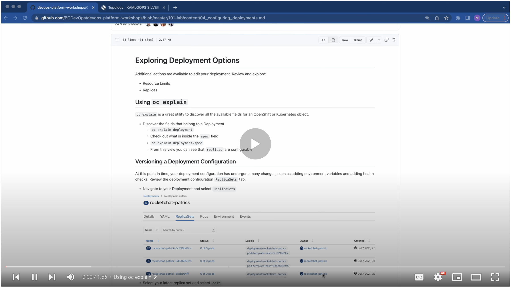
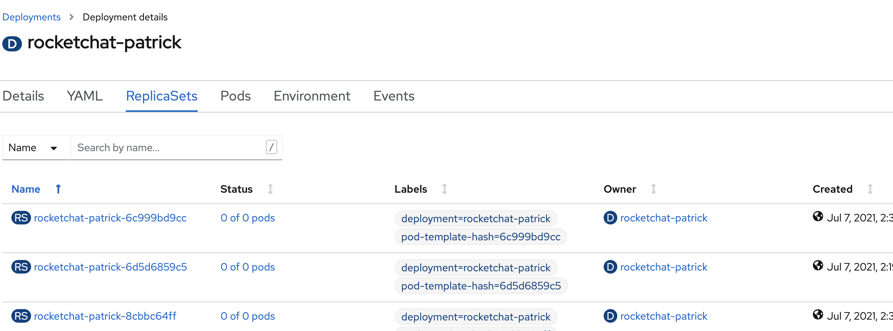
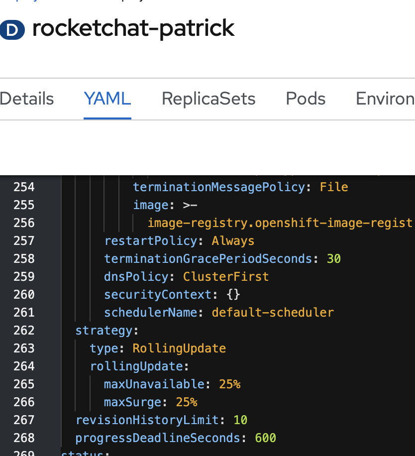
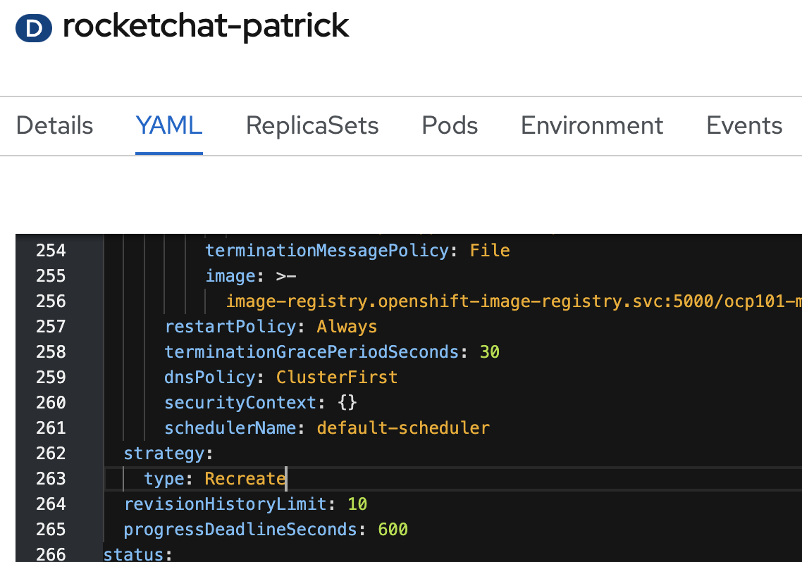

# Exploring Deployment Options
Additional actions are available to edit your deployment. Review and explore:
  - Resource Limits
  - Replicas

<kbd></kbd>

[Video walkthrough](https://youtu.be/ITNGojE7uJM)

## Using `oc explain`

`oc explain` is a great utility to discover all the available fields for an OpenShift or Kubernetes object. 

- Discover the fields that belong to a Deployment
  - `oc explain deployment`
  - Check out what is inside the `spec` field
  - `oc explain deployment.spec`
  - From this view you can see that `replicas` are configurable 

## Versioning a Deployment Configuration
At this point in time, your deployment has undergone many changes, such as adding environment variables and adding health checks. 
Review your rocketchat deployment's `ReplicaSets` tab: 
  - Navigate to your Deployment and select `ReplicaSets`
  <kbd></kbd>
  - Select your latest replica set and select `edit`
  - Compare the differences between that replica set and an older one - this can be done through the UI or by comparing the YAML

## Changing the Deployment Strategy Option
The default deployment configuration provides a `RollingUpdate` deployment strategy, which waits for the container to be ready prior to cutting over traffic and terminating the previous container. Explore what happens when you change your deployment strategy.
  - Navigate back to your rocketchat-[username] deployment.
  - Edit your deployment strategy using one of the methods below:
    - From the Actions menu, select "Edit update strategy". Change the strategy to a `Recreate`. Or,
    - Edit the YAML for the deployment and change the `.spec.strategy.type` from `RollingUpdate` to `Recreate`. Make sure to remove the `.spec.strategy.rollingUpdate` node as in the screenshots below.
    <kbd></kbd>
    <kbd></kbd>
  - Now make a small change to the deployment to trigger a new deploy (for testing):
    - `oc -n [-dev] set env deployment/rocketchat-[username] TEST=BAR`
  - Go back to Topology and observe the behaviour. You should notice that the old pod is killed before a new one is created.
  - Change your deployment strategy back to `RollingUpdate` by using the Actions menu or by editing the YAML directly.

Next page - [Resource Management](./05_resource_management.md)
