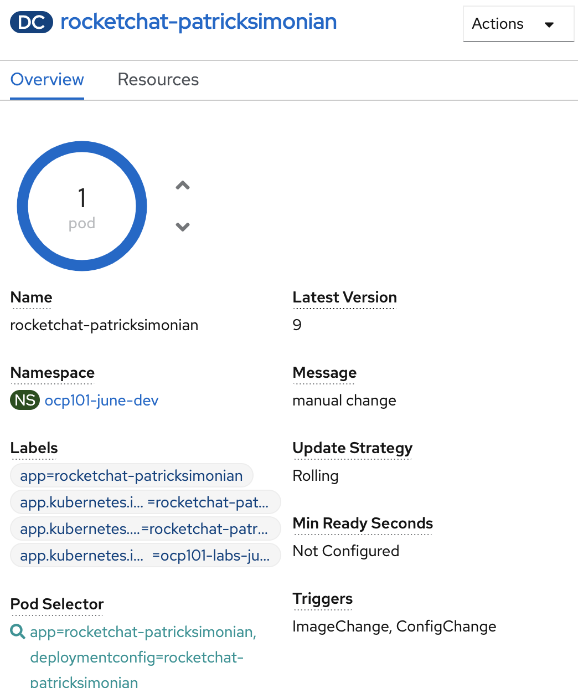
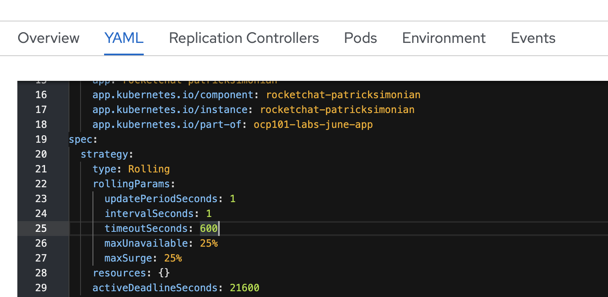

# Exploring Deployment Configuration Options
Additional actions are available to edit your deployment configuration. Review and explore; 
  - Resource Limits
  - Replicas

## Using `oc explain`

`oc explain` is a great utility to discover all the available fields for an
Openshift of K8s object. 

- Discover the fields that belong to a DeploymentConfig
  - `oc explain dc`
  - check out what is inside the `spec` field
  - `oc explain dc.spec`
  - From this view you can see that `replicas` are configurable 

## Versioning a Deployment Configuration
At this point in time, your deployment configuration has undergone many changes, such as adding environment variables and adding health checks. 
Review the deployment configuration `ReplicationControllers` tab: 
  - Navigate to your DeploymentConfig and select `ReplicationControllers`
  
  - Select your latest replication controller and select `edit`
  - Compare the differences between that replication controller and an older one - this can be done through the UI or by comparing the YAML

## Changing Deployment Configuration Triggers
Review your DeploymentConfig and take note of the `Trigger` section




  - Navigate to the `YAML` tab of the deployment and review the currently configured Triggers within `.spec.triggers`


Explore how an Image can also trigger a deployment
  - Navigate to your original build and investigate the available triggers


  - Edit the buildconfig to change the output image to the `dev` tag
```oc:cli
oc -n [-tools] patch bc/rocketchat-[username] -p '{"spec":{"output":{"to":{"name":"rocketchat-[username]:dev"}}}}'
```
  - Trigger a new build with `oc -n [-tools] start-build rocketchat-[username]`. Monitor your RocketChat deployment in the `[-dev]` namespace immediately after the build completes


## Changing the Deployment Strategy Option
The default deployment configuration provides a `Rolling Update` style deployment, which waits for the container to be ready prior to 
cutting over traffic and terminating the previous container. 



  - Change the strategy to a `Recreate` and redeploy a couple of times
```oc:cli
oc -n [-dev] patch dc/rocketchat-[username] -p '{"spec":{"strategy":{"activeDeadlineSeconds":21600,"recreateParams":{"timeoutSeconds":600},"resources":{},"type":"Recreate"}}}'
```
  - Refresh the browser URL right after a new deployment and observe the behavior
  - Change the strategy back to `Rolling`
```oc:cli
oc -n [-dev] patch dc/rocketchat-[username] -p '{"spec":{"strategy":{"activeDeadlineSeconds":21600,"resources":{},"rollingParams":{"intervalSeconds":1,"maxSurge":"25%","maxUnavailable":"25%","timeoutSeconds":600,"updatePeriodSeconds":1},"type":"Rolling"}}}'
```
