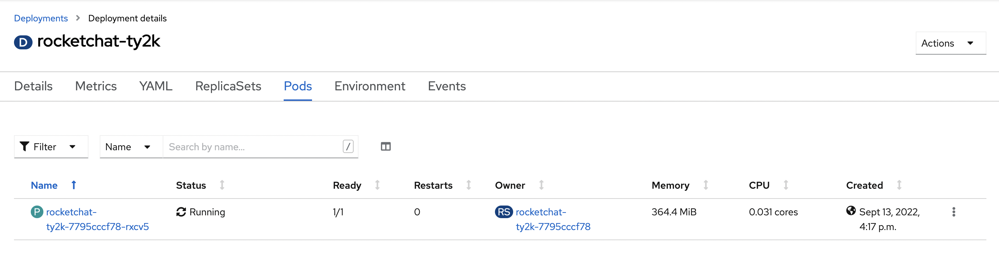
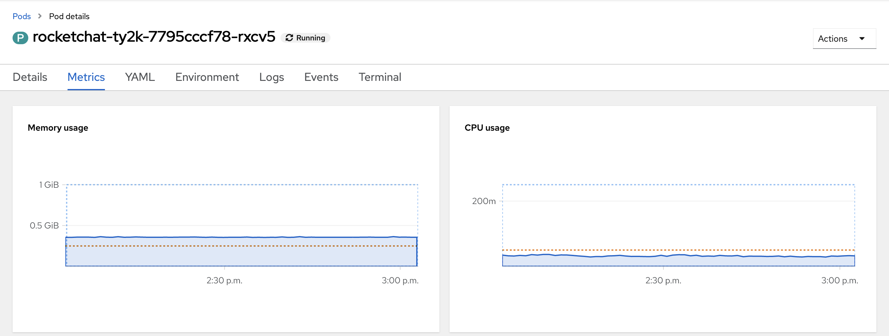

# Resource Requests and Limits
Tuning the resources assigned to a pod will have a direct effect on the performance of the application. 

Many templates include reasonable CPU and Memory resource configurations, however, new apps simply are deployed with the platform default. 

> Platform Resource Request defaults are maintained by platform services. It is a measurement based on the average cpu/memory utilization and serves as a great starting point for your pods horsepower

## Explore Default Resource Configurations
Since the Rocket Chat application was built from scratch and not deployed from a template, explore the current resources allocated to the pods: 

- Navigate to your rocketchat deployment and select `Yaml`
- Take a look a the resources spec under `.spec.template.spec.containers.resources`. These values should reflect the resource requests (cpu=500m,memory=512Mi) and limits (cpu=1000m,memory=1024Mi) we set earlier.  If we had not set any values for requests or limits earlier, we would see `{}` in the resources spec to indicate the deployment was using the default resource allocation for the platform. 

- To view the limitranges that are in place, run the command: 
`oc get LimitRange`

- You should see there is a limitrange in place called 'default-limits'. This set of request and limit values are applied when resource specifications are not defined.  To view the details of this limitrange, run: 
`oc -n [-dev] describe LimitRange default-limits`

- Review the current metrics of your `rocketchat-[username]` pod. Navigate to your Deployment and then select the Pods tab to see a list of pods in your Deployment. Navigate to your pod by clicking its name and then select the Metrics tab to see your current pod metrics.




- Reduce the CPU (request and limit) to `65 millicores` and Memory (request and limits) to `100 Megabytes` and monitor the startup time of the pod
  ```oc:cli
  oc -n [-dev] set resources deployment/rocketchat-[username] --requests=cpu="65m",memory="100Mi" --limits=cpu="65m",memory="100Mi"
  ```
- Monitor the startup events of your pod and measure the time it takes to start
  ```oc:cli
  # Restart deployment; and observe
  oc -n [-dev] rollout restart deployment/rocketchat-[username]

  # Wait for deployment to finish
  time oc -n [-dev] rollout restart deployment/rocketchat-[username]
  ```

  > you may notice your pod starts to crash loop. This is most likely because the `liveness` probe you added from an earlier lab is timing out. This is an important consideration when deciding to tune pod resources. It is always a balance.

- Remove the limits previously imposed, and set your pod to `1 core` (or `1000 millicores`) for the request and limit
  ```oc:cli
  oc -n [-dev] set resources deployment/rocketchat-[username] --requests=cpu="1000m",memory="512Mi" --limits=cpu="1000m",memory="1024Mi"
  ```

- Monitor the status and speed of the new deployment
  ```oc:cli
  # Start new deployment; and
  oc -n [-dev] rollout restart deployment/rocketchat-[username]

  # Wait for deployment to finish
  time oc -n [-dev] rollout restart deployment/rocketchat-[username]
  ```

## Sharing Resources

If there are many team members (and therefor workloads) working together in the same namespace there is a chance that requesting 1 core of cpu and 1 core of memory will not work. Why could that be?

- Reset resources utilization to something more appropriate

```oc:cli
oc -n [-dev] set resources deployment/rocketchat-[username] --requests=cpu="150m",memory="256Mi" --limits=cpu="200m",memory="400Mi"
```

## Troubleshooting OOM

The dreaded `OOM` or Out of Memory is when your pods are utilizing less memory than is required for the containers inside of the pod to work. Often there are __no logs__ visible during these issues. Often the symptoms of OOM are `CrashLoop Back off` failure events as well as `rollout` failures. These can be investigated in the `Events` panel. To resolve this you can first increase memory utilization. After that you should investigate if the memory utilization fix is a band-aid or not. In other words, is the application consuming more memory than it should.

Next page - [Application Availability](./06_application_availability.md) 
