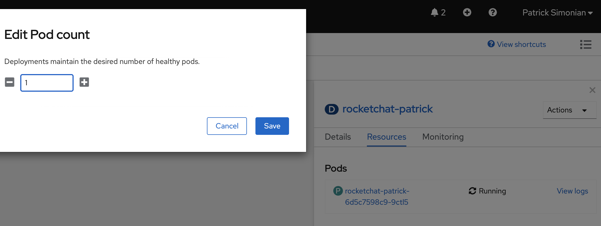

# Application Availability
Prior to beginning this lab, navigate to the public route you created and finish the initial setup of your application. 
Ensure to select `Keep standlone` on the last page of the initial Rocket.Chat application setup. 

### Single Pod Applications
Single pod applications are not highly-available and can be abruptly terminated if the pod crashes or due to regularly 
scheduled platform maintenance. In order to simulate the effect on an application: 

- Navigate to the pod, select `Actions` and `Delete`
    - Select `Delete pod immediately`


- Refresh URL of application


### Scaling Pods
To increase the availability of an application and defend against unplanned outages or planned maintenance tasks, an 
application must have multiple pods/instance running. For this reason, stateless applications are desirable as they 
do not require custom clustering configurations. 

**Note** Stateful applications do not support "scaling pods" as a form of high availability. Such a stateful example 
would be the mongodb database. For this reason, this lab focuses on the rocketchat application which will function 
with multiple pods. Please refer to specific application documentaion for details on scalability support. 

- Navigate to `Topology` and scale your Deployment by selecting it and pressing `Actions > Edit Count` and increasing the count to 2




- Or from the CLI

```oc:cli
oc -n [-dev] scale deployment/rocketchat-[username] --replicas=2
```
- Notice the balancing across nodes by exploring the details of each pod


- Or from the CLI notice the hosts the pod runs on (in the last field)

```oc:cli
oc -n [-dev] get pods --field-selector=status.phase=Running -l deployment=rocketchat-[username] -o wide
```
you can also simply combine with grep:
```
oc -n [-dev] get pods -o wide | grep rocketchat-[username]
```
- The output should look similar to this:
```
  rocketchat-[username]-7-k6kcc    1/1       Running   0          16m       10.97.40.235    mcs-silver-app-11.dmz
  rocketchat-[username]-7-k82w2    0/1       Running   0          1m        10.97.40.235    mcs-silver-app-12.dmz
```

### Delete single pod, refresh the URL of application and notice that the application is served by the surviving pods:
```oc:cli
  oc -n [-dev] get pods --field-selector=status.phase=Running -l deployment=rocketchat-[username] -o name | head -1 | xargs -I {} oc -n [-dev] delete {}
```
- **Mac OS X**
    You can use [homebrew](https://brew.sh/) to install the watch command on OSX. 

    To install homebrew run this command in your terminal: 
    ```oc:cli
    /bin/bash -c "$(curl -fsSL https://raw.githubusercontent.com/Homebrew/install/HEAD/install.sh)"
    ```
  Once homebrew is installed, install the watch command needed for the next step by running:
  ```oc:cli
  brew install watch
  ```
  ```oc:cli
  watch -dg -n 1 curl -fsSL https://rocketchat-[username]-[-dev].apps.silver.devops.gov.bc.ca/api/info
  ```
- **Windows**
    Windows users can skip the 'watch' steps and monitor their pods from the OpenShift console. 

### Notice that eventually your RocketChat will be back to having 2 pods
```oc:cli
  oc -n [-dev] get pods --field-selector=status.phase=Running -l deployment=rocketchat-[username]
```

- **Mac OS X**  
  ```oc:cli  
  # Monitor pods being created and deleted; and
  watch -dg -n 1 -x oc -n [-dev] get pods -l deployment=rocketchat-[username]

  # From another terminal, monitor RocketChat response
  watch -dg -n 1 curl -fsSL https://rocketchat-[username]-[-dev].[namespace].apps.silver.devops.gov.bc.ca/api/info
  ```
- **Windows**
    Windows users can skip the 'watch' steps and monitor their pods from the OpenShift console.

Next page - [Autoscaling](./07_autoscaling.md)