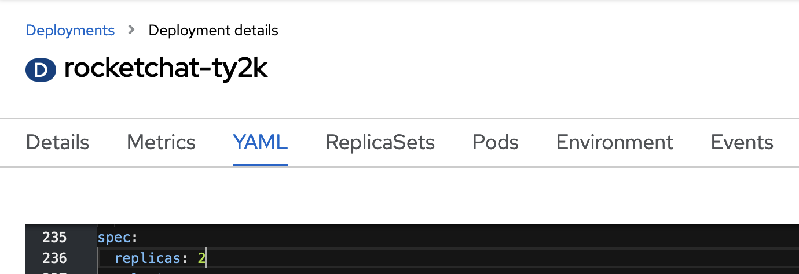
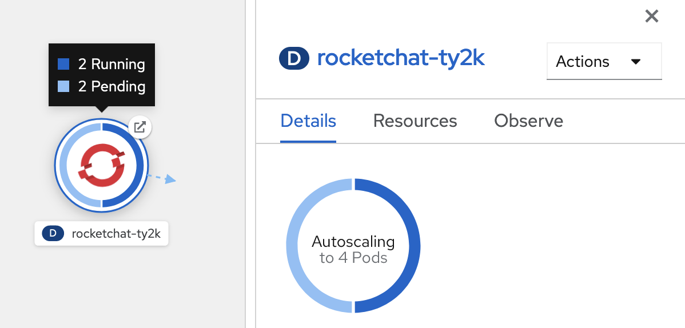

# Autoscaling
Autoscaling can be configured on pods to enable OpenShift to add or remove pods as load varies. In general, the Horizontal Pod Autoscaler sets: 
    
- Upper limit of pods
- Lower limit of pods
- Metric threshold to use for scaling tasks

Currently CPU and memory metrics are supported, with additional arbitrary metrics support intended for the future. 

## Autoscaling Pods
This lab will provide a simple demonstration of autoscaling based on CPU, as this is configurable in the Web Console. 

- First take some time to discover the configurable fields that belong to a HorizontalPodAutoscaler: `oc explain HorizontalPodAutoscaler` 
- Create an autoscaler to automatically set the number of pods your app uses:
> You are configuring a very low CPU request target (10%) so that you can test the autoscaling easily by browsing the web application. A real production CPU target would be closer to 70-80%.
```oc:cli
oc -n [-dev] autoscale deployment/rocketchat-[username] --min 1 --max 10 --cpu-percent=10
```

- Browse to the application to generate some load and monitor the behavior of the pods
- Generate some activity such as creating messages, channels, etc. 
- Use the command below to benchmark your app using 10,000 requests generated by [`ab` (ApacheBench)](https://httpd.apache.org/docs/current/programs/ab.html)
  ```oc:cli
  # update the URL below and grab a new integration URL
  # Open RocketChat, go to Adminstration > Integrations >  New Integration > Incoming WebHook
  #    Set "Enabled" to "true"
  #    Set "Post to Channel"  to "#general"
  #    Set "Post as"  as "rocket.cat"
  #    Click on "Save Changes" at the bottom
  #    Copy "Webhook URL" (see "COPY TO CLIPBOARD" button/link)
  #    Replace "https://rocketchat-[username]-[-dev].pathfinder.gov.bc.ca/hooks/<integration>/<token>" with the real roken.
  #    Make sure the domain matches the exposed route (no "localhost:3000")!!!
  printf '{"text":"Example message","attachments":[{"title":"Rocket.Chat","title_link":"https://rocket.chat","text":"Rocket.Chat, the best open source chat","image_url":"https://rocket.chat/images/mockup.png","color":"#764FA5"}]}' > /tmp/rocketchat-post-msg.json && ab -p /tmp/rocketchat-post-msg.json -n 10000 -c 10 -T "application/json" [http://rocketchat-patricksimonian-ocp101-june-dev.apps.training-us.clearwater.devops.gov.bc.ca]/hooks/<integration>/<token>
  ```

- Review the deployment and try to add or remove replicas by editing its `.spec.replicas` YAML value

  

- Observe how the autoscaler reacts to your new replica count and changes it

  

- Remove the autoscaler
  ```oc:cli
  oc -n [-dev] delete hpa/rocketchat-[username]
  ```

Next page - [Persistent Storage](./08_persistent_storage.md)
