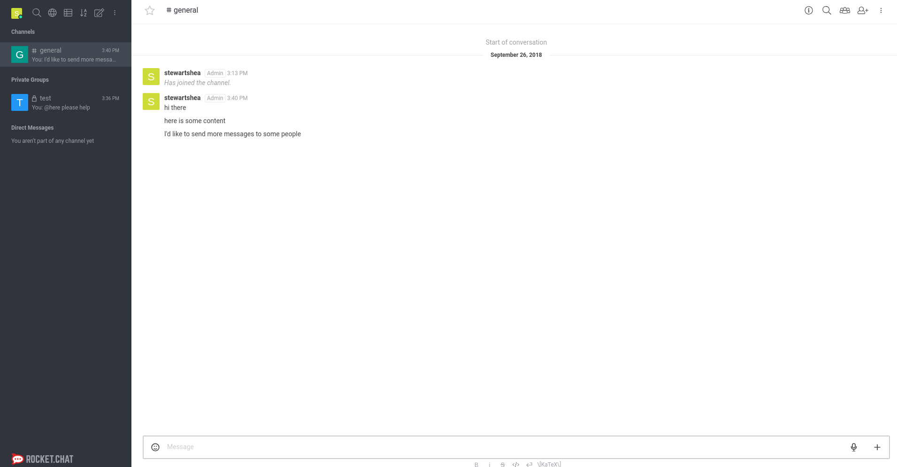
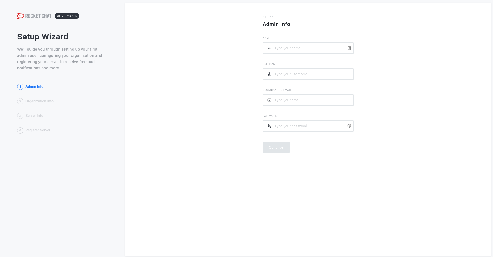
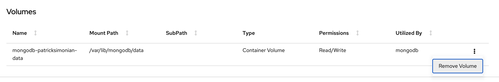
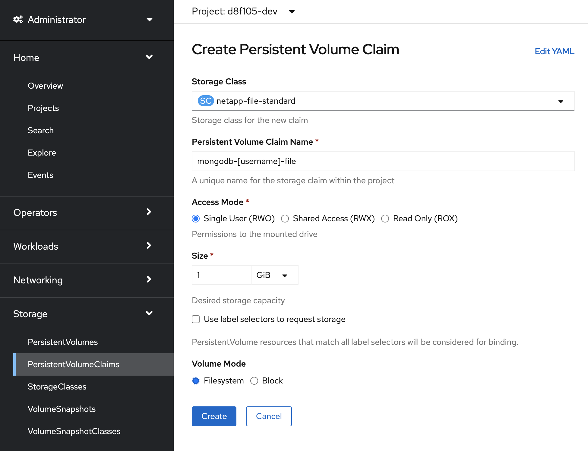
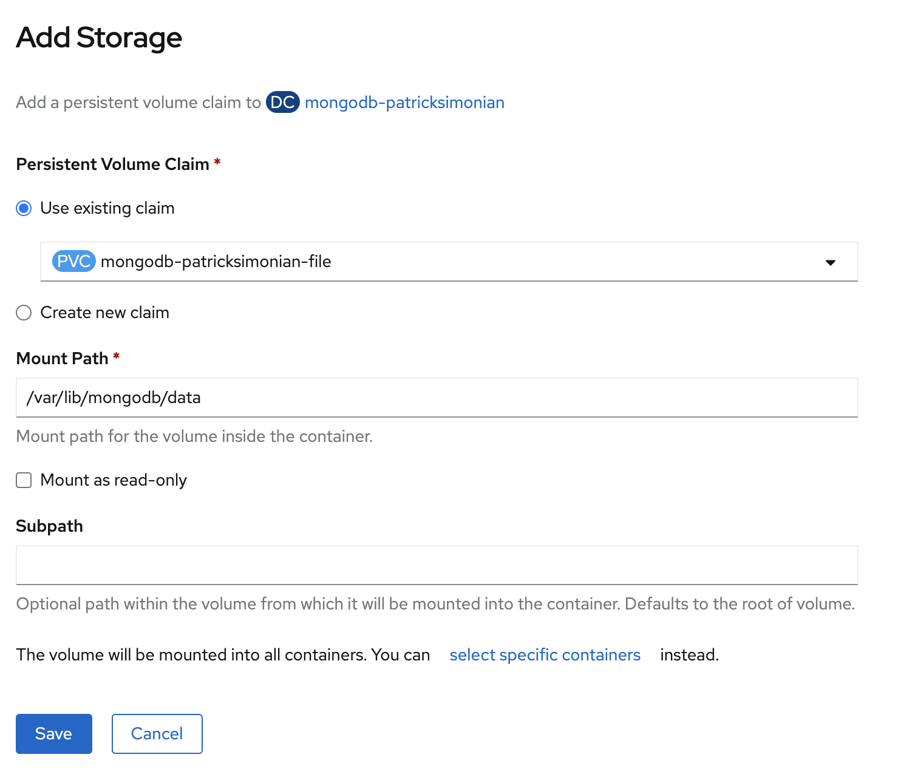
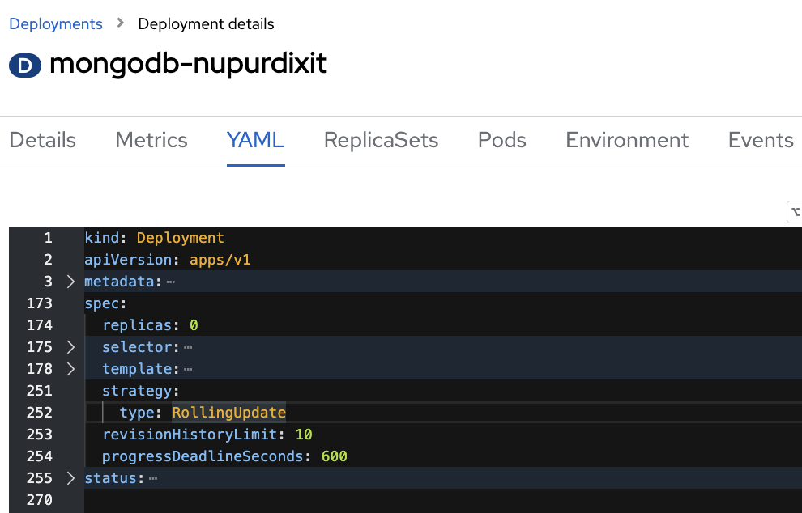
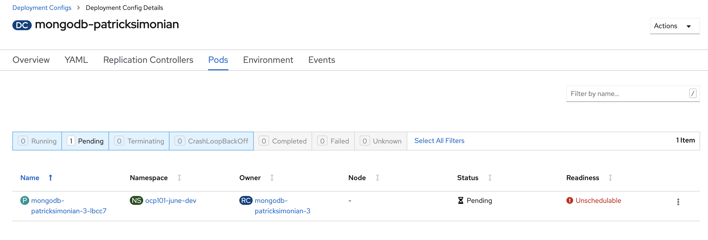
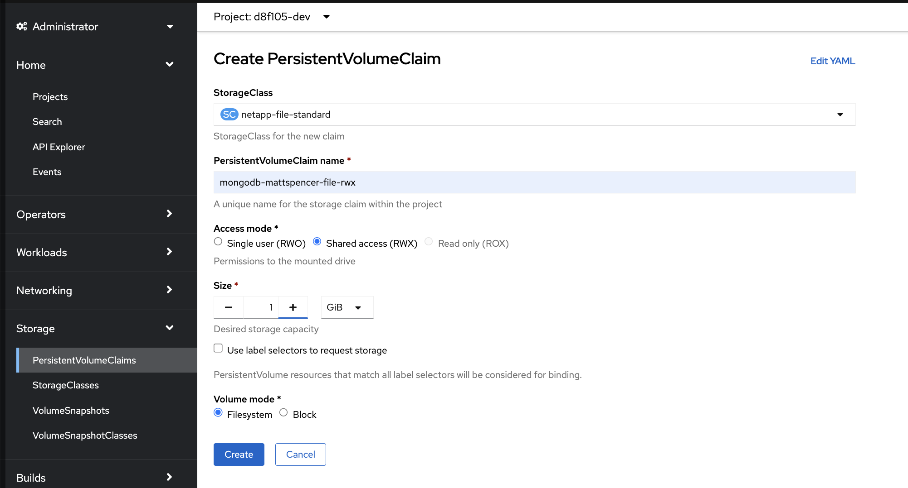
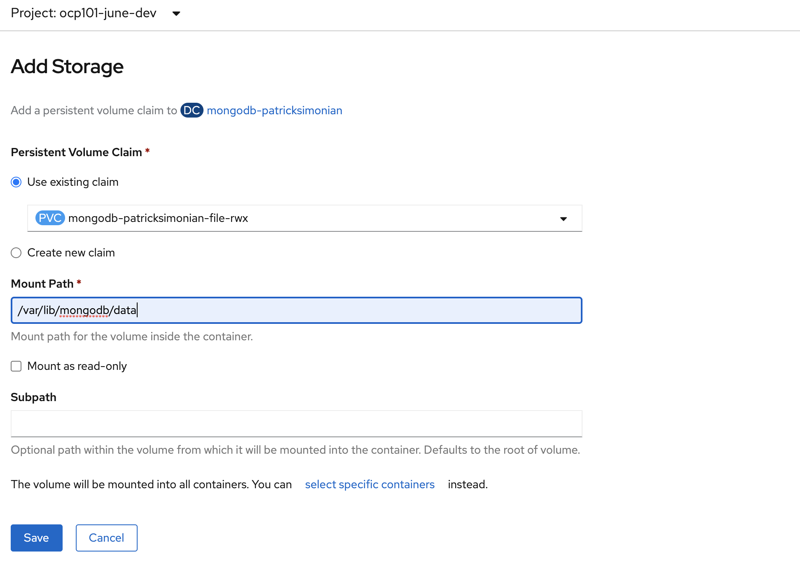

# Persistent Storage
Up to this point you have leveraged a single mongodb pod with ephemeral storage. In order to maintain the 
application data, persistent storage is required.  

- Let's first take a look at our application prior to this lab


### Deleting Pods with Ephemeral Storage
__Objective__: Observe that by using ephemeral storage causes RocketChat to lose any previous data or configuration after a redeployment.

To understand what will happen when a pod with ephemeral storage is removed,
- Scale down both the rocketchat and mongo applications to 0 pods
  ```oc:cli
  oc -n [-dev] scale deployment/rocketchat-[username] dc/mongodb-[username] --replicas=0
  ```
- Scale back up each application pod to 1 replica
  ```oc:cli
  oc -n [-dev] scale deployment/rocketchat-[username] dc/mongodb-[username] --replicas=1
  ```


### Adding Storage to Existing Deployment Configurations
__Objective__: Add persistent storage to MongoDB so that it won't lose data created by RocketChat.

Now that we notice all messages and configuration is gone whenever pods cycle, let's add persistent storage to the mongodb pod. 
- Scale down both the rocketchat and mongo applications to 0 pods
  ```oc:cli
  oc -n [-dev] scale deployment/rocketchat-[username] dc/mongodb-[username] --replicas=0
  ```
- Remove the emptyDir Storage by navigating to the mongodb deploymentconfig


- Add a new volume by navigating to `Administrator -> Storage -> Persitant Volume Claims -> Create Persistant Volume Claims` and name it `mongodb-[username]-file`



  - Select the `netapp-file-standard` storage class. Set the type to RWO, the size to 1GB, select `Filesystem` mode, and name it `mongodb-[username]-file`

  - Navigate back to your Mongo DeploymentConfig and select `Add Storage` from the `Actions` Tab

  - The mount path is `/var/lib/mongodb/data`



- Scale up `mongodb-[username]` instance to 1 pod
  ```oc:cli
  oc -n [-dev] scale dc/mongodb-[username] --replicas=1
  ```
- When mongo is running, scale `rocketchat-[username]` to 1 pod
  ```oc:cli
  oc -n [-dev] scale deployment/rocketchat-[username] --replicas=1
  ```
- Access the RocketChat URL and complete the Setup Wizard again
- Scale down and scale back up both the database and the rocketchat app
  ```oc:cli
  oc -n [-dev] scale deployment/rocketchat-[username] dc/mongodb-[username] --replicas=0
  # Scale up MongoDB to 1 replica; and
  oc -n [-dev] scale dc/mongodb-[username] --replicas=1
  # Scale up RocketChat to 1 replica
  oc -n [-dev] scale deployment/rocketchat-[username] --replicas=1
  ```
- Verify that data was persisted by accessing RocketChat URL and observing that it doesn't show the Setup Wizard.

#### RWO Storage

RWO Storage is analagous to attaching a physical disk to a pod. For this reason, RWO storage __cannot be mounted to more than 1 pod at the same time__.

__Objective__: Cause deployment error by using the wrong deployment strategy for the storage class.

RWO storage (which was selected above) can only be attached to a single pod at a time, which causes issues in certain deployment strategies. 

- Ensure your `mongodb-[username]` deployment strategy is set to `Rolling and then trigger a redeployment.



- Notice and investigate the issue

> rolling deployments will start up a new version of your application pod before killing the previous one. There is a brief moment where two pods for the mongo application exist at the same time. Because the storage type is __RWO__ it is unable to mount to two pods at the same time. This will cause the rolling deployment to hang and eventually time out. 



- Switch to recreate

### RWX Storage
__Objective__: Cause MongoDB to corrupt its data file by using the wrong storage class for MongoDB.

RWX storage allows multiple pods to access the same PV at the same time. 

- Scale down `mongodb-[username]` to 0 pods
  ```oc:cli
  oc -n [-dev] scale dc/mongodb-[username] --replicas=0
  ```



- Remove the previous storage volume and recreate as `netapp-file-standard` (mounting at `/var/lib/mongodb/data`) with type RWX, and naming it `mongodb-[username]-file-rwx`

  
  ```oc:cli
  oc -n [-dev] rollout pause dc/mongodb-[username] 
  # Remove all volumes
  oc -n [-dev] get dc/mongodb-[username] -o jsonpath='{.spec.template.spec.volumes[].name}{"\n"}' | xargs -I {} oc -n [-dev] set volumes dc/mongodb-[username] --remove '--name={}'

  # Add a new volume by creating a PVC. If the PVC already exists, omit '--claim-class', '--claim-mode', and '--claim-size' arguments
  oc -n [-dev] set volume dc/mongodb-[username] --add --name=mongodb-[username]-data -m /var/lib/mongodb/data -t pvc --claim-name=mongodb-[username]-file --claim-class=netapp-file-standard --claim-mode=ReadWriteMany --claim-size=1G
  ```
- Scale up `mongodb-[username]` to 1 pods
  ```oc:cli
  oc -n [-dev] scale dc/mongodb-[username] --replicas=1
  ```
- Redeploy with Rolling deployment
  ```oc:cli
  # you can resume rollout; or
  oc -n [-dev] rollout resume dc/mongodb-[username]
  oc -n [-dev] rollout latest dc/mongodb-[username]
  ```

### Fixing it
__Objective__: Fix corrupted MongoDB storage by using the correct storage class for MongoDB.

After using the `RWX` PVC with rolling deployment, you got to a point where your mongodb is now corrupted. That happens because MongoDB does NOT support multiple processes/pods reading/writing to the same location/mount (`/var/lib/mongodb/data`) of single/shared pvc.

To fix that we will need to replace the `RWX` PVC with a `RWO` PVC and change the deployment strategy from `Rolling` to `Recreate` as follow:
  - Scale down `rocketchat-[username]` to 0 pods
    ```oc:cli
    oc -n [-dev] scale deployment/rocketchat-[username] --replicas=0
    ```
  - Scale down `mongodb-[username]` to 0 pods
    ```oc:cli
    oc -n [-dev] scale dc/mongodb-[username] --replicas=0
    ```
  - Go to the `mongodb-[username]` DeploymentConfig and `Pause Rollouts` (under `Actions` menu on the top right side)
    ```oc:cli
      oc -n [-dev] rollout pause dc/mongodb-[username]
    ```
  - Remove all existing volumes on `mongodb-[username]`
    ```oc:cli
    # Remove all volumes
    oc -n [-dev] get dc/mongodb-[username] -o jsonpath='{.spec.template.spec.volumes[].name}{"\n"}' | xargs -I {} oc -n [-dev] set volumes dc/mongodb-[username] --remove '--name={}'
    ```
  - Attach a new volume using the existing `mongodb-[username]-file` PVC
    ```oc:cli
    oc -n [-dev] set volume dc/mongodb-[username] --add --name=mongodb-[username]-data -m /var/lib/mongodb/data -t pvc --claim-name=mongodb-[username]-file
    ```
  - Change the deployment strategy to use `Recreate` deployment strategy
    ```oc:cli
    oc -n [-dev] patch dc/mongodb-[username] -p '{"spec":{"strategy":{"activeDeadlineSeconds":21600,"recreateParams":{"timeoutSeconds":600},"resources":{},"type":"Recreate"}}}'
    ```
  - Go to the `mongodb-[username]` DeploymentConfig and `Resume Rollouts` (under `Actions` menu on the top right side)
    ```oc:cli
    oc -n [-dev] rollout resume dc/mongodb-[username]
    ```
  - Check if a new deployment is being rollout. If not, please do a manual deployment by clicking on `Deploy`
    ```oc:cli
      oc -n [-dev] rollout latest dc/mongodb-[username]
    ```
  - Scale up `mongodb-[username]` to 1 pod, and wait for the pod to become ready
    ```oc:cli
    oc -n [-dev] scale dc/mongodb-[username] --replicas=1
    ```
  - Scale up `rocketchat-[username]` to 1 pod, and wait for the pod to become ready
    ```oc:cli
    oc -n [-dev] scale deployment/rocketchat-[username] --replicas=1
    ```
  - Check deployment and make sure `mongodb-[username]-file-rwx` PVCs are not being used, and delete those PVCs.
    ```oc:cli
    oc -n [-dev] delete pvc/mongodb-[username]-file-rwx
    ```
Next page - [Persistent Configurations](./09_persistent_configurations.md)