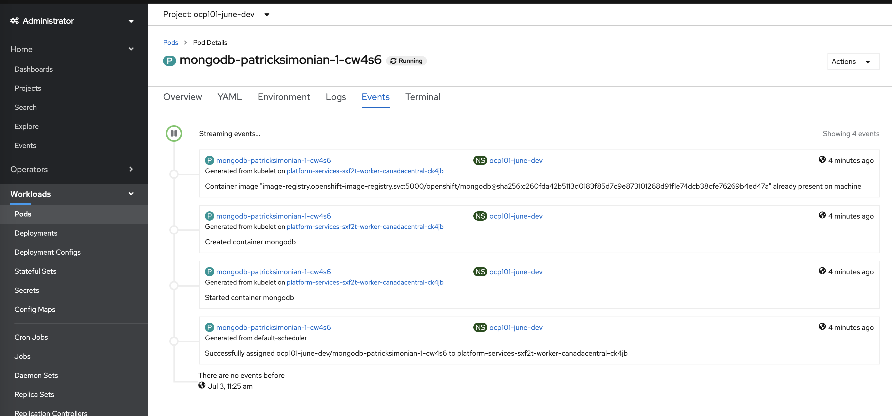
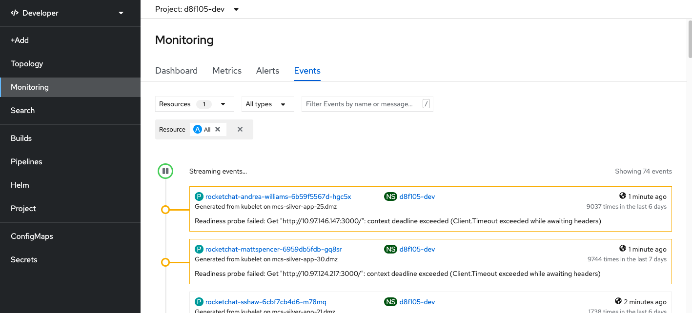

# Event Streams
Event streams exist on many objects as well as at the project level. The project is the highest level that a 
developer can explore to see all events with that particular project. 

### Exploring Event Streams
The Web Console is the primary tool to visualize events sorted by time.

- Explore the events of a pod
    - Navigate to the __Administrator View__ go to `Workloads -> Pods` and then select `Events`

<kbd></kbd>

- For project wide events, navigate to the __Developer View__ and go to `Observe (previously called Monitoring) -> Events`

<kbd></kbd>

- Or on the CLI in your project 

```
oc -n [-dev] get events --sort-by='.lastTimestamp'
```

- Navigate through some of the events and review some of the output that could be helpful 
in debugging pods

Next page - [Debugging Containers](./11_debugging_containers.md)
