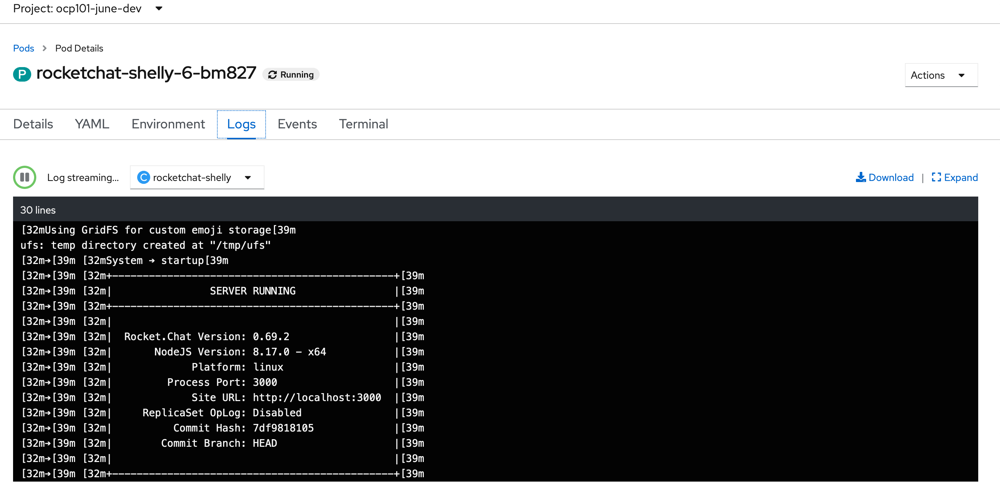
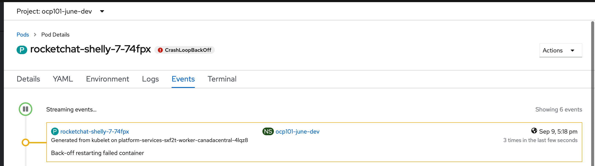

# Debugging Containers

### Accessing Local Logs
Logs of a running pod can be accessed from the Web Console or from the `oc` cli: 

- The `Logs` tab of any running pod can be used to view active logs for the current pod



- The `oc` command can be used to view or tail the logs: 

```
oc -n [-dev] logs -f <pod name>
```
If there is more than one container in a given pod, the `-c <container-name>` switch is used to specify the desired container logs. 

### Using a Debug Container

__Objective__: Create some error on app pod to start debugging:
In this lab, we will scale down the database deployment so that application pods will experience errors and crash.
- Scale down database:  
    ```
    oc -n [-dev] scale dc/mongodb-[username] --replicas=0
    ```
- Restart rocketchat:
    ```
    oc -n [-dev] rollout restart deployment/rocketchat-[username]
    ```
- Once the new pod starts, notice the CrashLoopBackOff



#### Using the `oc` command to start a debug container

- Find the name of a pod you would like to debug 
    ```
    oc -n [-dev] get pods
    ```
- Run the `oc debug` command to start a debug pod (your output will vary)
    ```
    $ oc -n [-dev] debug <rocketchat-pod-name>
    Defaulting container name to rocketchat-shelly.
    Use 'oc describe pod/rocketchat-shelly-6-bm827-debug -n ocp101-june-dev' to see all of the containers in this pod.

    Debugging with pod/rocketchat-shelly-6-bm827-debug, original command: container-entrypoint node main.js
    Waiting for pod to start ...
    If you don't see a command prompt, try pressing enter.
    sh-4.2$ 
    sh-4.2$ 
    sh-4.2$ exit
    exit

    Removing debug pod ...
    ```


### RSH and RSYNC
RSH is available to all normal pods through the web console under the `Terminal` tab, as well as through the 
`oc rsh` command. 

- With your choice of access, rsh into one of the application pods and test access within the namespace
    - cURL internal and external resources
    - Test internal name resolution, external name resolution, etc. 
    - Explore your userid

RSYNC is also available in many pods, available through the `oc rsync` command. 
- On the CLI, type `oc rsync -h` 
- Using this command, copy the contents of the mongo data directory to your local machine, or from your machine to the remote pod


### Port Forwarding
The `oc port-forward` command enables users to forward remote ports running in the cluster
into a local development machine. 

- Find your pod and use the port forward command

```
oc -n [-dev] get pods  | grep rocketchat-[username]
oc -n [-dev] port-forward [pod name from above] 8000:3000
```

- Navigate to http://127.0.0.1:8000
