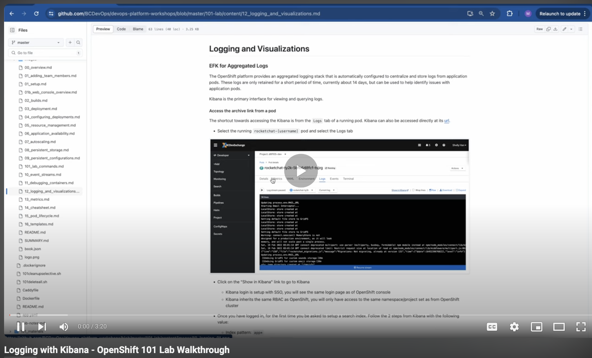
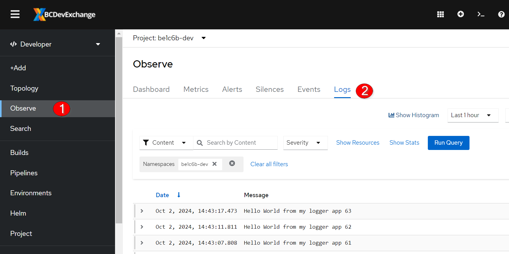
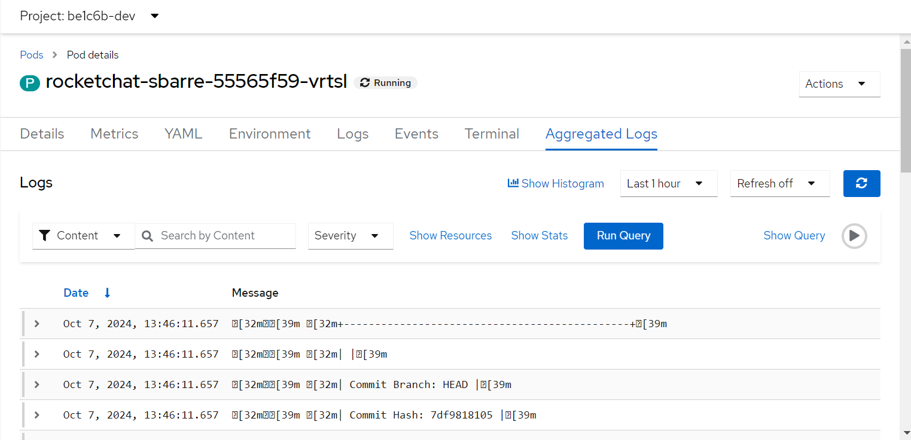

# Logging and Visualizations

<kbd></kbd>

## Loki for Aggregated Logs

The OpenShift platform provides an aggregated logging stack that is automatically configured to centralize and store logs from application pods. These logs are only retained for a short period of time, currently about 14 days, but can be used to help identify issues with application pods.

Loki is the primary interface for viewing and querying logs.

### Access the archive link from a pod

You can access Loki in the OpenShift console in the Developer mode under Observe -> Logs.

<kbd></kbd>

Or, select the running `rocketchat-[username]` pod and select the Aggregated Logs tab

<kbd></kbd>

Next page - [Metrics](./13_metrics.md)
