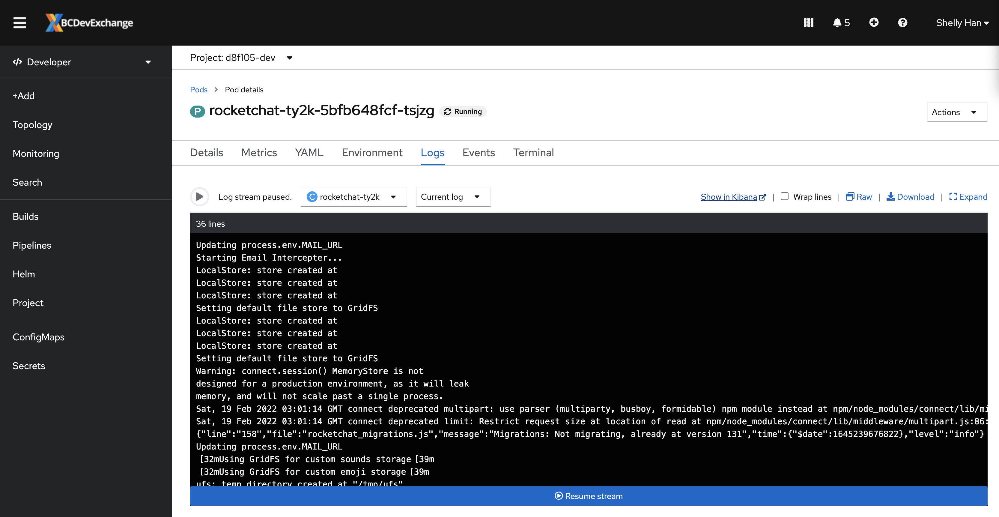
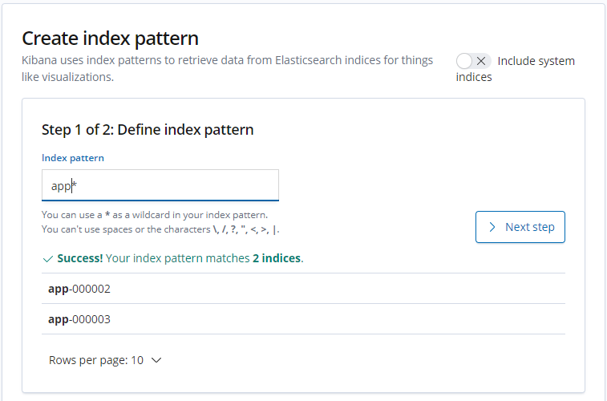
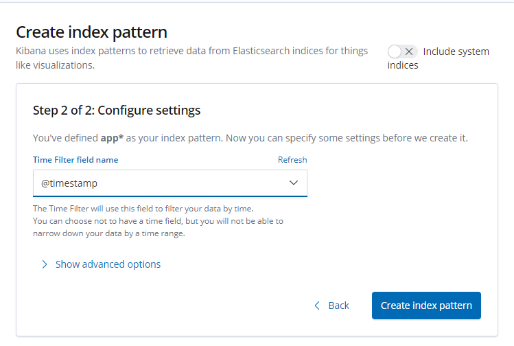
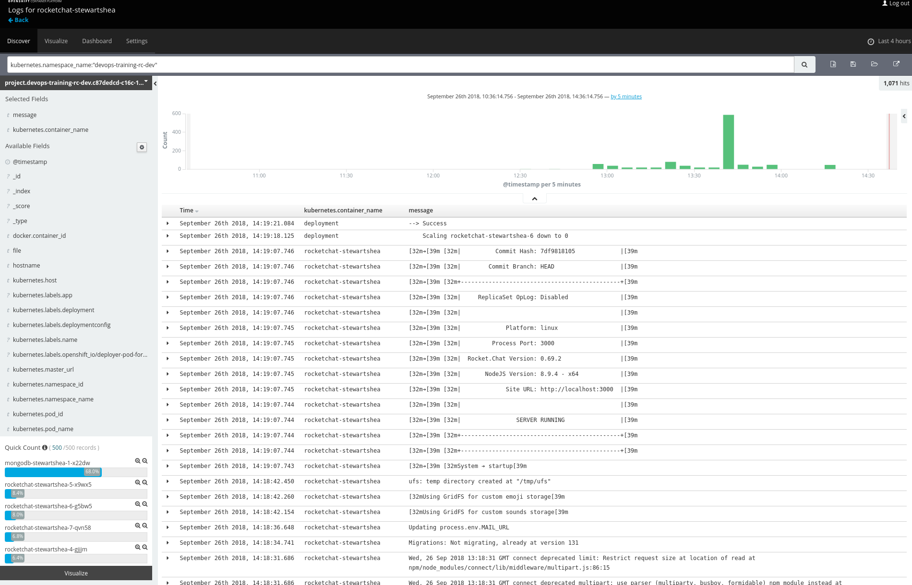
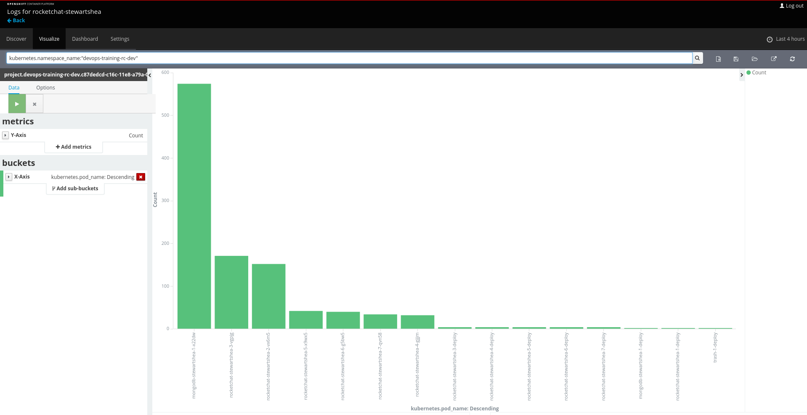

# Logging and Visualizations

<kbd>[](https://youtu.be/g6TyE3rIHeo)</kbd>

### EFK for Aggregated Logs
The OpenShift platform provides an aggregated logging stack that is automatically configured to centralize and store logs from application pods. These logs are only retained for a short period of time, currently about 14 days, but can be used to help identify issues with application pods. 

Kibana is the primary interface for viewing and querying logs. 

#### Access the archive link from a pod
The shortcut towards accessing the Kibana is from the `Logs` tab of a running pod. Kibana can also be accessed directly at its [url](https://kibana-openshift-logging.apps.silver.devops.gov.bc.ca/).


- Select the running `rocketchat-[username]` pod and select the Logs tab

<kbd></kbd>

- Click on the "Show in Kibana" link to go to Kibana
  - Kibana login is setup with SSO, you will see the same login page as of OpenShift console
  - Kibana inherits the same RBAC as OpenShift, you will only have access to the same namespace/project set as from OpenShift cluster

- Once you have logged in, for the first time you be asked to setup a search index. Follow the 2 steps from Kibana with the following value:
  - Index pattern: `app*`
  - Timestamp field name: `@timestamp`

<kbd></kbd>

<kbd></kbd>


- Review the logging interface and the query that has been automatically populated (there are more examples to explore at the end of this section)

<kbd></kbd>

- Modify the query and time picker to select the entire namespace within the last few hours

<kbd></kbd>

- Review how Kibana surfaces key information about the log sources in the left panel

<kbd></kbd>

- Create a simple visualization of the information surfaced by Kibana

<kbd></kbd>


#### Some useful queries you can try on:
- Get logs for the whole namespace: 
  ```sql
    kubernetes.namespace_name:"<namespace_name>"
  ```
- Use application labels to query logs from the same deployment:
  ```sql
    kubernetes.namespace_name:"<namespace_name>" AND kubernetes.flat_labels:"deploymentconfig=<dc_name>"
  ```
- Get error logs only:
  ```sql
    kubernetes.namespace_name:"<namespace_name>" AND level:error
  ```

Next page - [Metrics](./13_metrics.md)