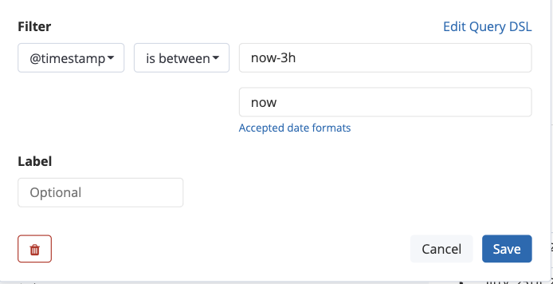
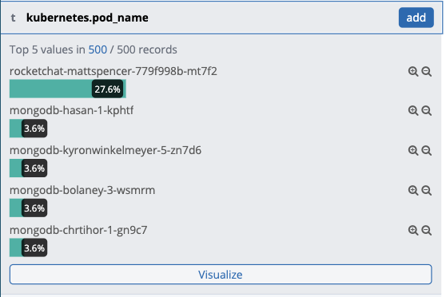
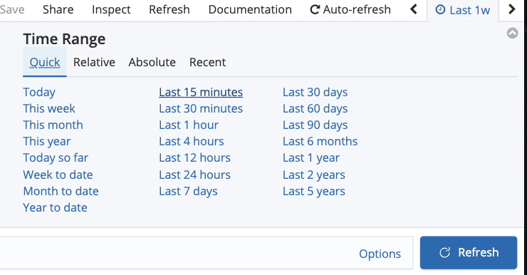
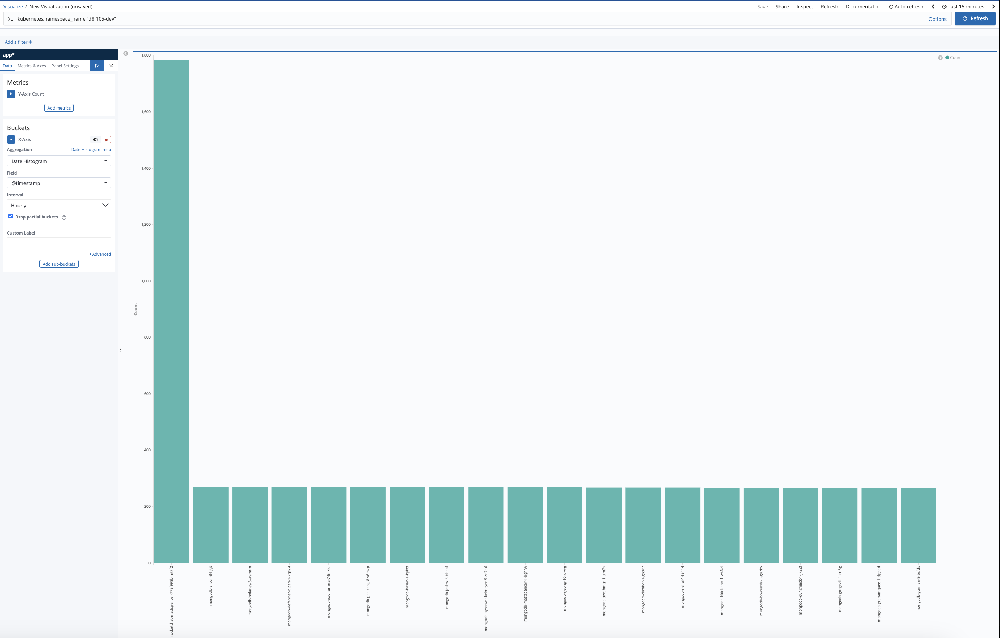

# Logging and Visualizations

<kbd>[](https://youtu.be/zDAJcN5yTCg)</kbd>

## EFK for Aggregated Logs

The OpenShift platform provides an aggregated logging stack that is automatically configured to centralize and store logs from application pods. These logs are only retained for a short period of time, currently about 14 days, but can be used to help identify issues with application pods.

Kibana is the primary interface for viewing and querying logs.

### Access the archive link from a pod

The shortcut towards accessing the Kibana is from the `Logs` tab of a running pod. Kibana can also be accessed directly at its [url](https://kibana-openshift-logging.apps.silver.devops.gov.bc.ca/).

- Select the running `rocketchat-[username]` pod and select the Logs tab

<kbd></kbd>

- Click on the "Show in Kibana" link to go to Kibana
  - Kibana login is setup with SSO, you will see the same login page as of OpenShift console
  - Kibana inherits the same RBAC as OpenShift, you will only have access to the same namespace/project set as from OpenShift cluster

- Once you have logged in, for the first time you be asked to setup a search index. Follow the 2 steps from Kibana with the following value:
  - Index pattern: `app*`
  - Timestamp field name: `@timestamp`

<kbd></kbd>

<kbd></kbd>

- Click the 'discover' tab and review the logging interface and the query that has been automatically populated (there are more examples to explore at the end of this section)

<kbd></kbd>

- Modify the query and time picker to select the entire namespace within the last few hours. First, I'm going to edit the query `kubernetes.namespace_name:"[-dev]"`, but replacing `[-dev]` with the name of the namespace I'm using. In the example, this is `kubernetes.namespace_name:"d8f105-dev"`. Next, I'll add a filter based on the `@timestamp` of the log messages, checking if each log entry `is between` the time periods `now-3h` and `now` and only displaying those logs.

<kbd></kbd>

<kbd></kbd>

- To see quick summary charts of a particular field, click the field name in the left menu of selected or available fields. In this case, let's click on the `kubernetes.pod_name` field.

<kbd></kbd>

- Let's visualize which pods have been generating the most logs in the last 15 minutes.  Click the 'visualize' button at the bottom of our `kubernetes.pod_name` field. Then, in the top right hand corner of the Kibana interface, look for the option to change the time range. Change this to `Last 15 minutes` from the `Quick` menu. You may wish to explore experimenting with visualizing other fields and time ranges.

<kbd></kbd>

<kbd></kbd>

### Some useful queries you can try on

- Get logs for the whole namespace

  ```sql
    kubernetes.namespace_name:"[-dev]"
  ```

- Use application labels to query logs from the same deployment:

  ```sql
    kubernetes.namespace_name:"[-dev]" AND kubernetes.flat_labels:"deployment=[deployment_name]"
  ```

- Get error logs only:

  ```sql
    kubernetes.namespace_name:"[-dev]" AND level:error
  ```

Next page - [Metrics](./13_metrics.md)
