# Pod Lifecycle
A Pod can be extended beyond the normal operation of the container by allowing developers to: 
- add `init` containers
- add `pre` and `post` lifecycle hooks
- modify the default `entrypoint` of a container 

<kbd>[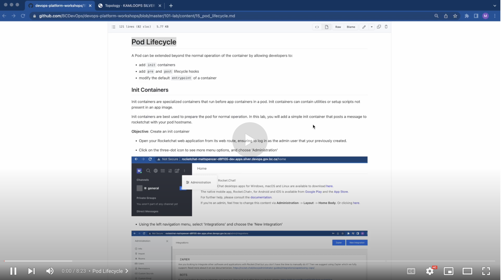](https://youtu.be/T3n3i-ucmkE)</kbd>

[Video walkthrough](https://youtu.be/T3n3i-ucmkE)

## Init Containers
Init containers are specialized containers that run before app containers in a pod. Init containers can contain utilities or setup scripts not present in an app image.

Init containers are best used to prepare the pod for normal operation. In this lab, you will add a simple init container that posts a message to rocketchat with your pod hostname.

__Objective__: Create an init container
- Open your Rocketchat web application from its web route, ensuring to log in as the admin user that your previously created. 

- Click on the three-dot icon to see more menu options, and choose 'Administration' 

<kbd>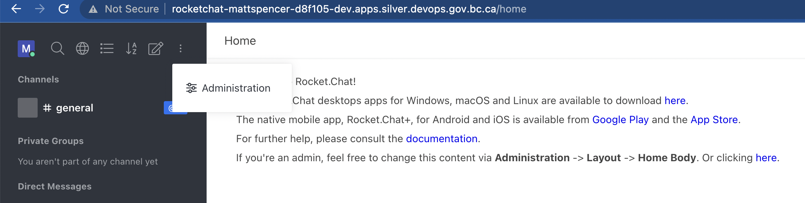</kbd>

- Using the left navigation menu, select 'Integrations' and choose the 'New Integration' 

<kbd>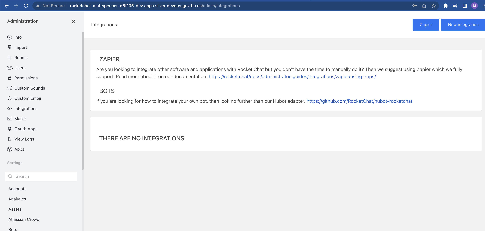</kbd>

- Next, select the option to create an 'Incoming WebHook' 

<kbd>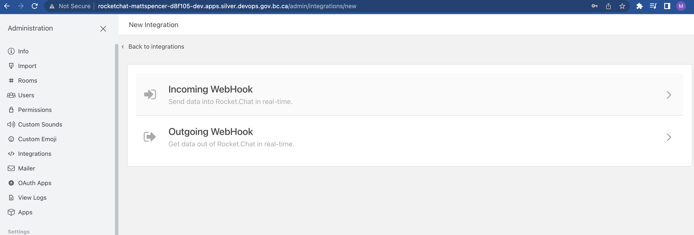</kbd>

- Configure the WebHook. Be sure to set 'enabled' to 'true', choose to post as the account name you set earlier, choose the default #general channel. Optionally, you can link to an avatar image or set and emoji as the avatar. Be sure to save the settings at the bottom right of the page, and confirm that no errors appear at the top right of the page. 

<kbd>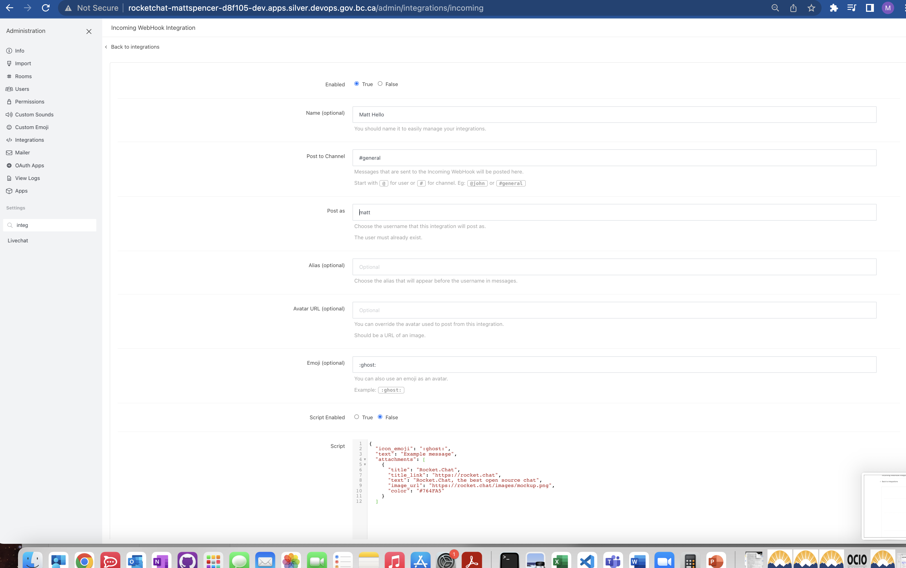</kbd>

- Once these settings are saved, navigate to the 'Integrations' page again and take note of the webhook URL that is generated.

<kbd>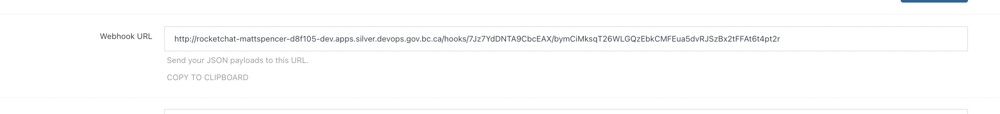</kbd>

- Next the OpenShift Web Console, navigate to `Topology` and select your `rocketchat-[username]` deployment.
- Navigate to the __YAML__ tab.
  > If you wish to perform this from the cli with the `oc` tool, type `oc edit deployment/rocketchat-[username]`


<kbd>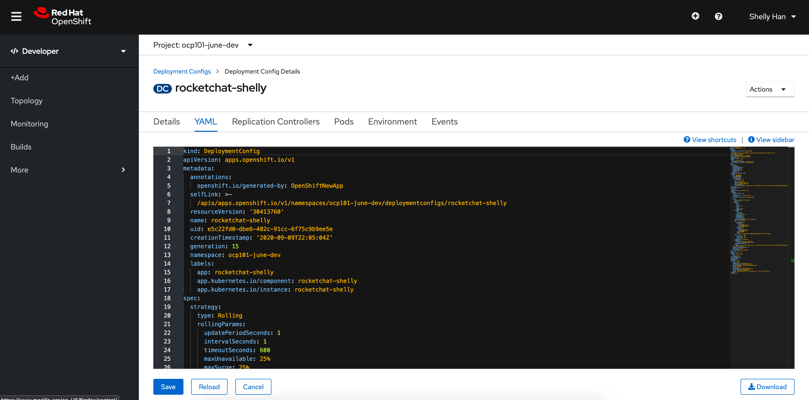</kbd>

- After replacing the URL below with the webhook URL from the previous step, add the following section of code under `spec: -> template: -> spec:`. As always with YAML, pay close attention to the formatting and indenting. 

```YAML
initContainers:
        - name: init
          image: docker.io/giantswarm/tiny-tools
          command:
            - /bin/sh
            - '-c'
            - >-
              c=$(curl -X POST -H 'Content-Type: application/json' --data
              '{"text":"Say Hello"}'
              [YOUR_WEBHOOK_URL])
          resources: {}
          terminationMessagePath: /dev/termination-log
          terminationMessagePolicy: File
          imagePullPolicy: Always
```
**Be careful when pasting your Webhook URL into the YAML above, you will need the ) after your URL.** 
- Save your changes to the YAML. It should look similar to this: 

<kbd>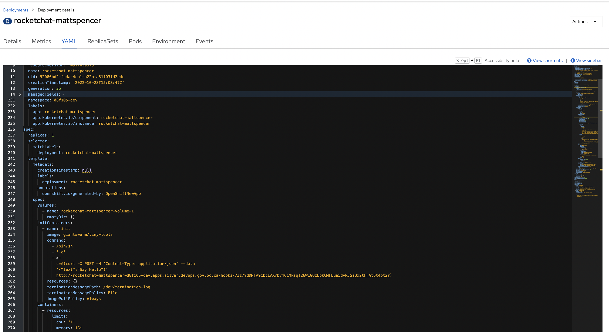</kbd>


- Now that you've added this init container, every time one of your Rocketchat pods initializes, the 'Say Hello' message will be posted to your #general channel on Rocketchat web application. You can test this by scaling up your rocketchat deployment to have an additional pod. 

<kbd>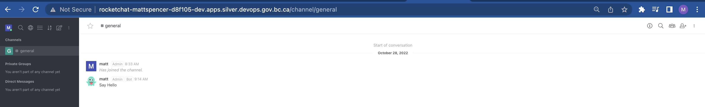</kbd>

- Explore the `Pod Details` to notice the difference with the Init Container 

<kbd>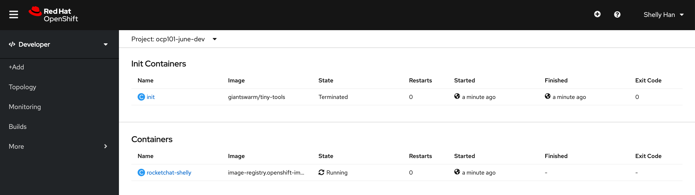</kbd>

In order to obtain logs from the init container, the `oc` command can be used by specifying `-c init`: 

```
oc -n [-dev] logs rocketchat-[username]-[pod-id] -c init
```

## Lifecycle Hooks
Lifecycle hooks can be configured to start and stop a container properly. The lifecycle hook is tied directly to each container. Next we will add a similar pre and post hook as the `initContainer` to demonstrate when it executes in your rocketchat deployment. 

- From the Web Console, navigate to the `rocketchat-[username]` deployment and click on `YAML` tab
    - If you wish to perform this from the cli with the `oc` tool, type `oc edit deployment/rocketchat-[username]`
- After replacing both URLs below with the webhook URL from the earlier step, add the following section of code under `spec: -> template: -> spec: -> containers`. Again, pay careful attention to the YAML indentation. 
```YAML
lifecycle:
            postStart:
              exec:
                command:  ["/bin/sh", "-c", "c=$(curl -X POST -H 'Content-Type: application/json' --data '{\"text\": \"'\"$HOSTNAME\"' is at the postStart phase, hooray! \"}'  http://YOUR_WEBHOOK_URL)"]
            preStop:
              exec:
                command:  ["/bin/sh", "-c", "c=$(curl -X POST -H 'Content-Type: application/json' --data '{\"text\": \"'\"$HOSTNAME\"' is just about to STOPPPPPP! \"}'  http://YOUR_WEBHOOK_URL)"]        
```
-  Save your changes to the YAML. It should now look similar to this: 

<kbd>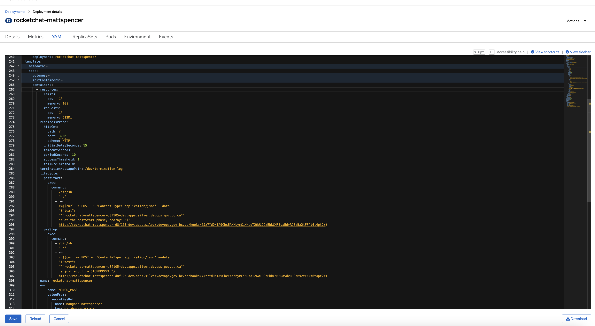</kbd>

- Test your lifecycle hooks by scaling up your deployment to run on an extra pod. When you're finished, scale down to 1 pod again. 

## Overriding the Entrypoint 
It may be necessary, from time to time, to override the initial command/entrypoint of a container image. Generally this is used for troubleshooting purposes, or to override a vendor provided image. 

- From the Web Console, navigate to the `rocketchat-[username]` deployment and click on `YAML` tab
    - If you wish to perform this from the cli with the `oc` tool, type `oc edit deployment/rocketchat-[username]`
- After replacing the example URL with your WebHook URL, add the following section of code under `spec: -> template: -> spec: -> containers:`

```YAML
command:  ["/bin/sh", "-c", "c=$(curl -X POST -H 'Content-Type: application/json' --data '{\"text\": \"'\"$HOSTNAME\"' is AN OVERRIDING COMMAND! \"}' https://chat.pathfinder.gov.bc.ca/hooks/xxx/xxx)"]
```

Your rocketchat deployment YAML should look similar to this (some sections have been collapsed for easier viewing):

<kbd>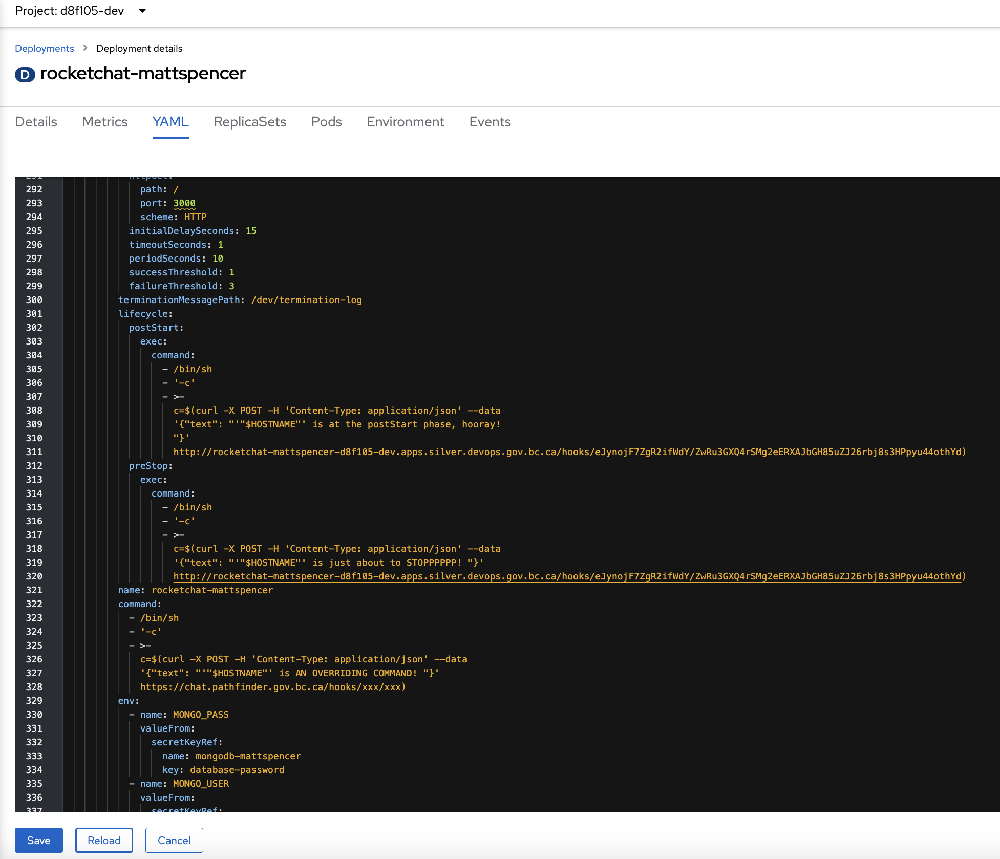</kbd>


Be sure to save the changes to your YAML. Then:
- Take note of the pattern that will happen in the rocketchat notification screen
- Remove the previous command to enable the rocketchat instance to start properly again

## References
- https://blog.openshift.com/kubernetes-pods-life/

Next page - [Templates](./16_templates.md)
