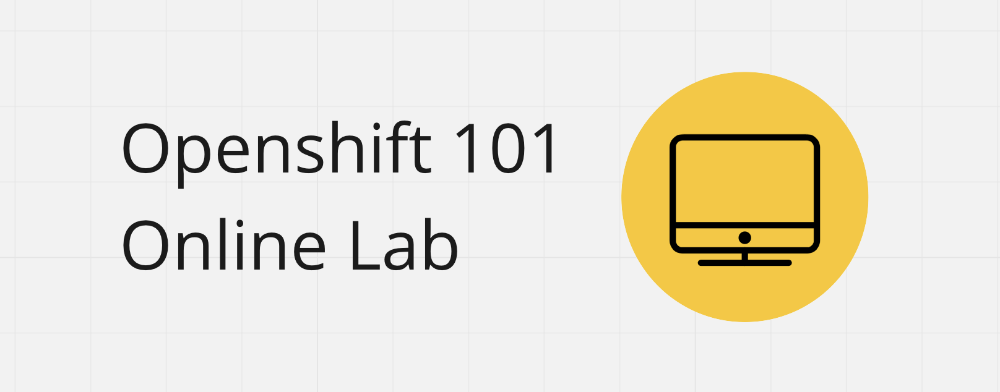

# Welcome to the Openshift 101 Lab

This lab has been designed as a do-it-at-your-own pace set of exercises. Essentially you are provided a set of training namespaces in an Openshift Environment to perform your work. You are apart of a cohort! So share, collaborate, and problem solve together as you would if you were all apart of the same project team :) 

## Important Notes

The lab follows a continuous improvement model. This means we track suggestions, feature improvements, bugs, and typos in github. If you have any issues that are outside of the planned experience for this lab please create an issue so we can improve this workshop for others. 

[You can find issues here](https://github.com/BCDevOps/devops-platform-workshops/issues/new?template=101-lab-issue.md&title=101+Lab+Questions%2FBugs)

## Get prepared for

- hands on exerecises using the tools that are commonly leveraged by teams when working on the platform
- running into issues as you debug the build and deployment of a RocketChat Application

## Unknown Territory

The OCP 101 Lab was initially delivered as a 2 day session pre-covid. The delivery model has changed to reflect the given times and so we are diving in as faciliators as much as you are :) Let's learn together. 

## Touch Points and Support

You are not alone! The lab, when scheduled, has at least one touch point scheduled mid way to address any questions/concerns. There is also a RocketChat channel that will be created specifically for the scheduled lab to be used by the cohort and facilitators. 

