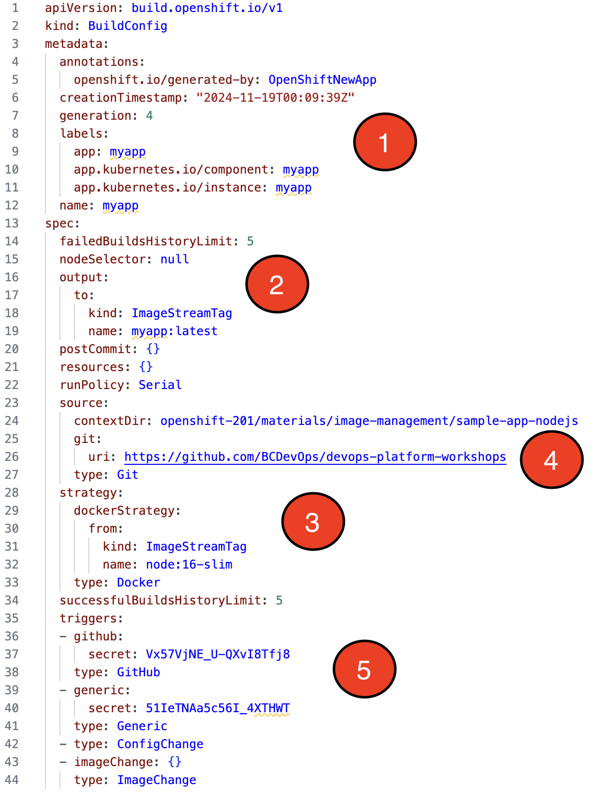
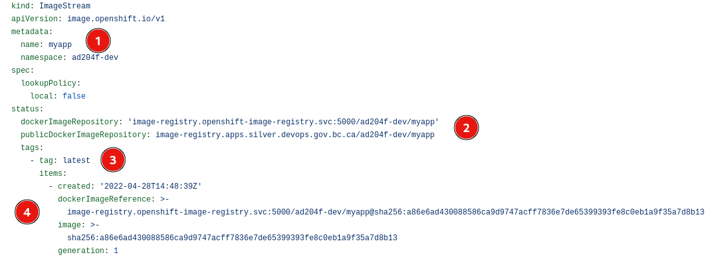

# Best Practices of Image Management

## Objectives:

After completing this section, you should have an understanding of the best practices around image management.

## Building Images
Source-to-image (S2I) is a framework that makes it easy to write images that take application source code as an input and produced a new image that runs the assembled application as output.

The main advantage of using S2I is the ease of use for developers.  OpenShift provides base images for the following:
* .NET
* Java
* Go
* Node.js
* Perl
* PHP
* Python
* Ruby

In the following exercise, you will manage application builds with OpenShift, using the source strategy with a Git input source.

The following commands are used to create a new application.  The `myapp` application created is a simple Java Sprint Boot app that will display a message based on environment variables.


### Create a new application 
```bash
oc -n [-dev] new-app --name myapp \
--image-stream=redhat-openjdk18-openshift:1.8 \
--context-dir=openshift-201/materials/image-management/sample-app \
https://github.com/BCDevOps/devops-platform-workshops
```

You should see output similar to the follow:
<pre>
...<em>output omitted</em>...
imagestream.image.openshift.io "myapp" created
    buildconfig.build.openshift.io "myapp" created
    deployment.apps "myapp" created
    service "myapp" created
--> Success
...<em>output omitted</em>...
</pre>

As you can see there are a few resources create with the `new-app` command.  One is the `BuildConfig`.  To see the `myapp` `BuildConfig`, select Administrator view in the console. Next, click on the `Builds -> BuildConfigs` item in the left menu then choose `myapp` and select `YAML` or run `oc -n [-dev] get bc/myapp -o yaml`.  You should see something similar to the following:



1. Name of BuildConfig
2. Defines the output.  Where the image will go after it is successfully built.
3. The `strategy` section describes the build strategy used to execute the build. You can specify a `Source` , `Docker`, or `Custom` strategy here. This example uses the `redhat-openjdk18-openshift` container image that Source-to-image (S2I) uses for the application build.
4. The `source` section defines the source of the build. The source type determines the primary source of input, and can be either `Git`, to point to a code repository location, `Dockerfile`, to build from an inline Dockerfile, or `Binary`, to accept binary payloads.
5. You can specify a list of triggers, which cause a new build to be created.


### Follow Build
Use the `oc logs` command to check the build logs from the `myapp` build:
```bash
oc -n [-dev] logs -f bc/myapp
```
<pre>
...<em>output omitted</em>...
Writing manifest to image destination
Storing signatures
...<em>output omitted</em>...
Push successful
</pre>

Once the build is complete let's inspect the `ImageStream`.  To do so click on the `Builds -> ImageStreams` item in the left menu then choose `myapp` and select `YAML` or run `oc -n [-dev] get is/myapp -o yaml`.  You should see something similar to the following:



1. Name of ImageStream
2. Docker repository path where new images can be pushed to add/update them in this image stream.
3. The image stream tag.  In this case `latest`.
4. The `items` are the associated images to the `latest` tag in this case.  `dockerImageReference` is the SHA identifier that this `ImageStreamTag` currently references and the `image` is the SHA identifier that this `ImageStreamTag` previously referenced.  In this case they are the same because we only have one image generation.

### Application Status
Wait for the build to complete and the application pod to be ready and running:
```bash
oc -n [-dev] get pods -w

NAME                    READY   STATUS      RESTARTS   AGE
myapp-1-build           0/1     Completed   0          10m
myapp-85c7dc4569-njqlb  1/1     Running     0          36s
```

> Note: sometime the build would take longer time. This might result in the replicaController being upset about where it complains about the image configuration being empty. When this happen, you won't see the deployment go through successfully. So if you are seeing the error and you are sure the image is ready, scale down the deployment:

```bash
# scale down so deployment will pick up the image later on
oc -n [-dev] scale deployment myapp --replicas=0
# now scale it back up again:
oc -n [-dev] scale deployment myapp --replicas=1
```


### Expose Application
Expose the application to external access:
```bash
oc -n [-dev] expose svc/myapp
```

### Test Application
Perform the following command to get the host of the route we just exposed:
```bash
export MY_HOST=`oc -n [-dev] get routes myapp --no-headers | awk '{print $2}'`
```

or run `oc get routes myapp` and copy the host name.

Then run the following:
```bash
curl http://$MY_HOST/hello

Hello world from unknown
```

## Application Configuration
The `myapp` application has 3 environment variables that can be set to change the output of our `hello` endpoint.
1. `NAME` is who is saying hello
2. `APP_MSG` message to output
3. `SECRET_APP_MSG` a secret message to output

There are multiple ways to configure these environment variables in OpenShift

### Environment Variables
Environment variables can be set directly on your `Deployment` or `DeploymentConfig`.  

#### Setting Environment Variable
We can set the `NAME` environment variable on our `myapp` deployment by performing the following:
```bash
oc -n [-dev] set env deployment/myapp NAME='<YOUR_NAME_HERE>'
```

This should automatically redeploy the app.
```bash
oc -n [-dev] get pods -w

NAME                   READY   STATUS              RESTARTS   AGE
myapp-77ff765f49-nsqhc 1/1     Running             0          4m27s
myapp-c97b5b874-zsz2j  0/1     ContainerCreating   0          5s
```

Wait for the new pod to be in the `Running` status.

#### Test Application
We should now see our name when calling our `hello` endpoint

```bash
curl http://$MY_HOST/hello

Hello world from YOUR_NAME_HERE
```

### ConfigMap
A `ConfigMap` is another way to inject configuration data into containers. Given our example above we will use a `ConfigMap` to inject another environment variable `APP_MSG`

#### Create the ConfigMap
To create the `ConfigMap` perform the following:
```bash
oc -n [-dev] create configmap myapp-config \
--from-literal APP_MSG='Containers are fun'
```

#### Update Deployment
To update our deployment to use the `ConfigMap` perform the following:
```bash
oc -n [-dev] set env deployment/myapp \
--from configmap/myapp-config
```

This should automatically redeploy the app.
```bash
oc -n [-dev] get pods -w

NAME                   READY   STATUS              RESTARTS   AGE
myapp-c97b5b874-zsz2j   1/1     Running             0          4m27s
myapp-5f598f7884-rjt5k  0/1     ContainerCreating   0          5s
```

Wait for the new pod to be in the `Running` status.

#### Test Application
We should now see our message when calling our `hello` endpoint
```bash
curl http://$MY_HOST/hello

Hello world from [YOUR_NAME_HERE]. Message received = Containers are fun
```

### Secret
A `Secret` is a way to inject sensitive data into containers. Given our example above we will use a `Secret` to inject another environment variable `SECRET_APP_MSG`

#### Create the Secret
```bash
oc -n [-dev] create secret generic myapp-secret \
--from-literal SECRET_APP_MSG='Shh... It is a secret'
```

#### Update Deployment
To update our deployment to use the `Secret` perform the following:
```bash
oc -n [-dev] set env deployment/myapp \
--from secret/myapp-secret
```

This should automatically redeploy the app.
```bash
oc -n [-dev] get pods -w

NAME                   READY   STATUS              RESTARTS   AGE
myapp-5fd4dcf7c8-9tlkq  1/1     Running             0          4m27s
myapp-5fd4dcf7c8-9tlkq  0/1     ContainerCreating   0          5s
```

Wait for the new pod to be in the `Running` status.

#### Test Application
We should now see our message when calling our `hello` endpoint
```bash
curl http://$MY_HOST/hello

Hello world from [YOUR_NAME_HERE]. Message received = Containers are fun with secret message: Shh... It is a secret
```

> Note: scale down the application to save resources with `oc scale deployment/myapp --replicas=0`.

## Image Streams
An Image Stream doesn't contain the Docker image itself but is a pointer to images.  We will demonstrate the use of an `ImageStream` below.

### Create Image Stream
The following command will create an "empty" `ImageStream`.  We will add a pointer when we build our image.

```bash
oc -n [-dev] create is hello-world
```
__NOTE:__ *`is`* is short for `imagestream`

### Create a BuildConfig
```bash
cat <<EOF | oc create -f -
kind: BuildConfig
apiVersion: build.openshift.io/v1
metadata:
  name: docker-build
  labels:
    name: docker-build
spec:
  output:
    to:
      kind: ImageStreamTag
      name: 'hello-world:latest'
  strategy:
    type: Docker
  source:
    type: Dockerfile
    dockerfile: |-
      FROM registry.access.redhat.com/ubi8 
      CMD echo 'Hello World!  Docker Build - v1.0' && exec sleep infinity
EOF
```

#### Start the build
```bash
oc -n [-dev] start-build docker-build
```

#### Follow Build
Use the `oc logs` command to check the build logs of the `docker-build`:
```bash
oc -n [-dev] logs -f bc/docker-build
```
<pre>
...<em>output omitted</em>...
Writing manifest to image destination
Storing signatures
...<em>output omitted</em>...
Push successful
</pre>

### Create Deployment
Run the following to create and start the `hello-world` application
```bash
oc -n [-dev] new-app hello-world
```
You should see output similar to the follow:
<pre>
...<em>output omitted</em>...
--> Creating resource ...
    deployment.apps "hello-world" created
--> Success
...<em>output omitted</em>...
</pre>

Notice in the `Deployment` created the annotation for the `image.openshift.io/triggers`
```bash
oc -n [-dev] get deployment hello-world -o yaml | grep -A2 annotations:
```
```
annotations:
  deployment.kubernetes.io/revision: "2"
  image.openshift.io/triggers: '[{"from":{"kind":"ImageStreamTag","name":"hello-world:latest","namespace":"ad204f-dev"},"fieldPath":"spec.template.spec.containers[?(@.name==\"hello-world\")].image"}]'
```
This annotation uses a JSON path expression to update the image reference inside the `Deployment`. 


#### Application Status
Wait for the application to be ready and running:
```bash
oc -n [-dev] get pods

NAME                          READY   STATUS      RESTARTS   AGE
hello-world-1-build           0/1     Completed   0          10m
hello-world-85c7dc4569-njqlb  1/1     Running     0          36s
```

Use the pod name shown above (the characters after `hello-world-` will be different for you) to display the output of the logs.
```bash
oc -n [-dev] logs hello-world-85c7dc4569-njqlb

Hello World!  Docker Build - v1.0
```

### Update the BuildConfig
Let's now modify the `BuildConfig` to update our image and release a new version.
```bash
cat <<EOF | oc apply -f -
kind: BuildConfig
apiVersion: build.openshift.io/v1
metadata:
  name: docker-build
  labels:
    name: docker-build
spec:
  output:
    to:
      kind: ImageStreamTag
      name: 'hello-world:latest'
  strategy:
    type: Docker
  source:
    type: Dockerfile
    dockerfile: |-
      FROM registry.access.redhat.com/ubi8 
      CMD echo 'Hello World!  Docker Build - v1.1' && exec sleep infinity
EOF
```

#### Start the build
```bash
oc -n [-dev] start-build docker-build
```

#### Follow Build
Use the `oc logs` command to check the build logs of the `docker-build`:
```bash
oc -n [-dev] logs -f bc/docker-build
```
<pre>
...<em>output omitted</em>...
Writing manifest to image destination
Storing signatures
...<em>output omitted</em>...
Push successful
</pre>

#### Application Status
Notice our `hello-world` deployment is automatically deploying our new image.  This is because our `ImageStream` tag `latest` was updated with a new image from our `BuildConfig`

```bash
oc -n [-dev] get pods

NAME                          READY   STATUS              RESTARTS   AGE
hello-world-1-build           0/1     Completed           0          10m
hello-world-75c89d744f-nzxpk  0/1     ContainerCreating   0          9s
hello-world-785c7dc456-njqlb  1/1     Running             0          36s
```

Use the new pod name shown above (the characters after `hello-world-` will be different for you) to display the output of the logs once the pod has the `Running` status.
```bash
oc -n [-dev] logs hello-world-75c89d744f-nzxpk

Hello World!  Docker Build - v1.1
```

### ImageStream Tags
If we look at our `ImageStream` we should see 2 items for our `latest` image tag:
```bash
oc -n [-dev] get is/hello-world -o yaml | grep -A10 tags
```
```yaml
  tags:
  - items:
    - created: "2022-05-03T18:43:28Z"
      dockerImageReference: image-registry.openshift-image-registry.svc:5000/ad204f-dev/hello-world@sha256:43378e2447d3fd0d1a8e84ac82ae88bf269d1c60ab0de29b1dc41475d5270284
      generation: 1
      image: sha256:43378e2447d3fd0d1a8e84ac82ae88bf269d1c60ab0de29b1dc41475d5270284
    - created: "2022-05-03T18:10:14Z"
      dockerImageReference: image-registry.openshift-image-registry.svc:5000/ad204f-dev/hello-world@sha256:9f388438ee6863477829e8d95cff895654030470aba5ca55a8f76a9f291c4ce2
      generation: 1
      image: sha256:9f388438ee6863477829e8d95cff895654030470aba5ca55a8f76a9f291c4ce2
    tag: latest
```

Let's create a tag for both the `v1.0` and `v1.1` images.  The first image in the list is our latest build of the `hello-world` image which is `v1.1`.  The second item is the first build `v1.0`

Perform the following commands (__NOTE:__ your numbers after the `sha256` will be different than above).
You will need to replace `{NAMESPACE}` with the current namespace in which you created the `ImageStream`

<sub>Creates an ImageStreamTag for v1.0</sub>
```bash
oc tag image-registry.openshift-image-registry.svc:5000/{NAMESPACE}/hello-world@sha256:9f388438ee6863477829e8d95cff895654030470aba5ca55a8f76a9f291c4ce2 hello-world:v1.0
```

<sub>Creates an ImageStreamTag for v1.1</sub>
```bash
oc tag image-registry.openshift-image-registry.svc:5000/{NAMESPACE}/hello-world@sha256:43378e2447d3fd0d1a8e84ac82ae88bf269d1c60ab0de29b1dc41475d5270284 hello-world:v1.1
```

We should now see our new tags on our `ImageStream`.
```bash
# list of tags
oc get is/hello-world

# details
oc -n [-dev] get is/hello-world -o yaml | grep -A25 tags
```
```yaml
  tags:
  - items:
    - created: "2022-05-04T14:15:10Z"
      dockerImageReference: image-registry.openshift-image-registry.svc:5000/ad204f-dev/hello-world@sha256:43378e2447d3fd0d1a8e84ac82ae88bf269d1c60ab0de29b1dc41475d5270284
      generation: 1
      image: sha256:43378e2447d3fd0d1a8e84ac82ae88bf269d1c60ab0de29b1dc41475d5270284
    - created: "2022-05-03T18:10:14Z"
      dockerImageReference: image-registry.openshift-image-registry.svc:5000/ad204f-dev/hello-world@sha256:9f388438ee6863477829e8d95cff895654030470aba5ca55a8f76a9f291c4ce2
      generation: 1
      image: sha256:9f388438ee6863477829e8d95cff895654030470aba5ca55a8f76a9f291c4ce2
    tag: latest
  - items:
    - created: "2022-05-04T14:34:43Z"
      dockerImageReference: image-registry.openshift-image-registry.svc:5000/ad204f-dev/hello-world@sha256:9f388438ee6863477829e8d95cff895654030470aba5ca55a8f76a9f291c4ce2
      generation: 6
      image: sha256:9f388438ee6863477829e8d95cff895654030470aba5ca55a8f76a9f291c4ce2
    tag: v1.0
  - items:
    - created: "2022-05-04T14:38:58Z"
      dockerImageReference: image-registry.openshift-image-registry.svc:5000/ad204f-dev/hello-world@sha256:43378e2447d3fd0d1a8e84ac82ae88bf269d1c60ab0de29b1dc41475d5270284
      generation: 8
      image: sha256:43378e2447d3fd0d1a8e84ac82ae88bf269d1c60ab0de29b1dc41475d5270284
    tag: v1.1
```

Now you can update the deployment to use the ImageStreamTag `hello-world:v1.1` directly.

> Note: scale down the application to save resources with `oc scale deployment/hello-world --replicas=0`.


