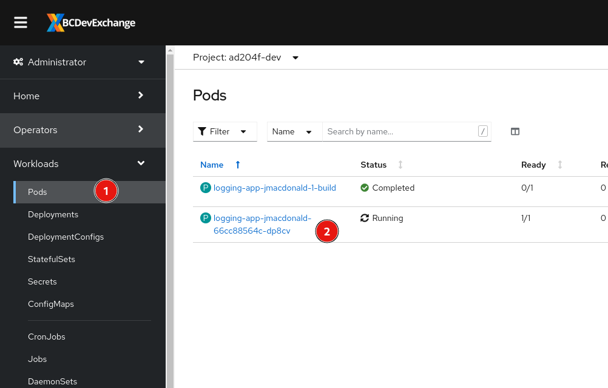
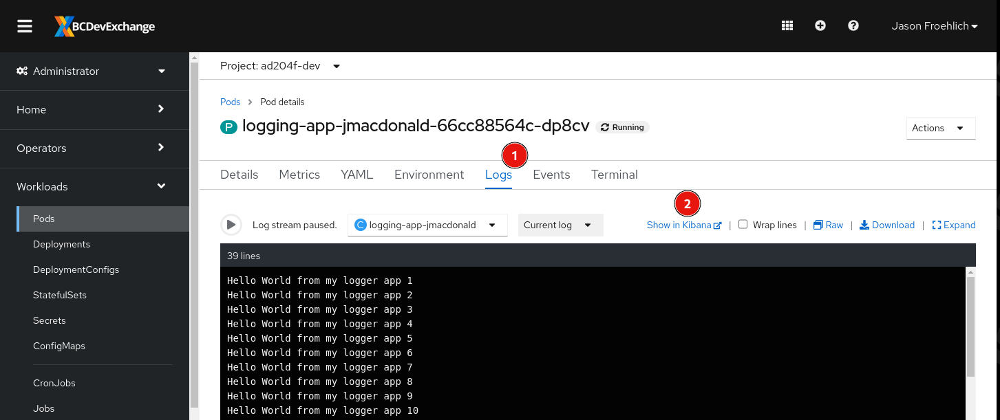
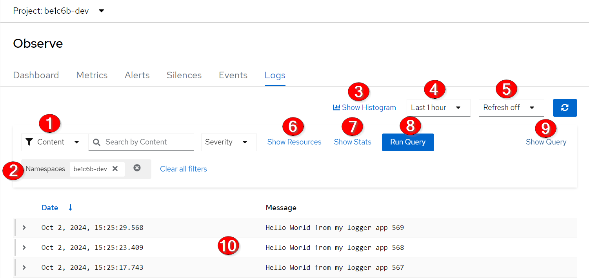
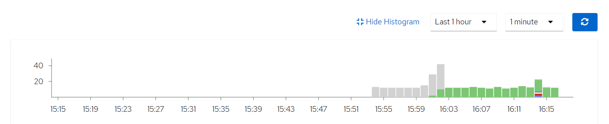
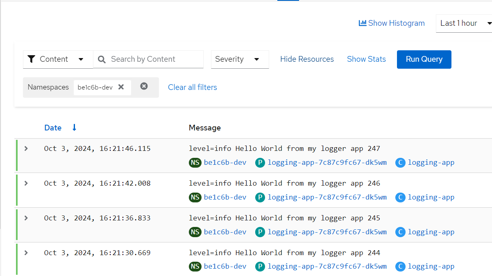
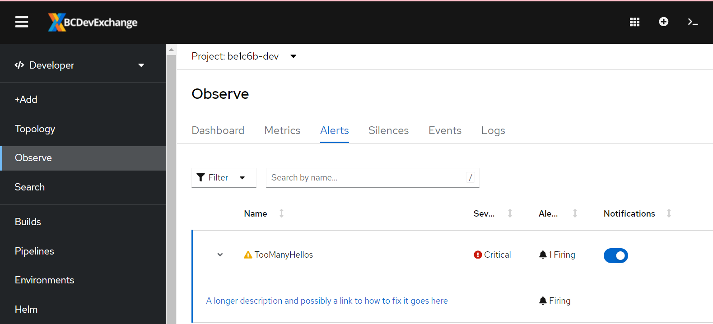
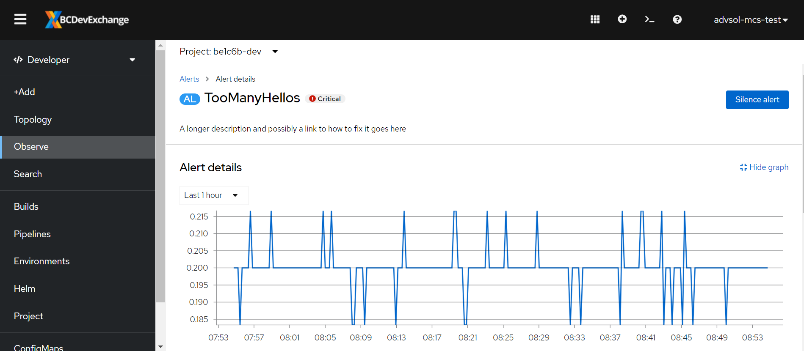

# Application Logging with Loki

<kbd>[](TBD)</kbd>

[Video walkthrough](https://youtu.be/VnpelRzTjOw)

## Objectives

After completing this section, you should know how to view application logs in Loki, navigate the list of fields, and create/save queries.

## Setup

We will setup a sample application that will produce a log entry every 5 seconds.

### Create a new application

```bash
 oc -n [-dev] new-app --name logging-app \
 --context-dir=openshift-201/materials/logging \
 https://github.com/BCDevOps/devops-platform-workshops
```

You should see output similar to the follow:

```text
...<em>output omitted</em>...
    imagestream.image.openshift.io "logging-app-jmacdonald" created
    buildconfig.build.openshift.io "logging-app-jmacdonald" created
    deployment.apps "logging-app-jmacdonald" created
    service "logging-app-jmacdonald" created
--> Success
...<em>output omitted</em>...
```

### Follow Build

Use the `oc -n [-dev] logs` command to check the build logs from the `logging-app` build:

```bash
oc -n [-dev] logs -f bc/logging-app
```

```text
...<em>output omitted</em>...
Writing manifest to image destination
Storing signatures
...<em>output omitted</em>...
Push successful
```

## Loki

### Accessing Logs

You can access Loki in the OpenShift console in the Developer mode under Observe -> Logs.

<kbd></kbd>

Or, you can access it from a pods tabs.

Select the running pod that was just created

<kbd></kbd>

Navigate to the Aggregated Logs tab

<kbd></kbd>

### View Logs

By default you will see something like this:

<kbd></kbd>

1. You can select to filter on the content of logs, or by namespace, pod, or container name.
2. Current applied filters
3. This will show a bar chart of the number of logs per time period that match your filter
4. Time range to show logs for
5. Set the page to refresh the log results every X time period
6. Adds the namespace, pod, and container names to all the log entries displayed below
7. Some detailed stats on how your query was performed
8. Button to run the query again
9. Show the LogQL query being used
10. Log entries that match the filter, search, etc.

### Histogram

If you click on `Show Histogram` a bar chart will appear. It is color coded to the log level tag of each log message.

<kbd></kbd>

### Log Levels

The log level of that is tagged onto any log line comes from some regular expressions run on the logs as they are collected. If you are creating your own log messages in your app, you can include the appropriate keywords to help differentiate your logs.

```text
    if match!(.message, r'Warning|WARN|^W[0-9]+|level=warn|Value:warn|"level":"warn"|<warn>') {
      .level = "warn"
    } else if match!(.message, r'Error|ERROR|^E[0-9]+|level=error|Value:error|"level":"error"|<error>') {
      .level = "error"
    } else if match!(.message, r'Critical|CRITICAL|^C[0-9]+|level=critical|Value:critical|"level":"critical"|<critical>') {
      .level = "critical"
    } else if match!(.message, r'Debug|DEBUG|^D[0-9]+|level=debug|Value:debug|"level":"debug"|<debug>') {
      .level = "debug"
    } else if match!(.message, r'Notice|NOTICE|^N[0-9]+|level=notice|Value:notice|"level":"notice"|<notice>') {
      .level = "notice"
    } else if match!(.message, r'Alert|ALERT|^A[0-9]+|level=alert|Value:alert|"level":"alert"|<alert>') {
      .level = "alert"
    } else if match!(.message, r'Emergency|EMERGENCY|^EM[0-9]+|level=emergency|Value:emergency|"level":"emergency"|<emergency>') {
      .level = "emergency"
    } else if match!(.message, r'(?i)\b(?:info)\b|^I[0-9]+|level=info|Value:info|"level":"info"|<info>') {
      .level = "info"
    }
```

### Resources

If you click the `Show Resources` link, then the namespace name, pod name, and container name will show up below each log line. Clicking on the resource will take you to that item in the web console.

<kbd></kbd>

### Query

If you click on `Show Query` you will see the LogQL query being used. You can then adjust it and make more complex queries than the basic filters support.

```text
{ log_type="application", kubernetes_namespace_name="be1c6b-dev" } | json
```

You can read all about LogQL on the [Loki docs](https://grafana.com/docs/loki/latest/query/log_queries/) site.

The indexed fields you can query inside stream selector are:

- kubernetes_namespace_name
- kubernetes_pod_name
- kubernetes_container_name
- log_type=application

All other filtering should be done after the `json` bit.

You can do a case insensitive search on the message string like this

```text
{ log_type="application", kubernetes_namespace_name="be1c6b-dev" } |~ `(?i)hello` | json
```

### Alerting

You can create an alert based on log data using LogQL [metric queries](https://grafana.com/docs/loki/latest/query/metric_queries/).

Your namespace already contains an AlertmanagerConfig object that will direct alerts as emails to your Product Owner and Tech Leads.

```yaml
apiVersion: loki.grafana.com/v1
kind: AlertingRule
metadata:
  labels:
    openshift.io/loki: "true" # This is required for Loki to pick up the config
    app: "logging-app"
  name: logging-app-alerts
  namespace: be1c6b-dev
spec:
  groups:
  - interval: 1m
    name: LoggingAlerts
    rules:
    - alert: TooManyHellos
      annotations:
        description: A longer description and possibly a link to how to fix it goes here
        summary: The logging app is generating too many Hellos
      # Get the rate of Hellos per second over the last minute from each
      # logging pod, sum those together. If they are higher than 0.1 Hellos per second
      # for more than 5 minutes, generate an alert
      expr: |
        sum(rate({ kubernetes_namespace_name="be1c6b-dev", log_type="application", kubernetes_pod_name=~"logging-app-.+" } |= ` Hello ` [1m])) > 0.1
      for: 5m
      labels:
        namespace: be1c6b-dev
        severity: critical
  tenantID: application
```

After a minute or two the alert will show up in the Observe section, and then after a little bit it will switch to Firing.

<kbd></kbd>

If you select the alert, you'll get to see a graph of the metric query, and the summary and description you provided for the alert.

<kbd></kbd>

## Conclusion

Loki is a powerful tool for observing your application. The queries we did in this lab are pretty simple. Take a look at the [LogQL examples](https://grafana.com/docs/loki/latest/query/query_examples/) for more information on how to write complex queries.

### Clean up

To clean up the lab environment run the following command to delete all of the resources we created:

```bash
oc -n [-dev] delete all -l app=logging-app

deployment.apps "logging-app" deleted
buildconfig.build.openshift.io "logging-app" deleted
imagestream.image.openshift.io "logging-app" deleted
```

Next topic - [Best Practices of Image Management](https://github.com/BCDevOps/devops-platform-workshops/blob/master/openshift-201/image-management.md)
