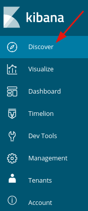
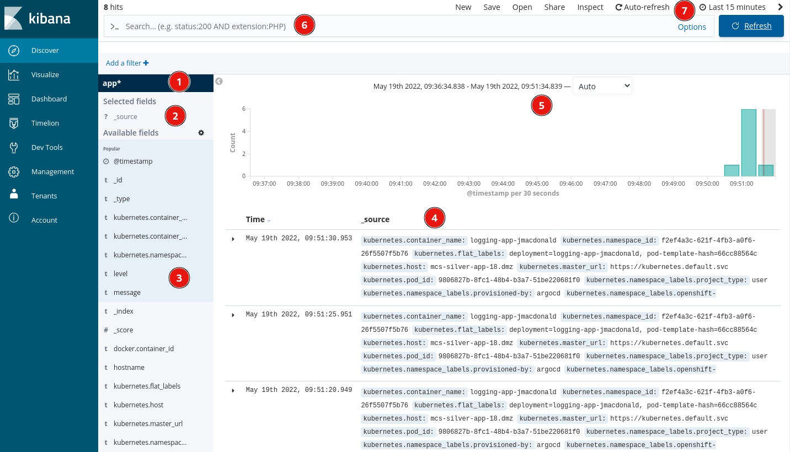
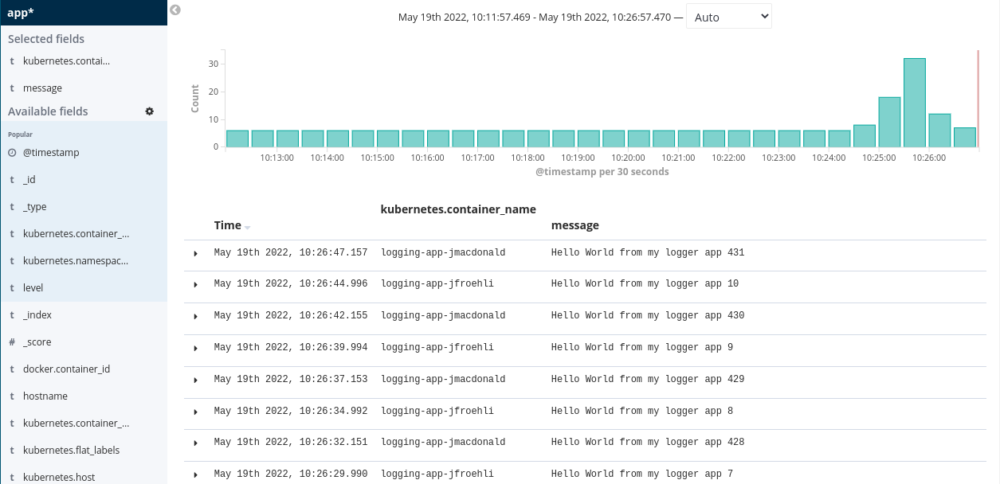
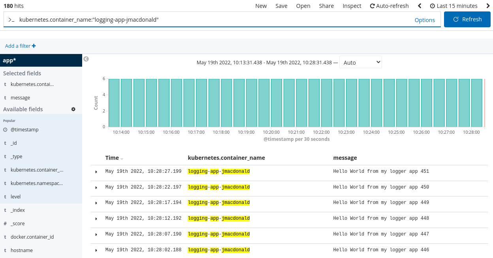
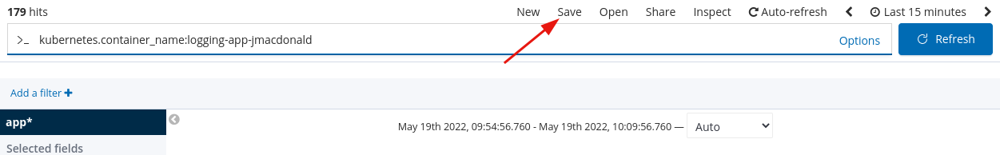
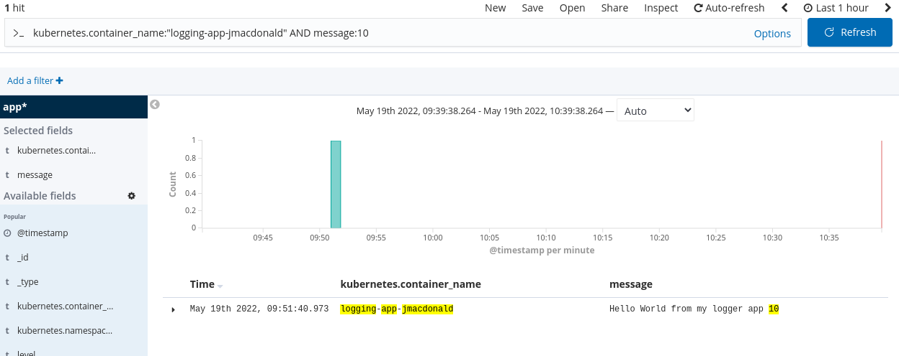
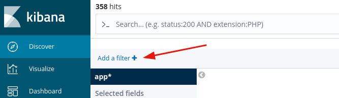
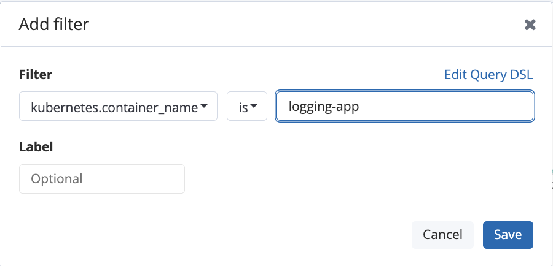

# Application Logging with Kibana

## Objectives:

After completing this section, you should know how to view application logs in Kibana, navigate the list of fields, and develop log queries.

## Prerequisites
All resources created in this lab should include your username so you do not clash with other lab participants.  If you set the `$USERNAME` environment variable to your username then you can easily copy/paste the commands below.  Just ensure your username contains only '-', '.' or lowercase alphanumberic characters.

example:
```bash
export USERNAME=jmacdonald
```

## Setup
We will setup a sample application that will produce a log entry every 5 seconds.

### Create a new application 
```bash
 oc new-app --name logging-app-$USERNAME \
 --context-dir=openshift-201/materials/logging \
 https://github.com/BCDevOps/devops-platform-workshops

```

You should see output similar to the follow:
<pre>
...<em>output omitted</em>...
    imagestream.image.openshift.io "logging-app-jmacdonald" created
    buildconfig.build.openshift.io "logging-app-jmacdonald" created
    deployment.apps "logging-app-jmacdonald" created
    service "logging-app-jmacdonald" created
--> Success
...<em>output omitted</em>...
</pre>


### Follow Build
Use the `oc logs` command to check the build logs from the `logging-app` build:
```bash
oc logs -f bc/logging-app-$USERNAME
```
<pre>
...<em>output omitted</em>...
Writing manifest to image destination
Storing signatures
...<em>output omitted</em>...
Push successful
</pre>

## Kibana

### Accessing Kibana
You can access Kibana directly at this [url](https://kibana-openshift-logging.apps.silver.devops.gov.bc.ca/) or it is also accessable from the OpenShift console.

Select the running pod that was just created:


Navigate to the Logs tab and click the `Show in Kibana` link


### First time Setup
If this is your first time logging in to Kibana you may see a screen to setup a search index.  See the steps in the Logging and Visualizations 101 lab [here](https://github.com/BCDevOps/devops-platform-workshops/blob/801b98ea01582e5585e80f736dcab8aa2dff4c36/101-lab/content/12_logging_and_visualizations.md#access-the-archive-link-from-a-pod)


### View Logs
To view logs click on the `Discover` tab on the left navigation pane.



By default you will see something like this:



1. Is your Index Pattern you created above.
2. Are the fields selected to show (`_source` is selected by default)
3. Are the Available Fields to choose
4. Is the results shown or the log entries that match the filter, search, ect.
5. Is the time frame shown
6. Is the search bar used to search for specific entries
7. Is the time frame chosen for the logs shown (default is last 15 minutes)

### Fields
Let's select 2 fields for viewing from the `Avaialbe feilds` panel on the left.

1. `kubernetes.container_name` - this is the name of the container running in kubernetes.  This should be `logging-app-$USERNAME`
2. `message` - is the message from our application

Your screen should look similar to following:



### Queries
Depending on how many other participants are in the lab you may see other `logging-app-$USERNAME` entries.  To only show your entries add the following in the search bar at the top and hit the `Enter` key or the `Update` button to the right of the search bar:
```
kubernetes.container_name:"logging-app-$USERNAME"
```
__NOTE:__ replace $USERNAME with your actual user name




Notice Kibana highlights your search term.

If you want to save your query (including the selected fields) click the save button at the top.



Let's say we are only interested in the messages with the number 10 in them.  Change the search terms to be the following:
```
kubernetes.container_name:"logging-app-$USERNAME" AND message:10
```
__NOTE__ if you aren't seeing results it may have been more than 15 minutes since the entry with the number 10 was logged.  If so, change the timefame in the upper right corner to `Last 30 minutes` or higher if needed.



### Filters
If you plan on doing a Google type search you can use a query.  If you are selecting a possible value from a drop down like the `kubernetes.container_name` it can be faster to use a filter.

Clear out the text in your search bar and then click the `Add a filter +` button just below the search bar:



Choose the `kubernetes.container_name` for the field, `is` as the operator and `logging-app-$USERNAME` (replacing $USERNAME with your username) as the value and then click save.



You should now only see your entries in the list similar to the query we performed above.  You can also save this filter by clicking the save button at the top just like we did with the query

## Conclusion
There are many fields available to choose from.  Feel free to experiment with adding other fields to your results.  For example you could add the `kubernetes.container_image` to your list if you are interested in looking at which version of the app the logs are from.

The queries we did in this lab are pretty simple.  Take a looka the [Kibana Query Language](https://www.elastic.co/guide/en/kibana/current/kuery-query.html) for more information on how to write complex queries.

### Clean up
To clean up the lab environment run the following command to delete all of the resources we created:
```bash
oc delete all -l app=logging-app-$USERNAME

deployment.apps "logging-app-jmacdonald" deleted
buildconfig.build.openshift.io "logging-app-jmacdonald" deleted
imagestream.image.openshift.io "logging-app-jmacdonald" deleted
```