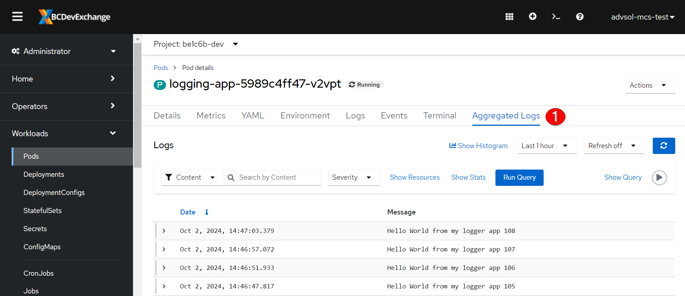

# Application Logging with Kibana

<kbd>[](https://youtu.be/VnpelRzTjOw)</kbd>

[Video walkthrough](https://youtu.be/VnpelRzTjOw)

## Objectives

After completing this section, you should know how to view application logs in Kibana, navigate the list of fields, and create/save queries.

## Setup

We will setup a sample application that will produce a log entry every 5 seconds.

### Create a new application

```bash
 oc -n [-dev] new-app --name logging-app \
 --context-dir=openshift-201/materials/logging \
 https://github.com/BCDevOps/devops-platform-workshops
```

You should see output similar to the follow:

```text
...<em>output omitted</em>...
    imagestream.image.openshift.io "logging-app-jmacdonald" created
    buildconfig.build.openshift.io "logging-app-jmacdonald" created
    deployment.apps "logging-app-jmacdonald" created
    service "logging-app-jmacdonald" created
--> Success
...<em>output omitted</em>...
```

### Follow Build

Use the `oc -n [-dev] logs` command to check the build logs from the `logging-app` build:

```bash
oc -n [-dev] logs -f bc/logging-app
```

```text
...<em>output omitted</em>...
Writing manifest to image destination
Storing signatures
...<em>output omitted</em>...
Push successful
```

## Loki

### Accessing Logs

You can access Loki in the OpenShift console in the Developer mode under Observe -> Logs.

<kbd></kbd>

Or, you can access it from a pods tabs.

Select the running pod that was just created

<kbd></kbd>

Navigate to the Aggregated Logs tab

<kbd></kbd>

### View Logs

By default you will see something like this:

<kbd></kbd>

1. You can select to filter on the content of logs, or by namespace, pod, or container name.
2. Current applied filters
3. This will show a bar chart of the number of logs per time period that match your filter
4. Time range to show logs for
5. Set the page to refresh the log results every X time period
6. Adds the namespace, pod, and container names to all the log entries displayed below
7. Some detailed stats on how your query was performed
8. Button to run the query again
9. Show the LogQL query being used
10. Log entries that match the filter, search, etc.

### Fields

Let's select 2 fields for viewing from the `Available fields` panel on the left.

1. `kubernetes.container_name` - this is the name of the container running in kubernetes.  This should be `logging-app`
2. `message` - is the message from our application

Your screen should look similar to following:

<kbd></kbd>

### Queries

Let's say we are only interested in the messages with the number 10 in them.  Change the search terms to be the following:

```text
kubernetes.container_name:"logging-app" AND message:10
```

__NOTE__ if you aren't seeing results it may have been more than 15 minutes since the entry with the number 10 was logged.  If so, change the timeframe in the upper right corner to `Last 30 minutes` or higher if needed.

<kbd></kbd>

Notice Kibana highlights your search term.

If you want to save your query (including the selected fields) click the save button at the top.

<kbd></kbd>

### Filters

If you plan on doing a Google type search you can use a query.  If you are selecting a possible value from a drop down like the `kubernetes.container_name` it can be faster to use a filter.

Clear out the text in your search bar and then click the `Add a filter +` button just below the search bar:

<kbd></kbd>

Choose the `kubernetes.container_name` for the field, `is` as the operator and `logging-app` as the value and then click save.

<kbd></kbd>

You should now only see your entries in the list similar to the query we performed above.  You can also save this filter by clicking the save button at the top just like we did with the query.

## Conclusion

There are many fields available to choose from.  Feel free to experiment with adding other fields to your results.  For example you could add the `kubernetes.container_image` to your list if you are interested in looking at which version of the app the logs are from.

The queries we did in this lab are pretty simple.  Take a look at the [Kibana Query Language](https://www.elastic.co/guide/en/kibana/current/kuery-query.html) for more information on how to write complex queries.

### Clean up

To clean up the lab environment run the following command to delete all of the resources we created:

```bash
oc -n [-dev] delete all -l app=logging-app

deployment.apps "logging-app" deleted
buildconfig.build.openshift.io "logging-app" deleted
imagestream.image.openshift.io "logging-app" deleted
```

Next topic - [Best Practices of Image Management](https://github.com/BCDevOps/devops-platform-workshops/blob/master/openshift-201/image-management.md)
