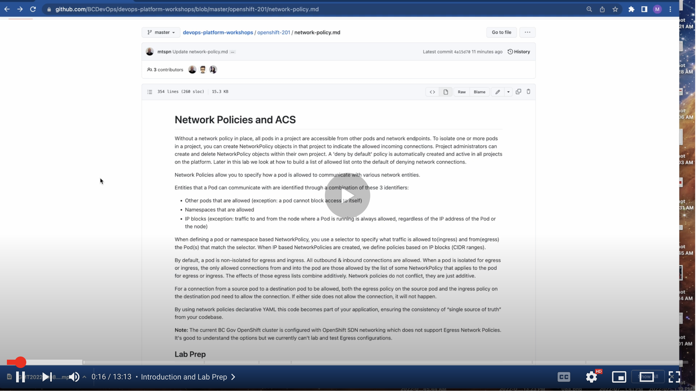
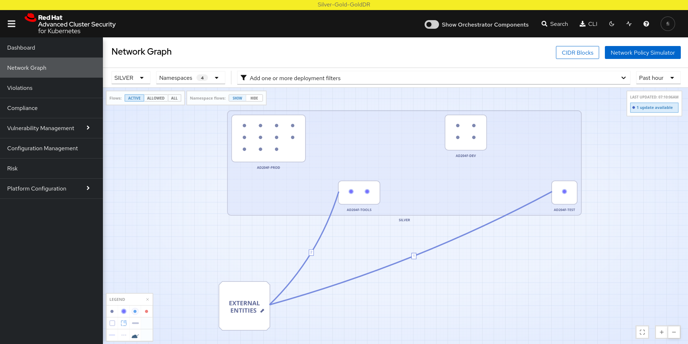

# Network Policies and ACS

[](https://youtu.be/Md7wrljdP44)

[Video walkthrough](https://youtu.be/Md7wrljdP44)

Without a network policy in place, all pods in a namespace are accessible from other pods and network endpoints. To isolate one or more pods in a namespace, you can create NetworkPolicy objects in that namespace to indicate the allowed incoming connections. Namespace administrators can create and delete NetworkPolicy objects within their own namespaces. A 'deny by default' policy is automatically created and active in all namespaces on the platform. Later in this lab we look at how to build a list of allowed list onto the default of denying network connections. 

Network Policies allow you to specify how a pod is allowed to communicate with various network entities.

Entities that a Pod can communicate with are identified through a combination of these 3 identifiers:
* Other pods that are allowed (exception: a pod cannot block access to itself)
* Namespaces that are allowed
* IP blocks (exception: traffic to and from the node where a Pod is running is always allowed, regardless of the IP address of the Pod or the node)

When defining a pod or namespace based NetworkPolicy, you use a selector to specify what traffic is allowed to(ingress) and from(egress) the Pod(s) that match the selector. When IP based NetworkPolicies are created, we define policies based on IP blocks (CIDR ranges).

By default in OpenShift, a pod is non-isolated for egress and ingress. All outbound & inbound connections are allowed. However, on the BCGov OpenShift platform, the `platform-services-controlled-deny-by-default` network policy is applied to all namespaces which blocks all ingress. This network policy will be automatically replaced if it is deleted.  
When a pod is isolated for egress or ingress, the only allowed connections from and into the pod are those allowed by the list of some NetworkPolicy that applies to the pod for egress or ingress. The effects of those egress lists combine additively. Network policies do not conflict, they are just additive.

For a connection from a source pod to a destination pod to be allowed, both the egress policy on the source pod and the ingress policy on the destination pod need to allow the connection. If either side does not allow the connection, it will not happen.

By using network policies declarative YAML this code becomes part of your application, ensuring the consistency of “single source of truth” from your codebase.

**Note:** The current BC Gov OpenShift cluster is configured with OpenShift SDN networking which does not support Egress Network Policies. It's good to understand the options but we currently can't lab and test Egress configurations.

## Lab Prep

If you have any network policies in your namespace please delete them. If you are using the web console, you can see networkpolicies under the network tab and delete them (other than the deny by default one called `platform-services-controlled-deny-by-default`). If you are doing this from the cli:

```shell
# get all the networkpolicies from this namespace
oc -n [-dev] get networkpolicy

# delete all the other networkpolicies with the name of them
oc -n [-dev] delete networkpolicy [name]
```

## Network Policy Structure


```yaml
apiVersion: networking.k8s.io/v1
kind: NetworkPolicy
metadata:
  name: test-network-policy
  namespace: default
spec:
  podSelector:
    matchLabels:
      role: db
  policyTypes:
    - Ingress
    - Egress
  ingress:
    - from:
        - ipBlock:
            cidr: 172.17.0.0/16
        - namespaceSelector:
            matchLabels:
              project: myproject
        - podSelector:
            matchLabels:
              role: frontend
      ports:
        - protocol: TCP
          port: 6379
  egress:
    - to:
        - ipBlock:
            cidr: 10.0.0.0/24
        - namespaceSelector:
            matchLabels:
              project: myproject
        - podSelector:
            matchLabels:
              role: frontend
      ports:
        - protocol: TCP
          port: 5978
```
* **namespace:** network polices are scoped to namespaces.
* **podSelector:** selects the grouping of pods to which the policy applies or empty podSelector selects all pods in the namespace.
* **policyTypes:** list which may include either Ingress, Egress, or both. 
* **ingress:** each rule allows traffic which matches both the from and ports sections.
* **egress:** each rule allows traffic which matches both the to and ports sections.
* **namespaceSelector:** This selects particular namespaces for which all Pods should be allowed as ingress sources or egress destinations.
* **ipBlock:** This selects particular IP CIDR ranges to allow as ingress sources or egress destinations. These should be cluster-external IPs, since Pod IPs are ephemeral and unpredictable.
* **ports.port:** The port on the given protocol. This can either be a numerical or named port on a pod. If this field is not provided, this matches all port names and numbers. If present, only traffic on the specified protocol AND port will be matched.
* **ports.protocol:** The protocol (TCP, UDP, or SCTP) which traffic must match. If not specified, this field defaults to TCP.
* **podSelector:** This selects particular Pods in the same namespace as the NetworkPolicy which should be allowed as ingress sources or egress destinations.


**NOTE:** namespaceSelector and podSelector can be used together in A single to/from entry that selects particular Pods within particular namespaces. Be careful to use correct YAML syntax!

```yaml
  ingress:
  - from:
    - namespaceSelector:
        matchLabels:
          user: alice
      podSelector:
        matchLabels:
          role: client
```

contains a single from element allowing connections from Pods with the label role=client in namespaces with the label user=alice. But this policy:

```yaml
  ingress:
  - from:
    - namespaceSelector:
        matchLabels:
          user: alice
    - podSelector:
        matchLabels:
          role: client
```

contains two elements in the from array, and allows connections from Pods in the local Namespace with the label role=client, or from any Pod in any namespace with the label user=alice.

## Deny By Default Policy

You'll notice that there is a `platform-services-controlled-deny-by-default` network policy in your namespace that will show up even if you delete it! This is controlled by the platform administrators.

```yaml
kind: NetworkPolicy
apiVersion: networking.k8s.io/v1
metadata:
  name: platform-services-controlled-deny-by-default
  namespace: ad204f-dev
  labels:
    devops.gov.bc.ca/argocd-app: ad204f
    environment: dev
    name: ad204f
    provisioned-by: argocd
spec:
  podSelector: {}
  policyTypes:
    - Ingress
```
The deny by default network policy is there to enforce the zero trust networking or walled garden pattern. So we start by denying all then build our allow list.

You should still have your `hello-world-nginx` deployment and pod(s) up and running from the [Resource Management](resource-mgmt.md) lab. If not, then create these and/or make sure they are running before you proceed.

You should also have a service and route pointing to these pods.

Lets get a list of the pods in our namespace. Scale your deployment to make sure you've got at least 2 pods running. You can do this with the `oc scale` command for your hello-world-nginx deployment, or use the web console to edit the pod count for the deployment.

```
oc -n [-dev] get pods -o wide 
NAME                                 READY   STATUS    AGE     IP              NODE                   
hello-world-nginx-599d5d8898-2k9n2   1/1     Running   8d      10.97.128.134   mcs-silver-app-32.dmz  
hello-world-nginx-599d5d8898-6q67s   1/1     Running   8d      10.97.58.168    mcs-silver-app-44.dmz  
```

Lets test the `deny-by-default` network policy and see if we can curl the http server running in one pod from another pod. Update the command below based on your pod name and pod ip address.

`oc -n [-dev] rsh [pod1 name] curl -v [pod2 ip]:8080`

so:

`oc -n [-dev] rsh hello-world-nginx-599d5d8898-2k9n2 curl -v 10.97.58.168:8080`

The curl command should not complete and eventually time out.

You can also try to navigate to the route URL from your browser.

https://route-https-ad204f-dev.apps.silver.devops.gov.bc.ca/

This should also fail. If it does seem to be working try from a incognito window or clearing your browsers cache.

## Allow from the same namespace

We've confirmed ingress traffic to our pod and http server is being blocked. Lets now allow traffic from pods in the same namespace.

To make pods accept connections from other pods in the same namespace, but reject all other connections from pods in other namespaces, add the following NetworkPolicy object:

```yaml
kind: NetworkPolicy
apiVersion: networking.k8s.io/v1
metadata:
  name: allow-same-namespace
spec:
  podSelector: {}
  ingress:
  - from:
    - podSelector: {}
```

Lets try our curl command again.

`oc -n [-dev] rsh hello-world-nginx-599d5d8898-2k9n2 curl -v 10.97.58.168:8080`

We should now see "Hello, world..." returning from the curl command.

## Allow from OpenShift Router

Pod to pod communication is now working but accessing the route is still failing. 

As network traffic from the route flows through the OpenShift router pods to our http pods we'll need to allow traffic from those pods. We can do that with a `namespaceSelector` that matches the namespace the router pods live in.


```yaml
apiVersion: networking.k8s.io/v1
kind: NetworkPolicy
metadata:
  name: allow-from-openshift-ingress
spec:
  ingress:
  - from:
    - namespaceSelector:
        matchLabels:
          network.openshift.io/policy-group: ingress
  podSelector: {}
  policyTypes:
  - Ingress
```
Lets try to access the route from our browser, it should be working.

* https://route-https-ad204f-dev.apps.silver.devops.gov.bc.ca/


## Allow only from specific Pod & Port

If we want to only allow specific traffic to access a pod on a specific port we can do that too!

Lets add this network policy which applies to only specific pods:

```yaml
apiVersion: networking.k8s.io/v1
kind: NetworkPolicy
metadata:
  name: allow-nginx-2-to-mysql
spec:
  podSelector:
    matchLabels:
      name: mysql
  policyTypes:
    - Ingress
  ingress:
    - from:
        - podSelector:
            matchLabels:
              deployment: hello-world-nginx-2
      ports:
        - protocol: TCP
          port: 3306
```

Once we have our network policy in place we'll need to set up some more pods to test. Lets scale our existing `hello-world-nginx` deployment down to 1 pod to make things more straight forward. Keep in mind if you have any autoscalers in place.

Create another deployment identical to `hello-world-nginx` that is instead called `hello-world-nginx-2`

```yaml
apiVersion: apps/v1
kind: Deployment
metadata:
  name: hello-world-nginx-2
spec:
  replicas: 1
  selector:
    matchLabels:
      deployment: hello-world-nginx-2
  strategy:
    rollingUpdate:
      maxSurge: 25%
      maxUnavailable: 25%
    type: RollingUpdate
  template:
    metadata:
      annotations:
      labels:
        deployment: hello-world-nginx-2
    spec:
      containers:
      - image: quay.io/redhattraining/hello-world-nginx:v1.0
        name: hello-world-nginx-2
        resources:
          requests:
            cpu: "10m"
            memory: 20Mi
          limits:
            cpu: "80m"
            memory: 100Mi
        ports:
        - containerPort: 8080
          protocol: TCP

```

From the developer catalog deploy the `MySQL (Ephemeral)` template. We can use all the default options.

So we should have at least 3 pods running. 1 mysql pod, 1 hello-world-nginx, and 1 hello-world-nginx2 pod.


Let's do some testing! First lets get our pod list.

```
oc -n [-dev] get pods -o wide 
NAME                                   READY   STATUS     AGE   IP             NODE                    
hello-world-nginx-2-6fd5855c9b-q86jz   1/1     Running    17h   10.97.138.81   mcs-silver-app-29.dmz
hello-world-nginx-599d5d8898-6q67s     1/1     Running    13d   10.97.58.168   mcs-silver-app-44.dmz 
mysql-1-w7h95                          1/1     Running    17h   10.97.41.145   mcs-silver-app-11.dmz 
```
Lets try to connect from our `hello-world-nginx-2` pod to our mysql pod. Your command should look something similar.

`oc -n [-dev] rsh hello-world-nginx-2-6fd5855c9b-q86jz curl -v telnet://10.97.41.145:3306`

We should get a response with probably some warnings but we should also see a connected response.

`* Connected to 10.97.41.145 (10.97.41.145) port 3306 (#0)`

Great our rule is working! Lets now test from our `hello-world-nginx` pod which should NOT work.

`oc -n [-dev] rsh hello-world-nginx-599d5d8898-6q67s curl -v telnet://10.97.41.145:3306`

Oh strange that seems to be working also. Ah from above we have a `allow-same-namespace` network policy. Remember network policies are additive so having the allow-same-namespace and this network policy in place means they are working together. The allow-same-namespace is letting all traffic between pods. Let's delete the `allow-same-namespace` network policy now and test again.

`oc [-n] rsh hello-world-nginx-599d5d8898-6q67s curl -v telnet://10.97.41.145:3306`

You should see the curl command running but no response is returning. Great! Our network policy is now working.

## ACS Network Graph

Lets now check out Red Hat Advanced Cluster Security (ACS) manager and see how we can visualize network policies!

You should be able to log into ACS by navigating to the URL: https://acs.developer.gov.bc.ca

If you have trouble logging in to ACS, please post in the lab rocketchat channel that was created for your live class, or if you're completing the course self-paced post [here](https://chat.developer.gov.bc.ca/channel/openshift-201-selfpaced).

Once logged in you should be able to click on `Network Graph` on the left navigation bar.

<kbd></kbd>

You will be scoped to see only your namespaces, so your network graph will not be identical to the image above.

We won't go through all the details for `Network Graph` web interface to get a better understanding please walkthrough the documentation:

* https://docs.openshift.com/acs/3.70/operating/manage-network-policies.html#network-graph-view_manage-network-policies


## ACS Simulating Network Policy

ACS allows us to visualize our Network Policy before we apply them. Lets test this out.

First lets save this network policy to a file locally. Make sure to update the namespace section.

```yaml
apiVersion: networking.k8s.io/v1
kind: NetworkPolicy
metadata:
  name: allow-nginx-to-mysql
  namespace: ad204f-dev **Update to your namespace name**
spec:
  podSelector:
    matchLabels:
      name: mysql
  policyTypes:
    - Ingress
  ingress:
    - from:
        - podSelector:
            matchLabels:
              deployment: hello-world-nginx
      ports:
        - protocol: TCP
          port: 3306
```

From the ACS `Network Graph` view click on `Network Policy Simulator` and click on the upload YAML button.

By hovering over the `hello-world-nginx` deployment in the web UI we should be able to see the added network flow that will apply.

You can close the `Network Policy Simulator` window now. You can apply network policy from ACS but it's best that your network policy YAML are stored with your code and applied via an automated method and not manually. The ACS `Network Policy Simulator` is great to visualize and confirm our network policy is correct before we apply it. 

### Generate network policies

There is also a section of `Network Policy Simulator` that can generate policies for us based on ACS observed network communication flows. There are a couple of points to take note of about this tooling:

* If a deployment already has a network policy, Red Hat Advanced Cluster Security for Kubernetes does not generate new policies or delete existing policies.
* Generated policies only restrict traffic to existing deployments.

So based on this we probably won't see any generated policy as we will always have at least 1 deny all network policy in place.

## ACS Network flows baseline

ACS will generate a baseline network flow for our deployments this can be viewed from the `Network Graph` section, clicking on a deployment, then `baseline settings`. Again this is handy to visualize but as we have a deny all default network policy in place we shouldn't see too much here that is different that what we set in our network policies. We may see some additional ports here for things like DNS and metrics.

From the `baseline settings` tab you can also click on `simulate baseline as network policy`. This will generate a YAML network policy file with rules for the observed baseline traffic.

Next topic - [Application Logging With Loki](https://github.com/BCDevOps/devops-platform-workshops/blob/master/openshift-201/logging.md)

## Links

* Existing documentation and walk through on Network Policy: https://developer.gov.bc.ca/TLDR
* https://docs.openshift.com/container-platform/4.8/networking/ovn_kubernetes_network_provider/about-ovn-kubernetes.html
* https://kubernetes.io/docs/concepts/services-networking/network-policies/
* https://docs.openshift.com/acs/3.70/operating/manage-network-policies.html
