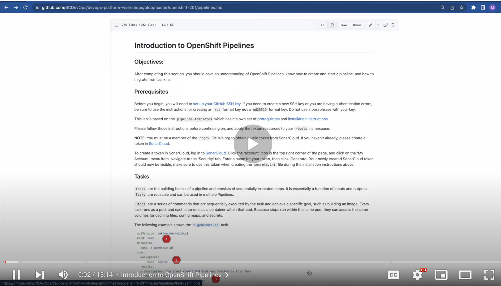

# Introduction to OpenShift Pipelines (maven demo)

<kbd>[](https://youtu.be/Nm-uS5S--HQ)</kbd>

[Video walkthrough](https://youtu.be/Nm-uS5S--HQ)

## Objectives:

After completing this section, you should have an understanding of OpenShift Pipelines, know how to create and start a pipeline, and how to migrate from Jenkins

As an alternative to this lab section, we also have another [pipeline lab exercise](https://github.com/BCDevOps/devops-platform-workshops/blob/master/openshift-201/react-pipeline.md) that uses react instead of maven. Please choose one of these to complete.

## Prerequisites
These instructions assume the use of a bash-based shell such as `zsh` (included on OS X) or [WSL](https://developer.gov.bc.ca/docs/default/component/platform-developer-docs/docs/openshift-projects-and-access/install-the-oc-command-line-tool/) for Windows. Please use one of these shells, or make the appropriate modifications to the commands shown in these instructions. 

This lab is based on the `pipeline-templates` which has it's own set of [prerequisites and installation instructions](https://github.com/bcgov/pipeline-templates/tree/main/tekton#install-in-docker-container). You'll need to choose either the docker installation method, or building on your own machine. If you follow the docker method shown in the video, you'll need to install and run [docker desktop](https://www.docker.com/).

Please follow those instructions before continuing on, and apply the tekton resources to your `-tools` namespace. 

**NOTE:** You must be a member of the `bcgov` GitHub org to obtain a valid token from SonarCloud.  If you haven't already, please create a token in [SonarCloud](https://sonarcloud.io/).

To create a token in SonarCloud, log in to [SonarCloud](https://sonarcloud.io/). Click the 'account' icon in the top right corner of the page, and click on the 'My Account' menu item. Navigate to the 'Security' tab. Enter a name for your token, then click 'Generate'. Your newly created SonarCloud token should now be visible, make sure to use this token when creating the `secrets.ini` file during the installation instructions above.

## Tasks
`Tasks` are the building blocks of a pipeline and consists of sequentially executed steps. It is essentially a function of inputs and outputs. `Tasks` are reusable and can be used in multiple Pipelines.

`Steps` are a series of commands that are sequentially executed by the task and achieve a specific goal, such as building an image. Every task runs as a pod, and each step runs as a container within that pod. Because steps run within the same pod, they can access the same volumes for caching files, config maps, and secrets.


The following example shows the [`t-generate-id`](https://github.com/bcgov/pipeline-templates/blob/main/tekton/base/tasks/generate-id.yaml) task.

<kbd>


1</kbd>. Defines the task API version and type of Kubernetes resource
2. Defines the workspaces (shared storage volumes) used by the task (optional)
3. Results define the output of the task that can be used by other tasks (optional)
4. This defines the steps to executed sequentially.  You can specify the name, image for the container and which script/command you want to run for this step

</br>

## Pipelines
A `Pipeline` is a collection of `Task` resources arranged in a specific order of execution. They are executed to construct complex workflows that automate the build, deployment and delivery of applications. You can define a CI/CD workflow for your application using pipelines containing one or more tasks.

The following example shows the [`mvn-build`](https://github.com/bcgov/pipeline-templates/blob/main/tekton/base/pipelines/maven.yaml) pipeline.


<kbd>


1</kbd>. Defines the Pipeline API version and type of Kubernetes resource
2. Defines the parameters (inputs) used in this Pipeline
3. Defines the workspaces (shared storage volumes) used by the Pipeline
4. Defines the tasks in the Pipeline.
    - `taskRef`: Refers to the task to run
    - `runAfter`: Allows for ordering of tasks (otherwise, the default is run in parallel)
    - `params`: inputs to the task
    - `workspaces`: shared storage volumes for the task


</br>

The details of the pipeline are as follows:
<kbd>

No</kbd>tice the `mvn-run` and `mvn-sonar-scan` tasks are run in parallel.  The triangle before the `mvn-sonar-scan` indicates a `when` condition as shown here:
```yaml
 - name: mvn-sonar-scan
    when:
    - input: "$(params.runSonarScan)"
        operator: in
        values: ["true"]
```
This is checking the `runSonarScan` parameter defined in the `Pipeline` and if `true` will run this `Task`.  Otherwise, it will be skipped.

## Running a Pipeline
Pipelines can be triggered either manually by creating a `PipelineRun` or automatically via a `Trigger`.  Let's manually create a `PipelineRun`.  This can be done via the command line by running:
```bash
cat <<EOF | kubectl create -f -
apiVersion: tekton.dev/v1beta1
kind: PipelineRun
metadata:
  generateName: mvn-build-run-
spec:
  pipelineRef:
    name: p-mvn-build
  params:
  - name: appName
    value: maven-test
  - name: repoUrl
    value: https://github.com/bcgov/pipeline-templates.git
  - name: branchName
    value: main
  - name: pathToContext
    value: ./tekton/demo/maven-test
  - name: mavenImage
    value: index.docker.io/library/maven
  - name: runSonarScan
    value: 'true'
  - name: sonarProject
    value: bcgov_pipeline-templates
  workspaces:
  - name: shared-data
    volumeClaimTemplate:
      spec:
        accessModes:
        - ReadWriteOnce
        resources:
          requests:
            storage: 100Mi
  - name: maven-settings
    emptyDir: {}
EOF
```
**Note: You may get an error similar to below, this is expected and you can continue with lab exercise**

```
E0308 09:52:04.872808   44101 memcache.go:255] couldn't get resource list for external.metrics.k8s.io/v1beta1: Got empty response for: external.metrics.k8s.io/v1beta1
pipelinerun.tekton.dev/mvn-build-run-65k2j
```

or via the OpenShift Console by performing the following:

<kbd></kbd>

After you've selected the `p-mvn-build` then do the following:

<kbd></kbd>

Then proceed to fill out the following form:

<kbd>

On</kbd>ce complete press the start button and a new `PipelineRun` will start:

<kbd>

Af</kbd>ter a few minutes the pipeline should succeed:

<kbd>


></kbd> Note: You'll see an error message from the SonarCloud scan step about "Sonar project doesn't exist". This is expected, there is no real project created in Sonarcloud. For the demonstration purpose, as long as the PipelineRun completes, then things are good!

> Note: If a new pipelineRun is failing with message about out of resource quota, then it's time for you to clean up some of the existing one to save up the space there. You can either go to the console Pipeline page and delete individual `PipelineRun` or through oc cli:

```
oc get pipelinerun
oc delete pipelinerun <name>
```

## Triggers
As mentioned before triggers can be used to automatically start a pipeline.  An example of this is a git web hook (triggering the pipeline when a merge request happens).

Triggers consist of the following main resources: TriggerBinding, TriggerTemplate and EventListener. The following example source code can be found [here](https://github.com/bcgov/pipeline-templates/blob/main/tekton/base/triggers/trigger-maven-build.yaml).

### TriggerBinding
Trigger Bindings extract field from an event payload and stores them as parameters.


<kbd>

1.</kbd> `branchName` parameter will be pulled from the body of the event, with the assigned value of `ref`
2. `contenttype` parameter will be pulled from the header of the event, with the assigned value of the `Content-Type` header.

Given the following http request:

**Headers**
```
Content-Type: application/json
User-Agent: Mozilla/5.0
```

**Body**
```json
{
  "ref": "main",
  "repository": {
    "url": "https://github.com/bcgov/pipeline-templates.git"
  }
}
```

The value of `branchName` would be `main` and the value of `contenttype` would be `application/json`

**NOTE:** Fields in your corresponding `TriggerTemplate` **must** match fields defined in the `TriggerBinding` in order for the mapping to occur

### TriggerTemplate
Trigger Templates receive input from the `TriggerBinding`, and then performs a series of action that result in the initiation of a new pipeline run.

<kbd>

1.</kbd> Parameters defined by this `TriggerTemplate`.  These usually include parameters needed to start a pipeline.  **Note:** in order to map values from the `TriggerBinding` these parameter names **must** match the parameter names in the `TriggerBinding`
2. `pipelineRef` defines the pipeline that this trigger template will start.
3. Parameters from TriggerTemplate can be referenced via `$(tt.params.<PARAM-NAME>)`.  Where `tt` stands for trigger template and `<PARAM-NAME>` is the name of the parameter you'd like to reference.

### EventListener
Provides an endpoint that listens for incoming HTTP-based event with JSON payload.  It will extract event parameters for each `TriggerBinding` and creates resources as specified by the `TriggerTemplate`

<kbd>

1.</kbd> Specifies the `ServiceAccount` that will be used to instantiate resources
2. Interceptors act as a filter and will process event payload data before passing it to the `TriggerBinding`.  In this case it will use a built in `github` interceptor and validate the webhook secret along with the `EventType` of the webhook.
3. Defines the `TriggerBindings` to be used in this `EventListener`
4. Defines the `TriggerTemplate` to be used in this `EventListener`

When the `EventListener` is created OpenShift will automatically create a `Service` and `Pod` to handle events

<kbd></kbd>

<kbd>

Fo</kbd>r the purposes of this lab we will edit the `EventListener` named `maven-build-event-listener` to remove the GitHub `secretRef`.  This is **NOT** something you would do in production but to reduce the complexity of the lab we will remove it.

To remove the `secretRef` perform the following:
```bash
oc patch el maven-build-event-listener --type json -p '[{"op": "remove", "path":  "/spec/triggers/0/interceptors/0/params/0"}]'
```

You can run 
```bash
oc get el
```
to get a list of the event listeners, then:

```bash
oc get el maven-build-event-listener -o yaml
```
to view the yaml output of the EventListener that you just patched. 

The `interceptors` section of the `EventListener` should now look like the following:
```yaml
interceptors:
  - params:
      - name: eventTypes
        value:
          - pull_request
          - push
    ref:
      kind: ClusterInterceptor
      name: github
```

We will need to expose the `EventListener` to be used outside the cluster.  In the prerequisites step an `EventListener` was created named `maven-build-event-listener` as described above.

To expose the `EventListener` service perform the following:
```
oc expose svc/el-maven-build-event-listener
```

The host of your route can be obtained by performing the following:
```
oc get route el-maven-build-event-listener -o=jsonpath='{.spec.host}'
```

Or by viewing the routes in the OpenShift Console:

<kbd></kbd>

Now let's test it out!

First thing first, let's create a network policy to allow traffic to the eventListener pod:

```bash
cat <<EOF | kubectl create -f -
apiVersion: networking.k8s.io/v1
kind: NetworkPolicy
metadata:
  name: allow-from-openshift-ingress-to-eventlistener
  labels:
    eventlistener: maven-build-event-listener
spec:
  ingress:
    - from:
        - namespaceSelector:
            matchLabels:
              network.openshift.io/policy-group: ingress
  podSelector: {}
  policyTypes:
    - Ingress
EOF
```

To simulate a github webhook perform the following replacing `$HOST` with the value you received in the previous step

```bash
curl -k -d '{"ref":"main","repository":{"url":"https://github.com/bcgov/pipeline-templates.git"}}' \
-H "Content-Type: application/json" \
-H "X-GitHub-Event: push" \
http://$HOST
```

This should produce output similar to the following:
```json
{"eventListener":"maven-build-event-listener","namespace":"ad204f-test","eventListenerUID":"cfad4b21-3fa0-44ad-98b6-5b37fbcac5d6","eventID":"523e43d4-6c92-4379-aac1-cbae2d43a5d0"}
```

If you now look at the pipelines you should see a new `PipelineRun` created and started just as if we manually started it from above.

**Note 1:** If your pipeline fails due to exceeding the storage quota on your namespace, delete any preivous 'PipelineRuns' on the namespace. This will delete the associated persistent volume claims (PVCs) which should give you sufficient storage space to run your pipeline.

**Note 2:** if you are creating your own pipelines in the future, you can use the 'pipeline builder' feature of the OpenShift web console. The can be accessed via the 'create' button on the Pipelines window of the web console. Since the 4.10 update, this pipeline builder will filter the tasks to show only those which are supported by the cluster. 

Next Topic - [Resource Management](https://github.com/BCDevOps/devops-platform-workshops/blob/master/openshift-201/resource-mgmt.md)
