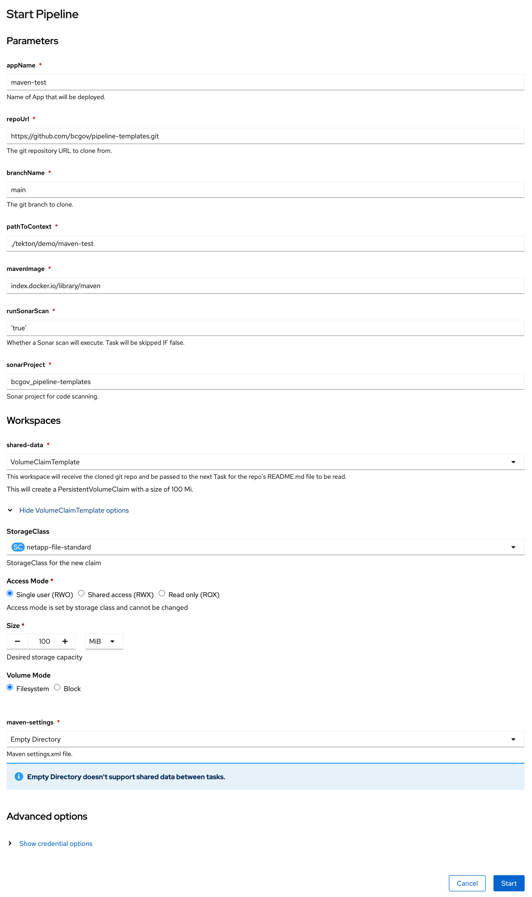

# Introduction to OpenShift Pipelines

## Objectives:

After completing this section, you should have an understanding of OpenShift Pipelines, know how to create and start a pipeline, and how to migrate from Jenkins

## Prerequisites
This lab is based on the `pipeline-templates` which has it's own set of [prerequisites](https://github.com/bcgov/pipeline-templates/tree/main/tekton#prerequisites) and [installation instructions](https://github.com/bcgov/pipeline-templates/tree/main/tekton#installation).

Please follow those instructions before continuing on.

## Tasks
`Tasks` are the building blocks of a pipeline and consists of sequentially executed steps. It is essentially a function of inputs and outputs. `Tasks` are reusable and can be used in multiple Pipelines.

`Steps` are a series of commands that are sequentially executed by the task and achieve a specific goal, such as building an image. Every task runs as a pod, and each step runs as a container within that pod. Because steps run within the same pod, they can access the same volumes for caching files, config maps, and secrets.


The following example shows the [`t-generate-id`](https://github.com/bcgov/pipeline-templates/blob/main/tekton/base/tasks/generate-id.yaml) task.


1. Defines the task API version and type of Kubernetes resource
2. Defines the workspaces (shared storage volumes) used by the task (optional)
3. Results define the output of the task that can be used by other tasks (optional)
4. This defines the steps to executed sequentially.  You can specify the name, image for the container and which script/command you want to run for this step

</br>

## Pipelines
A `Pipeline` is a collection of `Task` resources arranged in a specific order of execution. They are executed to construct complex workflows that automate the build, deployment and delivery of applications. You can define a CI/CD workflow for your application using pipelines containing one or more tasks.

The following example shows the [`mvn-build`](https://github.com/bcgov/pipeline-templates/blob/main/tekton/base/pipelines/maven.yaml) pipeline.


1. Defines the Pipeline API version and type of Kubernetes resource
2. Defines the parameters (inputs) used in this Pipeline
3. Defines the workspaces (shared storage volumes) used by the Pipeline
4. Defines the tasks in the Pipeline.
    - `taskRef`: Refers to the task to run
    - `runAfter`: Allows for ordering of tasks (otherwise, the default is run in parallel)
    - `params`: inputs to the task
    - `workspaces`: shared storage volumes for the task


</br>

The details of the pipeline are as follows:


Notice the `mvn-run` and `mvn-sonar-scan` tasks are run in parallel.  The triangle before the `mvn-sonar-scan` indicates a `when` condition as shown here:
```yaml
 - name: mvn-sonar-scan
    when:
    - input: "$(params.runSonarScan)"
        operator: in
        values: ["true"]
```
This is checking the `runSonarScan` parameter defined in the `Pipeline` and if `true` will run this `Task`.  Otherwise, it will be skipped.

## Running a Pipeline
Pipelines can be triggered either manually by creating a `PipelineRun` or automatically via a `Trigger`.  Let's manually create a `PipelineRun`.  This can be done via the command line by running:
```bash
cat <<EOF | kubectl create -f -
apiVersion: tekton.dev/v1beta1
kind: PipelineRun
metadata:
  generateName: mvn-build-run-
spec:
  pipelineRef:
    name: p-mvn-build
  params:
  - name: appName
    value: maven-test
  - name: mavenImage
    value: index.docker.io/library/maven
  - name: repoUrl
    value: git@github.com:bcgov/pipeline-templates.git
  - name: branchName
    value: main
  - name: pathToContext
    value: ./tekton/demo/maven-test
  - name: runSonarScan
    value: 'true'
  - name: sonarProject
    value: ci-testing
  workspaces:
  - name: shared-data
    volumeClaimTemplate:
      spec:
        accessModes:
        - ReadWriteOnce
        resources:
          requests:
            storage: 1Gi
  - name: ssh-creds
    secret:
      secretName: ssh-key-path
  - name: maven-settings
    emptyDir: {}
EOF
```
or via the OpenShift Console by performing the following:


After you've selected the `p-mvn-build` then do the following:


Then proceed to fill out the following form:


Once complete press the start button and a new `PipelineRun` will start:

