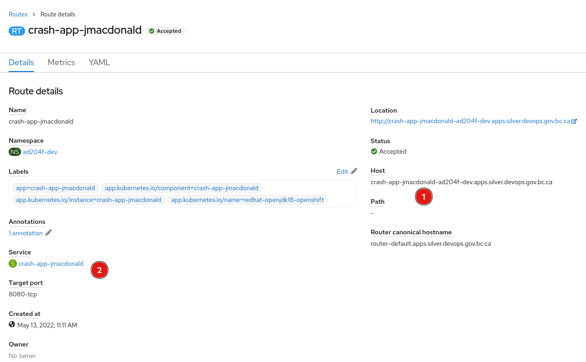
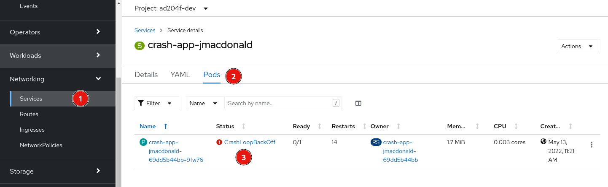
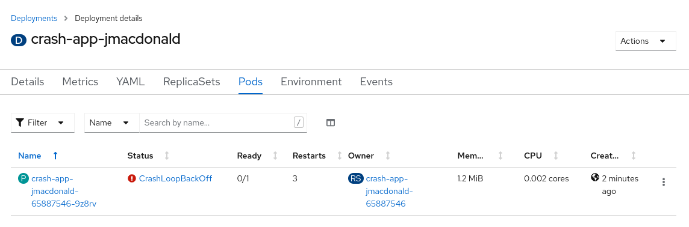

# Post Outage Checkup

## Objectives:

After completing this section, you should know what to do after there is an outage and how to handle common problems that may occur.

## Setup
We will setup a sample application and proceed with what steps should be taken after an outage occurs.

### Create a new application 
```bash
oc -n [-dev] new-app --name crash-app \
-i redhat-openjdk18-openshift:1.8 \
--context-dir=openshift-201/materials/post-outage-checkup/crash-app \
https://github.com/BCDevOps/devops-platform-workshops

```

You should see output similar to the follow:
<pre>
...<em>output omitted</em>...
    imagestream.image.openshift.io "crash-app" created
    buildconfig.build.openshift.io "crash-app" created
    deployment.apps "crash-app" created
    service "crash-app" created
--> Success
...<em>output omitted</em>...
</pre>

### Expose Application
Expose the application to external access:
```bash
oc -n [-dev] expose svc/crash-app
```

Perform the following command to get the host of the route we just exposed:
```bash
export MY_HOST=`oc get routes crash-app --no-headers | awk '{print $2}'`
```

or run `oc -n [-dev] get routes crash-app` and copy the host name.


### Follow Build
Use the `oc logs` command to check the build logs from the `crash-app` build:
```bash
oc -n [-dev] logs -f bc/crash-app
```
<pre>
...<em>output omitted</em>...
Writing manifest to image destination
Storing signatures
...<em>output omitted</em>...
Push successful
</pre>

## Post Outage Steps

### Verify Application is running
Our sample application should be running and you can access it using the following command:
```bash
curl http://$MY_HOST/hello
```
<pre>
&lt;html&gt;
...<em>output omitted</em>...
&lt;body&gt;
  &lt;div&gt;
    &lt;h1&gt;Application is not available&lt;/h1&gt;
    &lt;p&gt;The application is currently not serving requests at this endpoint. It may not have been started or is still starting.&lt;/p&gt;
...<em>output omitted</em>...
</pre>

We aren't getting what we expect and it looks as though there is an error.

### Verify the Route
Let's ensure our route is setup correctly.
```bash
oc -n [-dev] describe route/crash-app
```
<pre>
Name:             crash-app
...<em>output omitted</em>...
Requested Host:   crash-app-jmacdonald-ad204f-dev.apps.silver.devops.gov.bc.ca
			  exposed on router default (host router-default.apps.silver.devops.gov.bc.ca) 5 minutes ago
Service:	  crash-app
...<em>output omitted</em>...
</pre>

It looks as though we have a valid `Requested Host` and that our `Service` is hooked up to our route.

You could also verify the same in the console:


### Validate Service
Let's ensure our service has a valid pod attached to it.  In the console under Networking->Services click on our `crash-app` service and then the `Pods` tab.


It looks like we do have a pod attached but the `Status` is showing `CrashLoopBackOff`.
This usually indicates your application is failing to start.

__NOTE:__ depending on how fast you get here it may show the pod in an `Error` state but it will eventually get to the `CrashLoopBackOff` state 

### Observe CrashLoopBackOff
Let's take a look at the pods via the command line to validate the status:

```bash
oc -n [-dev] get pods

NAME                                 READY   STATUS             RESTARTS   AGE
crash-app-1-build         0/1     Completed          0          2m7s
crash-app-65887546-9z8rv  0/1     CrashLoopBackOff   1          52s

```

Viewing this from the console will see something like the following:


Use the new pod name shown above (the characters after `crash-app-` will be different for you) to display the output of the logs.
```bash
oc -n [-dev] logs crash-app-65887546-9z8rv
```
<pre>
Starting the Java application using /opt/jboss/container/java/run/run-java.sh ...
...<em>output omitted</em>...
Starting Crash App
Missing DEPLOY_ENV variable
...<em>output omitted</em>...
</pre>

__NOTE:__ Sometimes the restarting of the container occurs so quickly that you cannot see the log file.  You can add the `-p` or `--previous` option to the `oc logs` command to print the logs for the previous instance of the container in a pod if it exists.

As we can see we are missing a `DEPLOY_ENV` environment variable.  Let's set that on our deployment and see if we can resolve the `CrashLoopBackOff` error.

```bash
oc -n [-dev] set env deployment/crash-app DEPLOY_ENV='YES'
```

This should automatically redeploy the app.
```bash
oc -n [-dev] get pods

NAME                                  READY   STATUS              RESTARTS   AGE
crash-app-65887546-9z8rv   0/1     CrashLoopBackOff    0          4m27s
crash-app-c97b5b874-zsz2j  0/1     ContainerCreating   0          5s
```

Our pod should eventually get to and stay in the `Running` status.  We can check our logs again and verify it has started successfully

```bash
oc -n [-dev] logs crash-app-c97b5b874-zsz2j
```
<pre>
Starting the Java application using /opt/jboss/container/java/run/run-java.sh ...
...<em>output omitted</em>...
Starting Crash App
...<em>output omitted</em>...
... Started MyApp in 18.206 seconds (JVM running for 23.387)
</pre>

Now let's verify the app is accessible via the route.
```bash
curl http://$MY_HOST/hello

Hello world from Crash App
```

> Note: scale down the application to save resources with `oc scale deployment/crash-app --replicas=0`.

## Checklist
It is a good idea to create a checklist that has specifics for your application. We recommend that you create an issue template in github for your application which details all the specific things that you'll need to check to feel secure that your app is up and running after an outage.

Some other things to verify could include:
* __Database__ - validate the database is running and communication is working to the database.  It is also a good idea to check the database replication
* __CI/CD__ - Run a test pipeline to ensure everything is working as expected
* __Backups__ - Manually run the recovery test script to make sure that the most recent backup is working.
