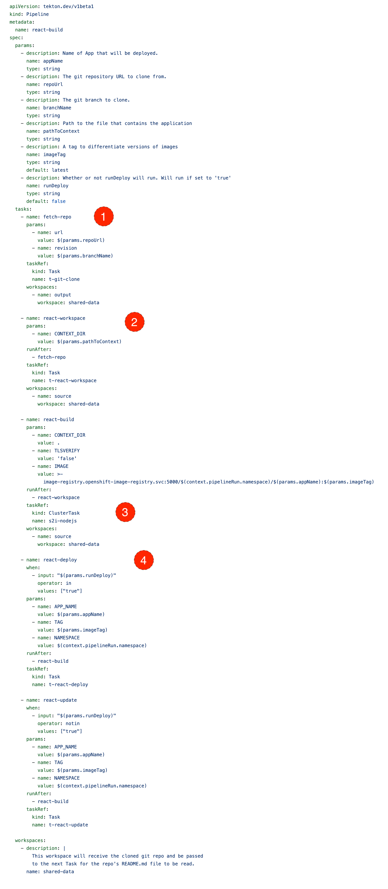
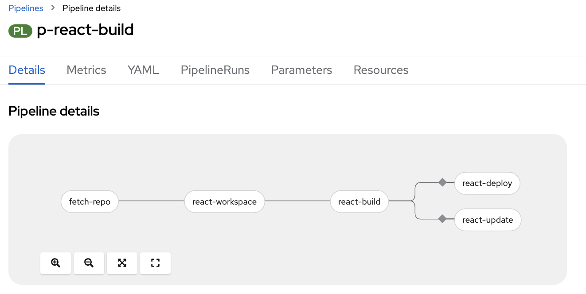
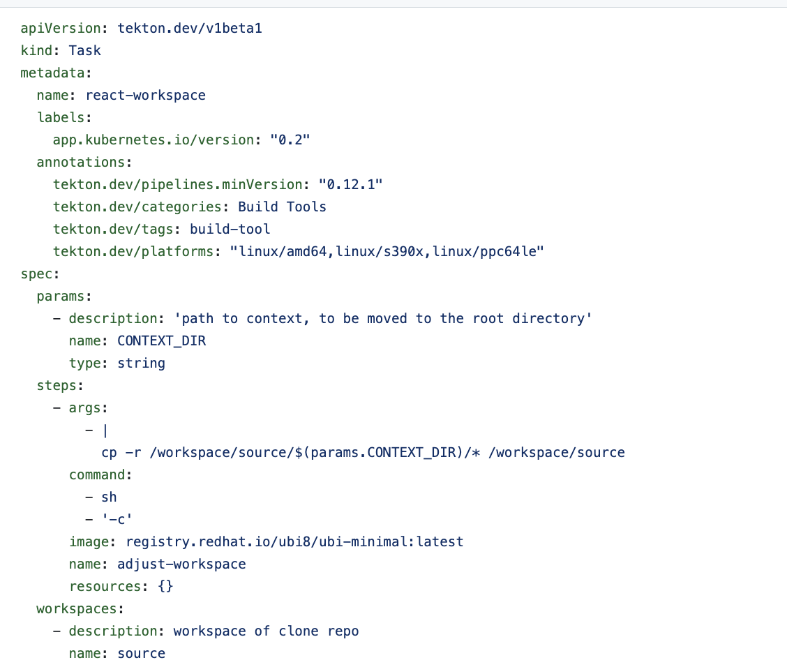
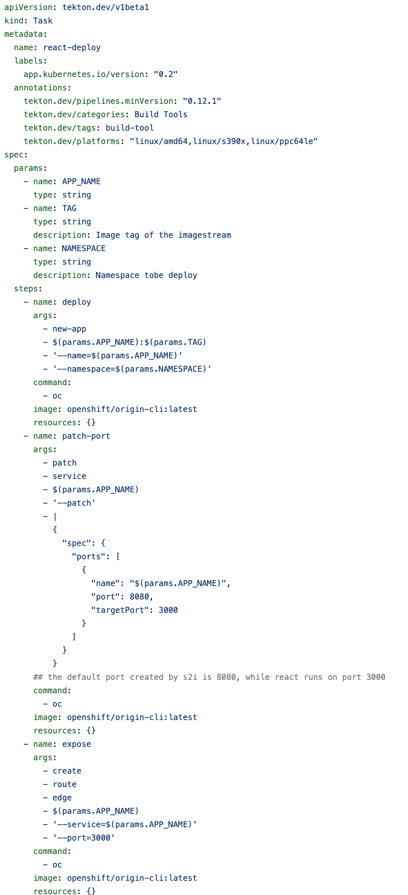
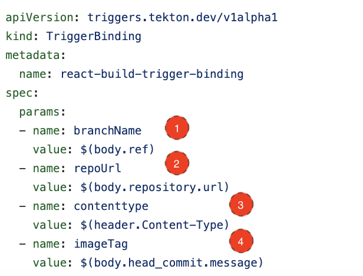
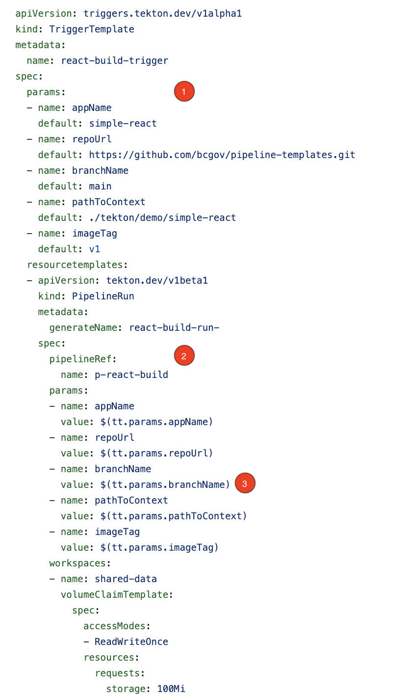
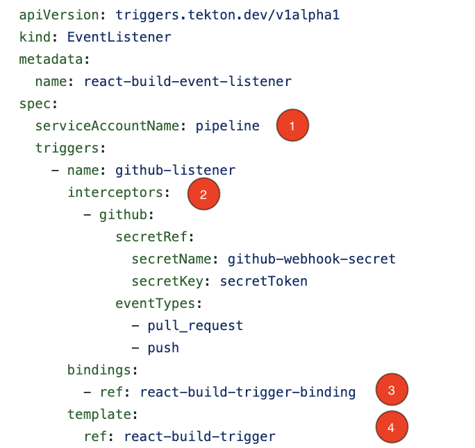
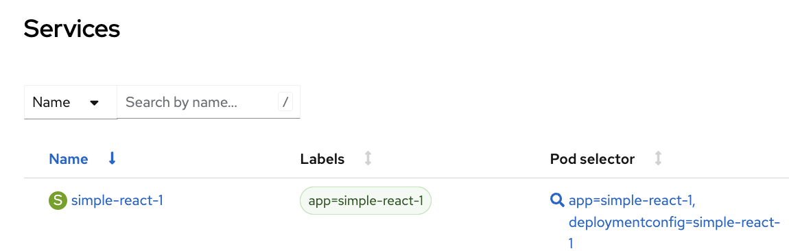
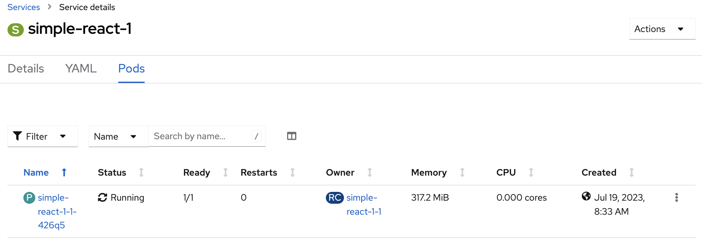
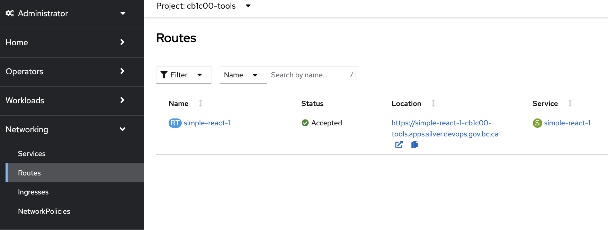

# Introduction to OpenShift Pipelines (react demo)

<kbd>[](https://youtu.be/NQT-7Cf2IVA)</kbd>
[Video walkthrough](https://youtu.be/NQT-7Cf2IVA)

## Objectives:

After completing this section, you should have a greater understanding of OpenShift Pipelines, and how to create tasks in order to deploy a react application. 

As an alternative, we also have another [pipeline lab exercise](https://github.com/BCDevOps/devops-platform-workshops/blob/master/openshift-201/pipelines.md) that uses `maven` instead of `react`. Please choose one of these to complete.

## Prerequisites
These instructions assume the use of a bash-based shell such as `zsh` (included on OS X) or [WSL](https://developer.gov.bc.ca/docs/default/component/platform-developer-docs/docs/openshift-projects-and-access/install-the-oc-command-line-tool/) for Windows. Please use one of these shells, or make the appropriate modifications to the commands shown in these instructions. 

This lab is based on the `pipeline-templates` which has it's own set of [prerequisites and installation instructions](https://github.com/bcgov/pipeline-templates/tree/main/tekton#install-in-docker-container). You'll need to choose either the docker installation method, or building on your own machine. If you follow the docker method shown in the video, you'll need to install and run [docker desktop](https://www.docker.com/).

Please follow those instructions before continuing on, and apply the tekton resources to your `-tools` namespace. 

## Pipeline Basics
### What is a Pipeline?
A pipeline refers to a set of automated processes and tools that enable the CI/CD of software applications. It's a fundamental concept that helps development and operations teams work together to streamline the software development lifecycle. A DevOps pipeline automates and orchestrates the steps required to build, test, and deploy software changes, ensuring a smooth and consistent flow of code from development to production.

### Pipelines in OpenShift
In OpenShift, pipelines are built with [Tekton](https://tekton.dev/), a Kubernetes-native framework that provides the building blocks for creating pipelines in OpenShift. Being Kubernetes-native essentially means that tekton acts as an OpenShift resource, managed using the same tools and principles as other OpenShift resources. 

## How This Pipeline Works
The `react-build` pipeline consists of 4 different tasks that run after one after the other. This pipeline will be triggered upon creating a `pipelineRun`,  and providing the required parameters. For this pipeline, the parameters include:

    - appName: Name for the app that will be deployed
    - repoURL: Git repository URL to clone from
    - branchName: Git branch to clone
    - pathToContext: The path to the file that contains the application
    - imageTag: A tag to differentiate versions of images
    - runDeploy: Whether or not runDeploy will run. Will run if set to 'true'

In this pipeline, `runDeploy` is not a mandatory parameter unless it is the first time you want to run the pipeline. Setting it to true basically deploys the application to your namespace, while anything else makes the pipeline update the image of the deployment. If the deployment already exists, `runDeploy` is not mandatory.

Besides these parameters, the pipelinerun is also required to provide a workspace. A workspace is similar to a Volume in openshift. In this pipeline, the workspace provides storage so that the different tasks can share the data that goes over the pipeline.

The following shows the [`react-build`](https://github.com/bcgov/pipeline-templates/blob/main/tekton/base/pipelines/react.yaml) pipeline.


<kbd></kbd>

1. The task that fetches the git repository. Provided the workspace, the result of this task will be stored in the workspace. In this case, the contents of the git repo will be stored in the directory `/workspace/source`
2. 'Fixes' the directory for the next task
3. This calls on a [`Clustertask`](https://tekton.dev/docs/pipelines/tasks/#task-vs-clustertask) that uses the s2i strategy to build an image of the application.
4. The last task deploys the application from an imagestream

The details of the pipeline are as follows:
<kbd></kbd>

Notice the diamond before `react-deploy` and `react-update`. This diamond indicates a `when` condition as shown here:
```yaml
- name: react-deploy
  when:
    - input: "$(params.runDeploy)"
      operator: in
      values: ["true"]
...
- name: react-update
when:
  - input: "$(params.runDeploy)"
    operator: notin
    values: ["true"]
```
This is checking the `runDeploy` parameter defined in the `Pipeline` and if `true` will run this `react-deploy` Task. Otherwise, the `react-update` Task will run instead. 


<br>

## Breakdown of Tasks
This pipeline is centered around the `s2i-nodejs` clusterTask, so the other tasks are built around said task to ensure that it works properly. To get a better understanding on how the clusterTasks work, you can use the following commands to view all the provided tasks that are present in the cluster and take a closer look at the `s2i-nodejs` task repectively
```bash
oc get clustertask
oc get clustertask/s2i-nodejs
```

### React Workspace

The following example shows the [`react-workspace`](https://github.com/bcgov/pipeline-templates/blob/main/tekton/base/tasks/react-workspace.yaml) task.

<kbd></kbd>


This task is fairly simple, but it shows how to run you bash commands in the pipeline. The idea behind this task is that s2i requires the source code to be in the `root` directory. Since the `fetch-repo` task clones the entire repository instead of just the demo app, we want to move it so that it is located in root. It is important to know that since we provided both `fetch-repo` and `react-worspace` with the same workspace, the location of the cloned git repo will be in `/workspace/source/`, with source being the name of the workspace that we gave to the tasks.

To initiate a bash command, we need a proper image and command. The `registry.redhat.io/ubi8/ubi-minimal:latest` image provide a lightweight foundation for building and running applications in containers, but it does not recognize your standard bash commands. So, we use `sh -c` to invoke the shell and instruct it to run the `cp` command written as args to accomplish our goal. 

</br>

### Building the image with s2i
After 'fixing' the workspace, the s2i ClusterTask will run, and provide an image in the form of an ImageStream. If an imagestream with the same name is already present, s2i might encounter some problems creating a new one, which is why a unique Image tag should be provided. It is also good practice to provide an identifier as an imageTag, such as 'v1' or '1.0.0' when pushing it through Docker, Openshift, or any other tools.

The following example shows the [`react-deploy`](https://github.com/bcgov/pipeline-templates/blob/main/tekton/base/tasks/react-deploy.yaml) task.

### React-Deploy
<kbd></kbd>

Since we want to deploy our application to Openshift, we will need our tasks to run openshift commands such as `oc new-app`. Unilke the previous commands like `cp` that requires a bash, openshift requires a separate image, since running openshift commands requires the use of openshift's CLI. For this reason, we are using a different image, `openshift/origin-cli:latest`. After deploying from the imagestream, this task does 2 more things: 
  1. Reroute the service from 8080 (s2i default) to 3000 (react's default)
  2. Create a route for an accessible link
  
### React-Update
If we have already deployed the application to our namespace, `oc new app` will simply not work since a deployment of the same name already exists. For that reason, we will run a seperate task, that solely updates the image for our deployment. This task will run instead of `react-deploy` if the parameter `runDeploy` is not provided.

## Running a Pipeline
You can manually run a pipeline by creating a `PipelineRun` or automatically via a `Trigger`.  Let's manually create a `PipelineRun`.  This can be done via the command line by running:
```bash
cat <<EOF | kubectl create -f -
apiVersion: tekton.dev/v1beta1
kind: PipelineRun
metadata:
  generateName: react-build-run-
spec:
  pipelineRef:
    name: p-react-build
  params:
  - name: appName
    value: simple-react
  - name: repoUrl
    value: https://github.com/bcgov/pipeline-templates.git
  - name: branchName
    value: react-demo
  - name: pathToContext
    value: ./tekton/demo/simple-react
  - name: imageTag
    value: v1
  - name: runDeploy
    value: true
  workspaces:
  - name: shared-data
    volumeClaimTemplate:
      spec:
        accessModes:
        - ReadWriteOnce
        resources:
          requests:
            storage: 100Mi
EOF
```
Let's break down this pipelineRun so that we can understand what is required in a pipelineRun.

The pipelineRef refers to the pipeline name that we want to trigger. If you recall, the pipeline name in the examples shown above is `react-build` while our  pipelineRef here is `p-react-build`. This is due to how we applied our resources to Openshift, which is through either a tekton/docker script. The script that we provide automatically adds 'p-' and 't-' prefixes depending on whether they are a pipeline or task respectively.

For the params, it is important for you to first analyze the Pipeline that you want to run. We basically want to provide all the required params that is stated in the pipeline. What follows next is a workspace. The workspace is basically a Volume of storage that is given to the pipeline. It is important that we provide it with adequate storage, otherwise the pipeline will fail.

 **For the sake of this lab, our first run of the pipeline will require you to set the `runDeploy` param to `true` to ensure that our image is deployed to our namespace.**

> Note: If a new pipelineRun is failing with message about out of resource quota, then it's time for you to clean up some of the existing one to save up the space there. You can either go to the console Pipeline page and delete individual `PipelineRun` or through oc cli:

```
oc get pipelinerun
oc delete pipelinerun <name>
```

Let's see the application!
First thing first, let's create a network policy to allow traffic so that we can access the application:

```bash
cat <<EOF | kubectl create -f -
apiVersion: networking.k8s.io/v1
kind: NetworkPolicy
metadata:
  name: allow-from-openshift-ingress
spec:
  ingress:
    - from:
        - namespaceSelector:
            matchLabels:
              network.openshift.io/policy-group: ingress
  podSelector: {}
  policyTypes:
    - Ingress
EOF
```

You can now access the application by going to your topology view and clicking the open URL icon on your pod.

> **Note: Before continuing to the next sections, it is important to make sure that you have a properly deployed react application in your namespace.**

## Triggers
As mentioned before triggers can be used to automatically start a pipeline.  An example of this is a git web hook (triggering the pipeline when a merge request happens).

Triggers consist of the following main resources: (1)TriggerBinding, (2)TriggerTemplate, (3)EventListener. The following example source code can be found [here](https://github.com/bcgov/pipeline-templates/blob/main/tekton/base/triggers/trigger-react-build.yaml).

### (1) TriggerBinding
Trigger Bindings extract field from an event payload and stores them as parameters.


<kbd></kbd>
<IMAGE react-triggerbinding>

`react-build-trigger-binding` takes in 4 parameters.
1. `branchName` parameter will be pulled from the body of the event, with the assigned value of `ref`
2. `repoUrl` parameter will be pulled from the body of event, with the assigned value of `repository.url`
3. `contenttype` parameter will be pulled from the header of the event, with the assigned value of the `Content-Type` header.
4. `imageTag` parameter will be pulled from the body of event, with the assigned value of `head_commit.message`

Given the following http request:

**Headers**
```
Content-Type: application/json
User-Agent: Mozilla/5.0
```

**Body**
```json
{
  "ref": "main",
  "repository": {
    "url": "https://github.com/bcgov/pipeline-templates.git"
  },
  "head_commit": {
    "message": "latest"
  }
}
```

1. `branchName` = main
2. `repoUrl` = https://github.com/bcgov/pipeline-templates.git
3. `contenttype` =  application/json
4. `imageTag` = latest

**NOTE:** Fields in your corresponding `TriggerTemplate` **must** match fields defined in the `TriggerBinding` in order for the mapping to occur

### (2) TriggerTemplate
Trigger Templates receive input from the `TriggerBinding`, and then performs a series of action that result in the initiation of a new pipeline run.

<kbd></kbd>

1. Parameters defined by this `TriggerTemplate`.  These usually include parameters needed to start a pipeline.  
**Note:** in order to map values from the `TriggerBinding` these parameter names **must** match the parameter names in the `TriggerBinding`
2. `pipelineRef` defines the pipeline that this trigger template will start.
3. Parameters from TriggerTemplate can be referenced via `$(tt.params.<PARAM-NAME>)`.  Where `tt` stands for trigger template and `<PARAM-NAME>` is the name of the parameter you'd like to reference.

### (3) EventListener
Provides an endpoint that listens for incoming HTTP-based event with JSON payload.  It will extract event parameters for each `TriggerBinding` and creates resources as specified by the `TriggerTemplate`

<kbd></kbd>
<IMAGE react-eventlistener>

1. Specifies the `ServiceAccount` that will be used to instantiate resources
2. Interceptors act as a filter and will process event payload data before passing it to the `TriggerBinding`.  In this case it will use a built in `github` interceptor and validate the webhook secret along with the `EventType` of the webhook.
3. Defines the `TriggerBindings` to be used in this `EventListener`
4. Defines the `TriggerTemplate` to be used in this `EventListener`

When the `EventListener` is created OpenShift will automatically create a `Service` and `Pod` to handle events

<kbd></kbd>

<kbd></kbd>

For the purposes of this lab we will edit the `EventListener` named `react-build-event-listener` to remove the GitHub `secretRef`.  This is **NOT** something you would do in production but to reduce the complexity of the lab we will remove it.

To remove the `secretRef` perform the following:
```bash
oc patch el react-build-event-listener --type json -p '[{"op": "remove", "path":  "/spec/triggers/0/interceptors/0/params/0"}]'
```

You can run 
```bash
oc get el
```
to get a list of the event listeners, then:

```bash
oc get el react-build-event-listener -o yaml
```
to view the yaml output of the EventListener that you just patched. 

The `interceptors` section of the `EventListener` should now look like the following:
```yaml
interceptors:
  - params:
      - name: eventTypes
        value:
          - pull_request
          - push
    ref:
      kind: ClusterInterceptor
      name: github
```

We will need to expose the `EventListener` to be used outside the cluster.  In the prerequisites step an `EventListener` was created named `react-build-event-listener` as described above.

To expose the `EventListener` service perform the following:
```
oc expose svc/el-react-build-event-listener
```

The host of your route can be obtained by performing the following:
```
oc get route el-react-build-event-listener -o=jsonpath='{.spec.host}'
```

Or by viewing the routes in the OpenShift Console:

<kbd></kbd>

Now let's test it out!

To simulate a github webhook perform the following replacing `$HOST` with the value you received in the previous step

```bash
curl -k -d '{"ref":"main","repository":{"url":"https://github.com/bcgov/pipeline-templates.git"},"head_commit":{"message": "v3"}}' \
-H "Content-Type: application/json" \
-H "X-GitHub-Event: push" \
http://$HOST
```

This should produce output similar to the following:
```json
{"eventListener":"react-build-event-listener","namespace":"ad204f-test","eventListenerUID":"cfad4b21-3fa0-44ad-98b6-5b37fbcac5d6","eventID":"523e43d4-6c92-4379-aac1-cbae2d43a5d0"}
```

If you now look at the pipelines you should see a new `PipelineRun` created and started just as if we manually started it from above.

**Note 1:** If your pipeline fails due to exceeding the storage quota on your namespace, delete any preivous 'PipelineRuns' on the namespace. This will delete the associated persistent volume claims (PVCs) which should give you sufficient storage space to run your pipeline.

**Note 2:** if you are creating your own pipelines in the future, you can use the 'pipeline builder' feature of the OpenShift web console. The can be accessed via the 'create' button on the Pipelines window of the web console. Since the 4.10 update, this pipeline builder will filter the tasks to show only those which are supported by the cluster. 


Next Topic - [Resource Management](https://github.com/BCDevOps/devops-platform-workshops/blob/master/openshift-201/resource-mgmt.md)

