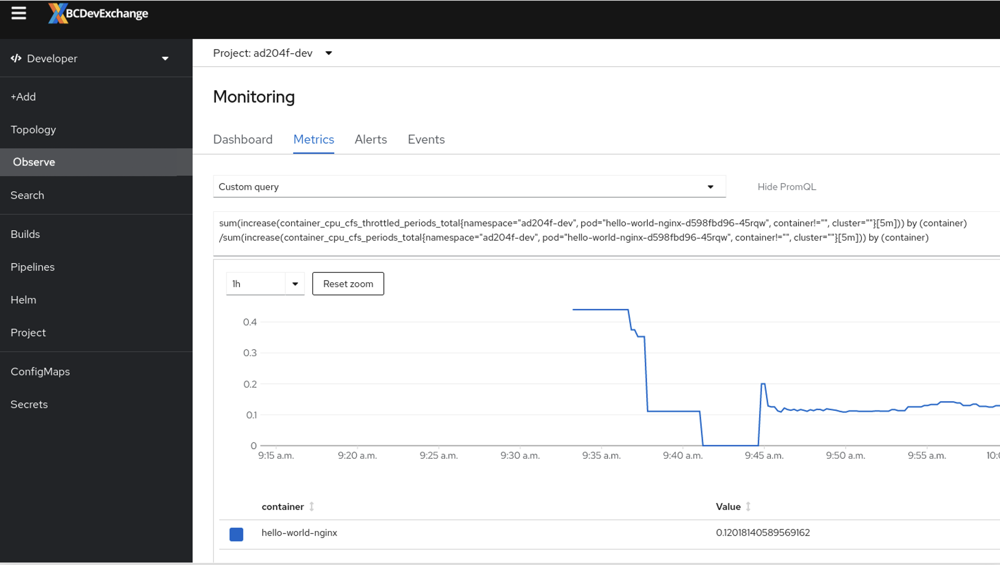

# Limiting Resource Usage by an Application

## Objectives:

After completing this section, you should be able to limit the resources consumed by containers, pods, and projects. 

## Defining Resource Requests and Limits for Pods. 

A pod definition can include both resource requests and resource limits:

**Resource requests:**
* Used for scheduling and to indicate that a pod cannot run with less than the specified amount of compute resources. The scheduler tries to find a node with sufficient compute resources to satisfy the pod requests. 

* If a node’s memory is exhausted, OpenShift Container Platform prioritizes evicting its containers whose memory usage most exceeds their memory request. In serious cases of memory exhaustion, the node OOM killer may select and kill a process in a container based on a similar metric.

**Resource limits:**
* Used to prevent a pod from using up all compute resources from a node. The node that runs a pod configures the Linux kernel cgroups feature to enforce the pod's resource limits.

* If the memory allocated by all of the processes in a container exceeds the memory limit, the node Out of Memory (OOM) killer will immediately select and kill a process in the container.

Resource request and resource limits should be defined for each container in either a Deployment, DeploymentConfiguration, StatefulSets, BuildConfigs, and CronJob. If requests and limits have not been defined, then you will find a resources: {} line for each container.

Lets create a deployment to test! Create this deployment in your project.

```
apiVersion: apps/v1
kind: Deployment
metadata:
  name: hello-world-nginx
spec:
  replicas: 1
  selector:
    matchLabels:
      deployment: hello-world-nginx
  strategy:
    rollingUpdate:
      maxSurge: 25%
      maxUnavailable: 25%
    type: RollingUpdate
  template:
    metadata:
      annotations:
      labels:
        deployment: hello-world-nginx
    spec:
      containers:
      - image: quay.io/redhattraining/hello-world-nginx:v1.0
        name: hello-world-nginx
        resources:
          requests:
            cpu: "10m"
            memory: 20Mi
          limits:
            cpu: "80m"
            memory: 100Mi
        ports:
        - containerPort: 8080
          protocol: TCP
```

You can use the oc edit command to modify a deployment or a deployment configuration, to ensure you use the correct indentation. Indentation mistakes can result in the editor refusing to save changes. To avoid indentation issues, you can use the oc set resources command to specify resource requests and limits. 

Lets modify our deployment using the following command:

```
[user@host ~]$ oc set resources deployment hello-world-nginx --requests cpu=15m,memory=25Mi --limits cpu=100m,memory=150Mi
```

This will cause the pod to re-deploy with updated resources.

If a resource quota applies to a resource request, then the pod should define a resource request. If a resource quota applies to a resource limit, then the pod 
should also define a resource limit. We recommend defining resource requests and limits always.

## Generate traffic and observe 

Let's expose our deployment from above with a service and a route.

* Expose the deployment with a service, the easiest way would be: `oc expose deployment/hello-world-nginx`
* Create an secure route with edge TLS termination from this service. This can be done from the web console or CLI.

Now that our Nginx web server has a route we can access, we can generate some traffic to it and see how our requests and limits settings work.

Create a new deployment. This will deploy an httpd container and use the ab (apache benchmark) command to generate traffic to a URL and then print a summary. Then the pod will stop. If you update the environment variables for the deployment that will trigger a pod redeployment to run the test again. Update the deployment below with the url to your Nginx web server under the SERVICE_HOST variable.

```
kind: Deployment
apiVersion: apps/v1
metadata:
  name: load-test
  labels:
    app: load-test
spec:
  replicas: 1
  selector:
    matchLabels:
      app: load-test
  template:
    metadata:
      annotations:
      labels:
        app: load-test
    spec:
      containers:
        - name: load-test
          image: registry.access.redhat.com/rhscl/httpd-24-rhel7
          env:
          - name: SERVICE_HOST
            value: "hello-world-lab1.apps.ocp4.example.com"
          - name: SERVICE_PORT
            value: "443"
          - name: REQUESTS
            value: "500000"
          - name: CONCURRENCY
            value: "20"
          command: ["/opt/rh/httpd24/root/usr/bin/ab"]
          args: ["-dSrk", "-c $(CONCURRENCY)", "-n $(REQUESTS)", "https://$(SERVICE_HOST):$(SERVICE_PORT)/index.html"]
  
```

From the web console if you change to developer view and navigate to the Monitoring tab select your nginx deployment. You should see the load-test pod traffic increasing metrics for our pod.

 

From the web console select your hello-world-nginx pod and navigate to the Metrics tab. We can see the traffic we are sending our pod is affecting the cpu quite a bit. In this example we can see the actual cpu usage is well over the request we set and  over 100% of the limit we set.


Because the actual cpu usage is higher than our cpu limit openshift/kubernetes will throttle the available cpu to our pod. This would affecting the performance of our web server and cause response times of our application.



You can create a custom PromQL query to view the CPU throttling by using this query and updating your pod name and namespace name:

```
sum(increase(container_cpu_cfs_throttled_periods_total{namespace="ad204f-dev", pod="hello-world-nginx-d598fbd96-45rqw", container!="", cluster=""}[5m])) by (container) /sum(increase(container_cpu_cfs_periods_total{namespace="ad204f-dev", pod="hello-world-nginx-d598fbd96-45rqw", container!="", cluster=""}[5m])) by (container)
```

We can see this load test isn't affecting the memory much on this pod and our values are probably set correct for this type of load and application running in the pod.


## Understanding overcommitment and quality of service classes

A node is overcommitted when it has a pod scheduled that makes no request, or when the sum of limits across all pods on that node exceeds available machine capacity.

In an overcommitted environment, it is possible that the pods on the node will attempt to use more compute resource than is available at any given point in time. When this occurs, the node must give priority to one pod over another. The facility used to make this decision is referred to as a Quality of Service (QoS) Class.

For each compute resource, a container is divided into one of three QoS classes with decreasing order of priority:


|Priority |Class Name |Description|
|---|---|---|
|1 (highest) |*Guaranteed* |If limits and optionally requests are set (not equal to 0) for all resources and they are equal, then the container is classified as *Guaranteed*.|
|2|*Burstable* |If requests and optionally limits are set (not equal to 0) for all resources, and they are not equal, then the container is classified as *Burstable*.|
|3 (lowest)|*BestEffort*|If requests and limits are not set for any of the resources, then the container is classified as *BestEffort*.|


Memory is an incompressible resource, so in low memory situations, containers that have the lowest priority are terminated first:

* Guaranteed containers are considered top priority, and are guaranteed to only be terminated if they exceed their limits, or if the system is under memory pressure and there are no lower priority containers that can be evicted.

* Burstable containers under system memory pressure are more likely to be terminated once they exceed their requests and no other BestEffort containers exist.

* BestEffort containers are treated with the lowest priority. Processes in these containers are first to be terminated if the system runs out of memory.


Do a `oc describe pod <podname>` and see what the value of `QoS Class:` is. Try setting the limits and requests to the same value for the hello world nginx deployment. Once the pod re-deploys check the QoS Class value again.

## Understanding eviction process

When a node in a OpenShift cluster is running out of memory or disk, it activates a flag signaling that it is under pressure. This blocks any new allocation in the node and starts the eviction process.

At that moment, kubelet starts to reclaim resources, killing containers and declaring pods as failed until the resource usage is under the eviction threshold again.

First, kubelet tries to free node resources, especially disk, by deleting dead pods and its containers, and then unused images. If this isn’t enough, kubelet starts to evict end-user pods in the following order:

* Best Effort.
* Burstable pods using more resources than its request of the starved resource.
* Burstable pods using less resources than its request of the starved resource.

You can see some messages like these if one of your pods is evicted by memory use:

```
NAME       READY   STATUS    RESTARTS   AGE
frontend   0/2     Evicted   0          10s
```

## Managing application cpu/memory strategy

The steps for sizing application cpu/memory on OpenShift Container Platform are as follows:

1. Determine expected container cpu/memory usage

Determine expected mean and peak container cpu/memory usage, empirically if necessary (for example, by separate load testing). Remember to consider all the processes that may potentially run in parallel in the container: for example, does the main application spawn any ancillary scripts?

2. Determine risk appetite

Determine risk appetite for eviction or throttling. If the risk appetite is low, the container should request cpu/memory according to the expected peak usage plus a percentage safety margin. Protect your critical pods setting values so they are classified as Guaranteed. If the risk appetite is higher, it may be more appropriate to request cpu/memory according to the expected mean usage.

3. Set container cpu/memory request

Set container cpu/memory request based on the above. The more accurately the request represents the application cpu/memory usage, the better. If the request is too high, cluster and quota usage will be inefficient. If the request is too low, the chances of application eviction increase.

4. Set container cpu/memory limit.

Setting a limit has the effect of immediately killing a container process or cpu throttling if the combined cpu or memory usage of all processes in the container exceeds the limit, and is therefore a mixed blessing. On the one hand, it may make unanticipated excess cpu/memory usage obvious early ("fail fast"); on the other hand it also terminates processes abruptly.

Limits should not be set to less than the expected peak container cpu/memory usage plus a percentage safety margin.

5. Ensure application is tuned

Ensure application is tuned with respect to configured request and limit values, if appropriate. This step is particularly relevant to applications which pool memory, such as the JVM. 

Try adjusting the limits and requests on our web server pod and running the load test again. Observe the results in the openshift dashboards and confirm the pod is not getting throttled. You can consult the ab program details as well - https://httpd.apache.org/docs/2.4/programs/ab.html and set the values to something your app/web server would be expecting at peak usage.

## Viewing Requests, Limits, and Actual Usage

The oc describe pod command displays requests and limits.

```
[user@host ~]$ oc describe pods
    Ready:          True
    Restart Count:  8
    Limits:
      cpu:     250m
      memory:  1Gi
    Requests:
      cpu:     50m
      memory:  256Mi
```

The oc adm top pods command shows actual usage. 

```
[user@host ~]$ oc adm top pods
NAME                                CPU(cores)   MEMORY(bytes)   
hello-world-nginx-d598fbd96-45rqw   69m          34Mi            
load-test-6798678dc-8tgjc           46m          6Mi            
```

The OpenShift web console also has numerous ways to view limits, requests and actual usage through the Metrics and Monitoring pages.

## Quotas 

OpenShift can enforce quotas that track and limit the use of two kinds of resources:

Object counts
The number of Kubernetes resources, such as pods, services, and routes.

Compute resources
The number of physical or virtual hardware resources, such as CPU, memory, and storage capacity.

Imposing a quota on the number of Kubernetes resources improves the stability of the OpenShift control plane by avoiding unbounded growth of the Etcd database. Quotas on Kubernetes resources also avoids exhausting other limited software resources, such as IP addresses for services.

In a similar way, imposing a quota on the amount of compute resources avoids exhausting the compute capacity of a single node in an OpenShift cluster. It also avoids having one application starve other applications in a shared cluster by using all the cluster capacity.

OpenShift manages quotas for the number of resources and the use of compute resources in a cluster by using a ResourceQuota resource, or a quota. A quota specifies hard resource usage limits for a project. All attributes of a quota are optional, meaning that any resource that is not restricted by a quota can be consumed without bounds.

Note:

Although a single quota resource can define all of the quotas for a project, a project can also contain multiple quotas. For example, one quota resource might limit compute resources, such as total CPU allowed or total memory allowed. Another quota resource might limit object counts, such as the number of pods allowed or the number of services allowed. The effect of multiple quotas is cumulative, but it is expected that two different ResourceQuota resources for the same project do not limit the use of the same type of Kubernetes or compute resource. For example, two different quotas in a project should not both attempt to limit the maximum number of pods allowed.


The following table describes some resources that a quota can restrict by their count or number:

|Resource Name|	Quota Description|
|----|-----|
|pods |	Total number of pods|
|replicationcontrollers |	Total number of replication controllers|
|services |	Total number of services|
|secrets |	Total number of secrets|
|persistentvolumeclaims |	Total number of persistent volume claims|

The following table describes some compute resources that can be restricted by a quota:

|Compute Resource Name|	Quota Description|
|---|----|
|cpu (requests.cpu)	Total |CPU use across all containers|
|memory (requests.memory)	|Total memory use across all containers|
|storage (requests.storage)|	Total storage requests by containers across all persistent volume claims|

Quota attributes can track either resource requests or resource limits for all pods in the project. By default, quota attributes track resource requests. Instead, to track resource limits, prefix the compute resource name with limits, for example, limits.cpu.

The following listing show a ResourceQuota resource defined using YAML syntax. This example specifies quotas for both the number of resources and the use of compute resources:

```
apiVersion: v1
kind: ResourceQuota
metadata:
  name: compute-long-running-quota
spec:
  hard:
    limits.cpu: 1500m
    limits.memory: 4Gi
    pods: "100"
    requests.cpu: 500m
    requests.memory: 2Gi
  scopes:
  - NotTerminating
  - NotBestEffort
```
Use the `oc get resourcequota` command to list available quotas, and use the oc describe resourcequota command to view usage statistics related to any hard limits defined in the quota, for example:

```
NAME                         AGE     REQUEST                                                           LIMIT
compute-best-effort-quota    2d23h   pods: 0/3                                                                                                                                               
compute-long-running-quota   2d23h   pods: 2/100, requests.cpu: 60m/500m, requests.memory: 276Mi/2Gi   limits.cpu: 330m/1500m, limits.memory: 1124Mi/4Gi
compute-time-bound-quota     2d23h   pods: 0/100, requests.cpu: 0/500m, requests.memory: 0/2Gi         limits.cpu: 0/1500m, limits.memory: 0/4Gi
```

Without arguments, the `oc describe quota` command displays the cumulative limits set for all ResourceQuota resources in the project:

```
Name:       compute-long-running-quota
Namespace:  ad204f-dev
Scopes:     NotBestEffort, NotTerminating
 * Matches all pods that have at least one resource requirement set. These pods have a burstable or guaranteed quality of service.
 * Matches all pods that do not have an active deadline. These pods usually include long running pods whose container command is not expected to terminate.
Resource         Used    Hard
--------         ----    ----
limits.cpu       330m    1500m
limits.memory    1124Mi  4Gi
pods             2       100
requests.cpu     60m     500m
requests.memory  276Mi   2Gi
```
Also getting the yaml output of a quota will show the status of the quota.

```
status:
  hard:
    limits.cpu: 1500m
    limits.memory: 4Gi
    pods: "100"
    requests.cpu: 500m
    requests.memory: 2Gi
  used:
    limits.cpu: 330m
    limits.memory: 1124Mi
    pods: "2"
    requests.cpu: 60m
    requests.memory: 276Mi
```

Important:

ResourceQuota constraints are applied for the project as a whole, but many OpenShift processes, such as builds and deployments, create pods inside the project and might fail because starting them would exceed the project quota.


If a modification to a project exceeds the quota for a resource count, then OpenShift denies the action and returns an appropriate error message to the user. However, if the modification exceeds the quota for a compute resource, then the operation does not fail immediately; OpenShift retries the operation several times, giving the administrator an opportunity to increase the quota or to perform another corrective action, such as bringing a new node online.
Important

If a quota that restricts usage of compute resources for a project is set, then OpenShift refuses to create pods that do not specify resource requests or resource limits for that compute resource. To use most templates and builders with a project restricted by quotas, the project must also contain a limit range resource that specifies default values for container resource requests.

Quota scopes

Each quota can have an associated set of scopes. A quota only measures usage for a resource if it matches the intersection of enumerated scopes.

Adding a scope to a quota restricts the set of resources to which that quota can apply. Specifying a resource outside of the allowed set results in a validation error.

| Scope | Description|
|---|---|
|Terminating | Match pods where spec.activeDeadlineSeconds >= 0.|
| NotTerminating | Match pods where spec.activeDeadlineSeconds is nil.|
| BestEffort | Match pods that have best effort quality of service for either cpu or memory.|
| NotBestEffort| Match pods that do not have best effort quality of service for cpu and memory.|

You'll notice there are a few quotas within the BC Gov OpenShift projects. Have a look at quota details and see how much has been consumed.
## Limit Ranges

A LimitRange resource, also called a limit, defines the default, minimum, and maximum values for compute resource requests, and the limits for a single pod or container defined inside the project. 

To understand the difference between a limit range and a resource quota, consider that a limit range defines valid ranges and default values for a single container, and a resource quota defines only top values for the sum of all pods in a project. 

A cluster administrator concerned about resource usage in an OpenShift cluster usually defines both limits and quotas for a project.

A limit range resource can also define default, minimum, and maximum values for the storage capacity requested by an image, image stream, or persistent volume claim. 

If a resource that is added to a project like a new pod does not provide a compute resource request, then it takes the default value provided by the limit ranges for the project. If a new resource provides compute resource requests or limits that are smaller than the minimum specified by the project limit ranges, then the resource is not created. Similarly, if a new resource provides compute resource requests or limits that are higher than the maximum specified by the project limit ranges, then the resource is not created.

The following listing shows a limit range defined using YAML syntax:

```
apiVersion: "v1"
kind: "LimitRange"
metadata:
  name: "dev-limits"
spec:
  limits:
    - type: "Pod"
      max: (1)
        cpu: "500m"
        memory: "750Mi"
      min: (2)
        cpu: "10m"
        memory: "5Mi"
    - type: "Container"
      max: (3)
        cpu: "500m"
        memory: "750Mi"
      min: (4)
        cpu: "10m"
        memory: "5Mi"
      default: (5)
        cpu: "100m"
        memory: "100Mi"
      defaultRequest: (6)
        cpu: "20m"
        memory: "20Mi"
    - type: openshift.io/Image (7)
      max:
        storage: 1Gi
    - type: openshift.io/ImageStream (8)
      max:
        openshift.io/image-tags: 10
        openshift.io/images: 20
    - type: "PersistentVolumeClaim" (9)
      min:
        storage: "1Gi"
      max:
        storage: "50Gi"
```

1. The maximum amount of CPU and memory that all containers within a pod can consume. A new pod that exceeds the maximum limits is not created. An existing pod that exceeds the maximum limits is restarted.

2. The minimum amount of CPU and memory consumed across all containers within a pod. A pod that does not satisfy the minimum requirements is not created. Because many pods only have one container, you might set the minimum pod values to the same values as the minimum container values.

3. The maximum amount of CPU and memory that an individual container within a pod can consume. A new container that exceeds the maximum limits does not create the associated pod. An existing container that exceeds the maximum limits restarts the entire pod.

4. The minimum amount of CPU and memory that an individual container within a pod can consume. A container that does not satisfy the minimum requirements prevents the associated pod from being created.

5. The default maximum amount of CPU and memory that an individual container can consume. This is used when a CPU resource limit or a memory limit is not defined for the container.

6. The default CPU and memory an individual container requests. This default is used when a CPU resource request or a memory request is not defined for the container. If CPU and memory quotas are enabled for a namespace, then configuring the defaultRequest section allows pods to start, even if the containers do not specify resource requests.

7. The maximum image size that can be pushed to the internal registry.

8. The maximum number of image tags and versions that an image stream resource can reference.

9. The minimum and maximum sizes allowed for a persistent volume claim.

Users can create a limit range resource in the same way as any other OpenShift resource; that is, by passing a YAML or JSON resource definition file to the oc create command:

```
[user@host ~]$ oc create --save-config -f dev-limits.yml
```

Red Hat OpenShift Container Platform does not provide an oc create command specifically for limit ranges like it does for resource quotas. The only alternative is to use YAML or JSON files.

Use the oc describe limitrange command to view the limit constraints enforced in a project:

```
[user@host ~]$ oc describe limitrange dev-limits
Name:       dev-limits
Namespace:  schedule-demo
Type                      Resource                 Min  Max    Default Request ...
----                      --------                 ---  ---    --------------- ...
Pod                       cpu                      10m  500m   -               ...
Pod                       memory                   5Mi  750Mi  -               ...
Container                 memory                   5Mi  750Mi  20Mi            ...
Container                 cpu                      10m  500m   20m             ...
openshift.io/Image        storage                  -    1Gi    -               ...
openshift.io/ImageStream  openshift.io/image-tags  -    10     -               ...
openshift.io/ImageStream  openshift.io/images      -    20     -               ...
PersistentVolumeClaim     storage                  1Gi  50Gi   -               ...
```

After a limit range is created in a project, all requests to create new resources are evaluated against each limit range resource in the project. If the new resource violates the minimum or maximum constraint enumerated by any limit range, then the resource is rejected. If the new resource does not set an explicit value, and the constraint supports a default value, then the default value is applied to the new resource as its usage value.

All resource update requests are also evaluated against each limit range resource in the project. If the updated resource violates any constraint, the update is rejected.

Important:
Avoid setting LimitRange constraints that are too high, or ResourceQuota constraints that are too low. A violation of LimitRange constraints prevents pod creation, resulting in error messages. A violation of ResourceQuota constraints prevents a pod from being scheduled to any node. The pod might be created but remain in the pending state.


App project in the BC Gov clusters have a default-limits LimitRange that users can’t delete, these specify defaults for containers.

```
spec:
  limits:
  - default:
      cpu: 250m
      memory: 1Gi
    defaultRequest:
      cpu: 50m
      memory: 256Mi
    type: Container
```

## Futher Reading

   * https://sysdig.com/blog/kubernetes-pod-evicted/
   * https://sysdig.com/blog/troubleshoot-kubernetes-oom/
   * https://kubernetes.io/docs/tasks/configure-pod-container/quality-service-pod/
   * https://docs.openshift.com/container-platform/4.10/nodes/clusters/nodes-cluster-resource-configure.html
   * https://docs.openshift.com/container-platform/4.10/applications/quotas/quotas-setting-per-project.html