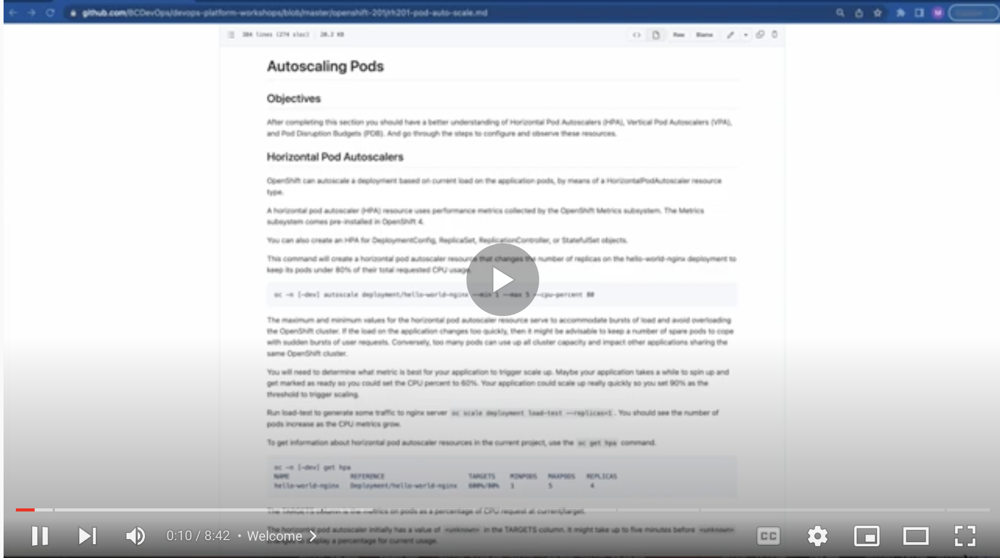

# Autoscaling Pods

<kbd>[](https://youtu.be/SX4j8-kFgN8)</kbd>

[Video walkthrough](https://youtu.be/SX4j8-kFgN8)

## Objectives

After completing this section you should have a better understanding of Horizontal Pod Autoscalers (HPA), Vertical Pod Autoscalers (VPA), and Pod Disruption Budgets (PDB). And go through the steps to configure and observe these resources.

## Horizontal Pod Autoscalers

OpenShift can autoscale a deployment based on current load on the application pods, by means of a HorizontalPodAutoscaler resource type.

A horizontal pod autoscaler (HPA) resource uses performance metrics collected by the OpenShift Metrics subsystem. The Metrics subsystem comes pre-installed in OpenShift 4.

You can also create an HPA for DeploymentConfig, ReplicaSet, ReplicationController, or StatefulSet objects.

This command will create a horizontal pod autoscaler resource that changes the number of replicas on the hello-world-nginx deployment to keep its pods under 80% of their total requested CPU usage.

```
oc -n [-dev] autoscale deployment/hello-world-nginx --min 1 --max 5 --cpu-percent 80
```

The maximum and minimum values for the horizontal pod autoscaler resource serve to accommodate bursts of load and avoid overloading the OpenShift cluster. If the load on the application changes too quickly, then it might be advisable to keep a number of spare pods to cope with sudden bursts of user requests. Conversely, too many pods can use up all cluster capacity and impact other applications sharing the same OpenShift cluster.

You will need to determine what metric is best for your application to trigger scale up. Maybe your application takes a while to spin up and get marked as ready so you could set the CPU percent to 60%. Your application could scale up really quickly so you set 90% as the threshold to trigger scaling.

Update the YAML below to add the SERVICE_HOST variable for your `hello-world-nginx` deployment. Run this load-test job to generate some traffic to nginx server. You should see the number of pods increase as the CPU metrics grow.

```
apiVersion: batch/v1
kind: Job
metadata:
  name: load-test-job
spec:
  template:
    metadata:
      labels:
        app: load-test
    spec:
      containers:
        - name: load-test
          image: registry.access.redhat.com/rhscl/httpd-24-rhel7
          env:
            - name: SERVICE_HOST
              value: "hello-world-lab1.apps.ocp4.example.com"
            - name: SERVICE_PORT
              value: "443"
            - name: REQUESTS
              value: "500000"
            - name: CONCURRENCY
              value: "20"
            - name: TIMELIMIT
              value: "3600"
          command: ["/opt/rh/httpd24/root/usr/bin/ab"]
          args: ["-dSrk", "-c", "$(CONCURRENCY)", "-n", "$(REQUESTS)", "-t", "$(TIMELIMIT)", "https://$(SERVICE_HOST):$(SERVICE_PORT)/index.html"]
          resources:
            requests:
              memory: "256Mi"  
              cpu: "100m"       
            limits:
              memory: "512Mi"  
              cpu: "200m"       
      restartPolicy: Never
  backoffLimit: 1
  activeDeadlineSeconds: 3660
```

To get information about horizontal pod autoscaler resources in the current project, use the `oc get hpa` command.

```yaml
oc -n [-dev] get hpa 
NAME                REFERENCE                      TARGETS    MINPODS   MAXPODS   REPLICAS
hello-world-nginx   Deployment/hello-world-nginx   600%/80%   1         5          4        
```

The TARGETS column is the metrics on pods as a percentage of CPU request at current/target.

The horizontal pod autoscaler initially has a value of `<unknown>` in the TARGETS column. It might take up to five minutes before `<unknown>` changes to display a percentage for current usage.

A persistent value of `<unknown>` in the TARGETS column might indicate that the deployment does not define resource requests for the metric. The horizontal pod autoscaler will not scale these pods.

### API Versions 

There are different API versions for autoscaling. `autoscaling/v2` is the new default horizontal pod autoscaler version since `oc 4.12`.

|Metric | Description | API version|
|---|---|----|
|CPU utilization| Number of CPU cores used. Can be used to calculate a percentage of the pod’s requested CPU.| autoscaling/v1, autoscaling/v2|
|Memory utilization| Amount of memory used. Can be used to calculate a percentage of the pod’s requested memory.| autoscaling/v2|

You can check the autoscaling API versions available in the cluster.

```
oc  api-versions | grep autoscaling
```

The `oc autoscale` command will create a v2 type autoscaler. You can view with the HPA details with an `oc -n [-dev] get hpa hello-world-nginx -o yaml` command.

```yaml
apiVersion: autoscaling/v2
kind: HorizontalPodAutoscaler
metadata:
  name: hello-world-nginx
spec:
  maxReplicas: 5
  minReplicas: 1
  scaleTargetRef:
    apiVersion: apps/v1
    kind: Deployment
    name: hello-world-nginx
  targetCPUUtilizationPercentage: 80
```

You can also create a v2 autoscaler by using a yaml manifest, as follows:

```yaml
apiVersion: autoscaling/v2
kind: HorizontalPodAutoscaler
metadata:
  name: hello-world-nginx-mem-hpa
spec:
  scaleTargetRef:
    apiVersion: apps/v1
    kind: Deployment
    name: hello-world-nginx
  minReplicas: 1
  maxReplicas: 5
  metrics:
  - type: Resource
    resource:
      name: memory
      target:
        type: AverageValue
        averageValue: 30Mi
```

Under metrics.resource.target you can set type to AverageValue and specify averageValue memory. You can also specify Utilization in the metrics section of the v2 HPA. Check out the available options by `oc explain --api-version='autoscaling/v2' HorizontalPodAutoscaler.spec.metrics.resource.target`. Note you'll need to specify the API version as it defaults to v2.

```yaml
metrics: 
  - type: Resource
    resource:
      name: memory 
      target:
        type: Utilization 
        averageUtilization: 50 
```

Specify averageUtilization and a target average memory utilization over all the pods, represented as a percent of requested memory. The target pods must have memory requests configured.

### Memory HPA

For memory-based autoscaling, memory usage must increase and decrease proportionally to the replica count. On average an increase in replica count must lead to an overall decrease in memory (working set) usage per-pod. A decrease in replica count must lead to an overall increase in per-pod memory usage.

Replace your existing HPA with the `hello-world-nginx-mem-hpa` spec from above in your project.

Describe the HPA.

```yaml
oc -n [-dev] describe hpa hello-world-nginx-mem-hpa

Name:                       hello-world-nginx-mem-hpa
Namespace:                  ad204f-dev
Reference:                  Deployment/hello-world-nginx
Metrics:                    ( current / target )
  resource memory on pods:  44965888 / 30Mi
Min replicas:               1
Max replicas:               5
Deployment pods:            2 current / 2 desired
Conditions:
  Type            Status  Reason              Message
  ----            ------  ------              -------
  AbleToScale     True    ReadyForNewScale    recommended size matches current size
  ScalingActive   True    ValidMetricFound    the HPA was able to successfully calculate a replica count from memory resource
  ScalingLimited  False   DesiredWithinRange  the desired count is within the acceptable range
Events:
  Type    Reason             Age                 From                       Message
  ----    ------             ----                ----                       -------
  Normal  SuccessfulRescale  71m                 horizontal-pod-autoscaler  New size: 3; reason: All metrics below target
  Normal  SuccessfulRescale  65m (x12 over 70m)  horizontal-pod-autoscaler  New size: 2; reason: All metrics below target
```

**Note:**
All pods must have resource requests configured

The HPA makes a scaling decision based on the observed CPU or memory utilization values of pods in an OpenShift Container Platform cluster. Utilization values are calculated as a percentage of the resource requests of each pod. Missing resource request values can affect the optimal performance of the HPA.
  
Keep in mind your application will "work" with scaling up or down replicas. If adding more pods to your application won't reduce the load or if scaling down pods would cause issues an HPA might not be the best choice. If your application is reliant on some persistent storage per pod that may also be something to consider when using HPAs.

### Advanced Options

There are a few more advanced options with the HPAs like scaleup and scaledown policies and behaviours. Check the online documentation for these details.

* https://docs.openshift.com/container-platform/4.9/nodes/pods/nodes-pods-autoscaling.html
* https://kubernetes.io/docs/tasks/run-application/horizontal-pod-autoscale/


## Vertical Pod Autoscaler

VPA reduces resources for pods that are requesting more resources than they are using and increases resources for pods that are not requesting enough.

The VPA reviews historic and current CPU and memory resources for containers in pods and can update the resource limits and requests based on the usage values it learns. The VPA will update all of the pods associated with a workload object, such as a Deployment, DeploymentConfig, StatefulSet, Job, DaemonSet, ReplicaSet, or ReplicationController, in a project.
  
The VPA will proportionally scale limits based on your default manifest, if you had the following requests to limits ratio:
* CPU: 50m → 200m: 1:4 ratio
* memory: 100Mi → 250Mi: 1:2.5 ratio

You get a scaling recommendation that will respect and keep the same ratio you originally configured, and proportionally set the new values based on your original ratio.
  
VPA automatically deletes any pods that are out of alignment with its recommendations one at a time, so that your applications can continue to serve requests with no downtime. By default, workload objects must specify a minimum of two replicas in order for the VPA to automatically delete their pods. Workload objects that specify fewer replicas than this minimum are not deleted. If you manually delete these pods, when the workload object redeploys the pods, the VPA does update the new pods with its recommendations.

For developers, you can use the VPA to help ensure your pods stay up during periods of high demand by scheduling pods onto nodes that have appropriate resources for each pod. Administrators use the VPA to better utilize cluster resources, such as preventing pods from reserving more CPU resources than needed. The VPA monitors the resources that workloads are actually using and adjusts the resource requirements so capacity is available to other workloads. 

The VPA custom resources (CR) must be in the same project as the pods you want to monitor. There are 4 updateModes available for the VPA:

* Auto, the VPA assigns resource requests on pod creation and updates the existing pods by terminating them when the requested resources differ significantly from the new recommendation.
* Recreate, the VPA assigns resource requests on pod creation and updates the existing pods by terminating them when the requested resources differ significantly from the new recommendation. This mode should be used rarely, only if you need to ensure that the pods are restarted whenever the resource request changes. Otherwise prefer the "Auto" mode which may take advantage of restart free updates once they are available.
* Initial, automatically applies VPA recommendations only at pod creation.
* Off, only provides recommended resource limits and requests, allowing you to manually apply the recommendations. The off mode does not update pods.


Let's first confirm that the VPA operator is installed in our cluster, we should see 2 results.

```
oc api-resources | grep vpa
```
### Update Mode Off

Let's now create a VPA with update mode turned to "Off" so we just get resource recommendations.

Create a VPA using the below yaml:

```yaml
apiVersion: autoscaling.k8s.io/v1
kind: VerticalPodAutoscaler
metadata:
  name: vpa-recommender
spec:
  targetRef:
    apiVersion: "apps/v1"
    kind:       Deployment 
    name:       hello-world-nginx
  updatePolicy:
    updateMode: "Off"
```

If it's not still running, run the load test job again. Be sure to first update the YAML below to add the SERVICE_HOST variable for your `hello-world-nginx` deployment.  Let the job fire up a new pod and send load to our hello-world-nginx pod.

```
apiVersion: batch/v1
kind: Job
metadata:
  name: load-test-job
spec:
  template:
    metadata:
      labels:
        app: load-test
    spec:
      containers:
        - name: load-test
          image: registry.access.redhat.com/rhscl/httpd-24-rhel7
          env:
            - name: SERVICE_HOST
              value: "hello-world-lab1.apps.ocp4.example.com"
            - name: SERVICE_PORT
              value: "443"
            - name: REQUESTS
              value: "500000"
            - name: CONCURRENCY
              value: "20"
            - name: TIMELIMIT
              value: "3600"
          command: ["/opt/rh/httpd24/root/usr/bin/ab"]
          args: ["-dSrk", "-c", "$(CONCURRENCY)", "-n", "$(REQUESTS)", "-t", "$(TIMELIMIT)", "https://$(SERVICE_HOST):$(SERVICE_PORT)/index.html"]
          resources:
            requests:
              memory: "256Mi"  
              cpu: "100m"       
            limits:
              memory: "512Mi"  
              cpu: "200m"       
      restartPolicy: Never
  backoffLimit: 1
  activeDeadlineSeconds: 3660
```

Give the load test a few minutes to run then check the VPA status sections for recommendations.


```yaml
oc -n [-dev] get vpa vpa-recommender -o yaml

 status:
    conditions:
    - lastTransitionTime: "2022-04-11T17:35:54Z"
      status: "True"
      type: RecommendationProvided
    recommendation:
      containerRecommendations:
      - containerName: hello-world-nginx
        lowerBound:
          cpu: 25m
          memory: 262144k
        target:
          cpu: 35m
          memory: 262144k
        uncappedTarget:
          cpu: 35m
          memory: 262144k
        upperBound:
          cpu: 66m
          memory: 262144k
```


- The output shows the recommended resources under target.
- The minimum recommended resources under lowerBound. 
- The highest recommended resources under upperBound.
- The most recent resource recommendations under uncappedTarget. (A more advanced option in the VPA you can set spec.resourcePolicy.containerPolicies.minAllowed and maxAllowed if wanted. So uncappedTarget shoes estimation produced if there were no minAllowed and maxAllowed restrictions if you did have them set)

With the recommendations, you can edit the workload object to add CPU and memory requests, then delete and redeploy the pods using the recommended resources.

If the VPA updateMode uses something other than `off` then the lowerBound and upperBound values are used to determine if a pod needs to be updated. If a pod has resource requests below the lowerBound values or above the upperBound values, the VPA terminates and recreates the pod with the target values.

### Update Mode Auto

Let's create an VPA in auto mode and send traffic to the hello-world-nginx pods and observe what happens.

> Note: VPAs in Auto updateMode won't work with HPA using the same CPU and memory metrics because it would cause a race condition. If HPA objects still exists from previous labs, let's delete them to focus on VPAs.

Then let's scale our hello-world-nginx deployment replicas up to three so the VPA can re-deploy our pods if needed.

Then let's create another VPA in Auto updateMode:

```yaml
cat <<EOF | oc apply -f -
apiVersion: autoscaling.k8s.io/v1
kind: VerticalPodAutoscaler
metadata:
  name: vpa-auto
spec:
  targetRef:
    apiVersion: "apps/v1"
    kind:       Deployment 
    name:       hello-world-nginx
  updatePolicy:
    updateMode: "Auto"
EOF
```
Again, unless it is still running, run the load test job again. Remember to update the YAML below to add the SERVICE_HOST variable for your `hello-world-nginx` deployment.  Let the job fire up a new pod and send load to our hello-world-nginx pod.

```
apiVersion: batch/v1
kind: Job
metadata:
  name: load-test-job
spec:
  template:
    metadata:
      labels:
        app: load-test
    spec:
      containers:
        - name: load-test
          image: registry.access.redhat.com/rhscl/httpd-24-rhel7
          env:
            - name: SERVICE_HOST
              value: "hello-world-lab1.apps.ocp4.example.com"
            - name: SERVICE_PORT
              value: "443"
            - name: REQUESTS
              value: "500000"
            - name: CONCURRENCY
              value: "20"
            - name: TIMELIMIT
              value: "3600"
          command: ["/opt/rh/httpd24/root/usr/bin/ab"]
          args: ["-dSrk", "-c", "$(CONCURRENCY)", "-n", "$(REQUESTS)", "-t", "$(TIMELIMIT)", "https://$(SERVICE_HOST):$(SERVICE_PORT)/index.html"]
          resources:
            requests:
              memory: "256Mi"  
              cpu: "100m"       
            limits:
              memory: "512Mi"  
              cpu: "200m"       
      restartPolicy: Never
  backoffLimit: 1
  activeDeadlineSeconds: 3660
```

Give it a few minutes and observe the VPA and the hello-world-nginx pods. We should see them re-deploy based on updated values from the VPA.

### Summary 

Have a think what would be good for an app in a production environment. Maybe just getting recommendations to review might be good then you update manually. Having Auto mode on will terminate and restart pods and containers which maybe something your application can't handle in a production environment.

VPAs are not aware of OpenShift cluster infrastructure variables such as node size in terms of memory and CPU. Therefore, it doesn't know whether a recommended pod size will fit your node. Also VPAs are not aware of quotas so it may resize to something bigger than can fit in the current quota.

Have a look at the online documentation if you are interested more in VPAs, there are some more advanced options like exempting containers in a pod by using resourcePolicy.

* https://docs.openshift.com/container-platform/4.9/nodes/pods/nodes-pods-vertical-autoscaler.html
* https://github.com/kubernetes/autoscaler/tree/master/vertical-pod-autoscaler

## Pod Disruption Budgets

A PodDisruptionBudget is an object that specifies the minimum number or percentage of replicas that must be up at a time. Setting these in projects can be helpful during node maintenance (such as scaling a cluster down or a cluster upgrade) and is only honored on voluntary evictions (not on node failures).

This means that the drain event could be temporarily halted while it waits for more pods to become available on other nodes so that the budget isn’t crossed by evicting the pods.

You can set an availability level, which specifies the minimum number of pods that must be available simultaneously, either:

* minAvailable is the number of pods must always be available, even during a disruption.
* maxUnavailable is the number of pods can be unavailable during a disruption.

Values for minAvailable or maxUnavailable can be expressed as integers or as a percentage.

* When you specify an integer, it represents a number of Pods. If you set minAvailable to 10, then 10 Pods must always be available, even during a disruption.
  
* When you specify a percentage it represents a percentage of total Pods. If you set maxUnavailable to "50%", then only 50% of the Pods can be unavailable during a disruption.

When you specify the value as a percentage it may not map to an exact number of Pods. If you have 7 Pods and you set minAvailable to "50%", it's not immediately obvious whether that means 3 Pods or 4 Pods must be available. OpenShift will round up to the nearest integer, so in this case, 4 Pods must be available.

A maxUnavailable of 0% or 0 or a minAvailable of 100% or equal to the number of replicas is permitted but can block nodes from being drained. It will also generate alerts for the Operations team who will contact you asking for it to be adjusted. **THIS IS IMPORTANT**, your configuration of a PDB in your project could effect a cluster wide upgrade process. If your using PDBs then be a good neighbor and ensure that it's configured correctly and that you are keeping an eye on it or configured monitoring to ensure the PDB is still valid for the deployment or object it's pointing to.


Let's create a pod disruption budget where we always want at least 1 Nginx pod to be available for our deployment. Apply the following config to your project.

```yaml
apiVersion: policy/v1
kind: PodDisruptionBudget
metadata:
  name: hello-world-nginx-pdb
spec:
  minAvailable: 1
  selector:
    matchLabels:
      deployment: hello-world-nginx
```

This indicates to OpenShift that we want at least 1 pod that matches the label Deployment: hello-world-nginx to be available at any given time. This means OpenShift will wait for the pod in one node drain request to be replaced before evicting the pods in a second node drain request.

We can view the PDB with: `oc get pdb`.

That's about all we can do for PDB. They can only really be tested during a node drain event.

> Note to delete the PDB object when you are done with it. `oc delete pdb <pdb_name>`


## Pod Anti-Affinity 

Pod anti-affinity can prevent the scheduler from locating a new pod on the same node as pods with the same labels if the label selector on the new pod matches the label on the current pod.

There are two types of pod anti-affinity rules: required and preferred. (You can also check it out with `oc explain pod.spec.affinity.podAffinity`)

* `requiredDuringSchedulingIgnoredDuringExecution`: The scheduler can't schedule the Pod unless the rule is met. This functions like nodeSelector, but with a more expressive syntax.

* `preferredDuringSchedulingIgnoredDuringExecution`: The scheduler tries to find a node that meets the rule. If a matching node is not available, the scheduler still schedules the Pod.

You configure pod anti-affinity through the Pod spec files. You can specify a required rule, a preferred rule, or both. If you specify both, the node must first meet the required rule, then attempts to meet the preferred rule.

Let's update our deployment to add an anti-affinity rule.

> Note: If there are still HPAs or VPAs in place in your project you should clean them out.

```yaml
.
.
.
    spec:
      affinity:
        podAntiAffinity: 
          requiredDuringSchedulingIgnoredDuringExecution: 
          - labelSelector:
              matchExpressions:
                - key: deployment 
                  operator: In 
                  values:
                  - hello-world-nginx
            topologyKey: topology.kubernetes.io/zone
      containers:
.
.
.
```
Scale the deployment up to say 3 replicas. Once the pods are all running check to make sure they are on different nodes.

```
oc -n [-dev] get pods -o wide
NAME                                 READY   STATUS     IP              NODE                   
hello-world-nginx-599d5d8898-58mxv   1/1     Running    10.97.14.47     mcs-silver-app-07.dmz   
hello-world-nginx-599d5d8898-bgxdr   1/1     Running    10.97.23.120    mcs-silver-app-04.dmz   
hello-world-nginx-599d5d8898-ph49f   1/1     Running    10.97.132.155   mcs-silver-app-22.dmz   
```

> Note: scale down the application to save resources with `oc -n [-dev] scale deployment/hello-world-nginx --replicas=0`.

There are some more advanced options with pod affinity and anti-affinity and combining them both. You can also apply some weighting to different rules. See the Kubernetes documentation if you want to play around with some advanced scheduling configurations.

* https://kubernetes.io/docs/concepts/scheduling-eviction/assign-pod-node/

Next topic - [Post Outage Checkup](https://github.com/BCDevOps/devops-platform-workshops/blob/master/openshift-201/post-outage-checkup.md)
