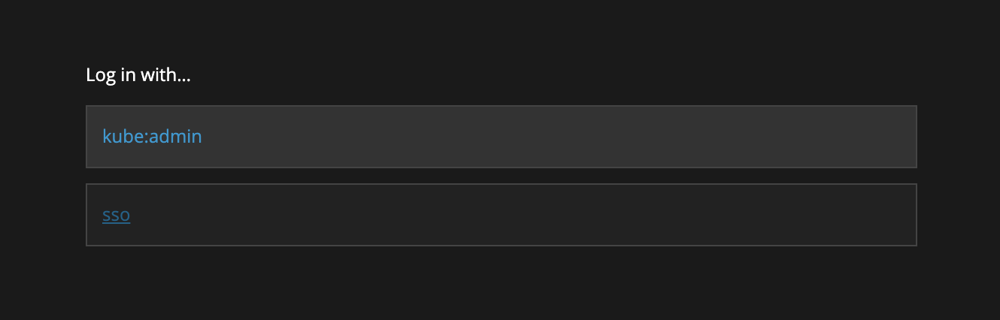
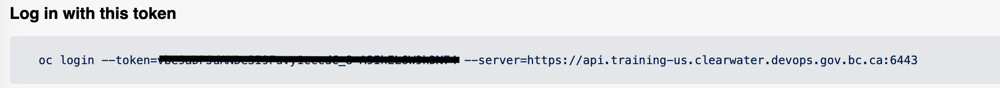
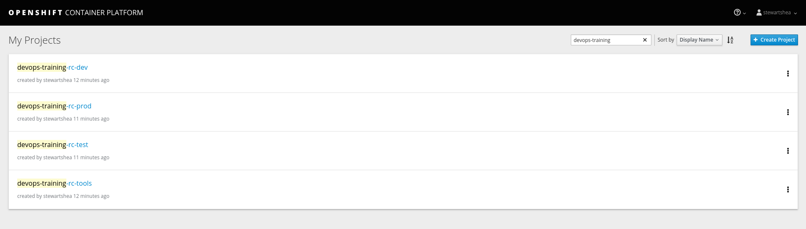
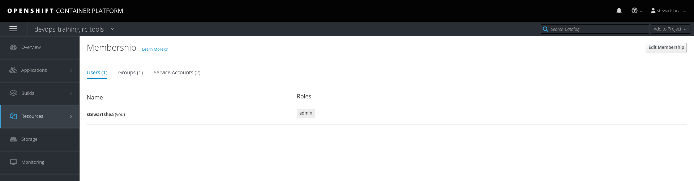
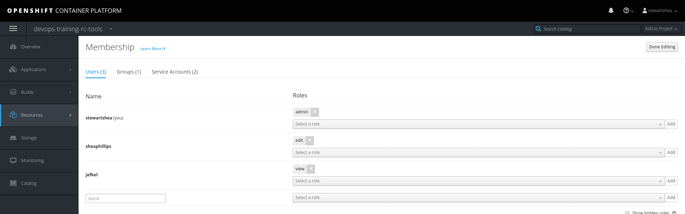

# Lab Setup
Prior to working on labs, the Platform Services team will have created 2
projects:
- ocp101-tools: This namespace will have all of the builds related objects
- ocp101-dev: This namespace will have all the deployment related objects

One member from your group has been given administrative rights to the projects
and is responsible for adding all other members to each project.

NOTE: the actual name of the namespaces may vary, and `ocp101` may be a sequence of random characters.

---
Assign yourself a unique name to be used during your application deployments.
**Do not copy the application names directly from the lab guides** as you are in a
shared environment with the rest of your team.

For example, if the lab says to create an application named `app1-[username]`, I
would create an app named `app1-stewartshea`.

## Lab Requirements
These labs will require access to the lab ocp environment:
- [ARO Web Console](https://console-openshift-console.apps.training-us.clearwater.devops.gov.bc.ca/)


## Installing OC

You may already have `oc` installed on your machine. Your `oc` version should match the version of the cluster. 

__If you have `oc`__ installed run `oc version`. It should look like this
```shell
Client Version: 4.4.4
Server Version: 4.3.18
Kubernetes Version: v1.16.2
```

__If you do not have `oc` installed__ or your version is incorrect follow these instructions.

1. Navigate to the [Openshift CLI Mirror](https://mirror.openshift.com/pub/openshift-v4/clients/ocp/4.3.25/) and download the version of `oc` that matches your operating system. 

> For Linux/Mac users that may be working with multiple versions of `oc`, it is helpful to have both versions of `oc` (3.11/4.3) on your machine. You can create an `alias` to `oc 4.3` instead of adding it to your path. This way you can utilize `oc 3.11` for the current production cluster and `oc 4.3` for the purpose of this lab.

2. Unpack `oc` into a place that is easily reference-able from a command line interface or add it to your `PATH`

## Other Requirements

In addition, developers require GIT locally installed and must have a 2FA device to support access to GitHub.

## Logging In

- Login to the [ARO Web Console](https://console-openshift-console.apps.training-us.clearwater.devops.gov.bc.ca/) with your GitHub ID

> Select __SSO__ 



- Navigate to the top right corner, select the drop-down from your username, and select `Copy Login Command`

- Paste the copied command into your terminal of choice



```
oc login --token=[token] --server=https://api.training-us.clearwater.devops.gov.bc.ca:6443
```

## Team Permissions
Once all projects have been created by the Platform Services team, the team admin
must navigate to each project and assign your users the appropriate permissions. 

As a team, find each project and add the rest of the team members. Feel free to experiment with
the default roles.  



- Once in the project, navigate to `Resources -> Membership -> Users`

- Select `Edit Membership`



- Add each user based on their GitHub id



- Select `Done Editing`


This can also be done on the CLI with the `oc` utility: 

```
oc policy add-role-to-user [role] [username]
```