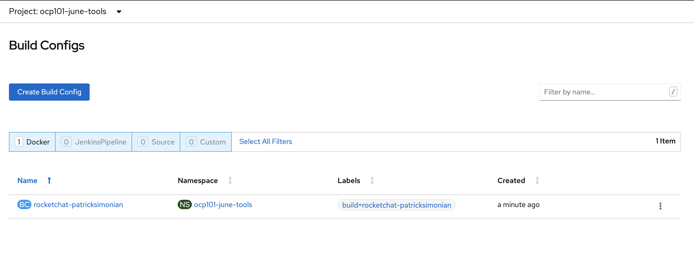
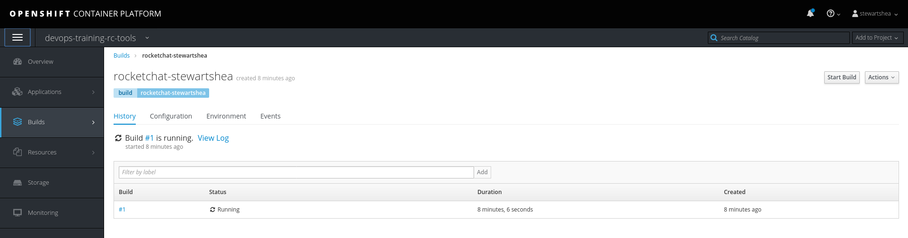
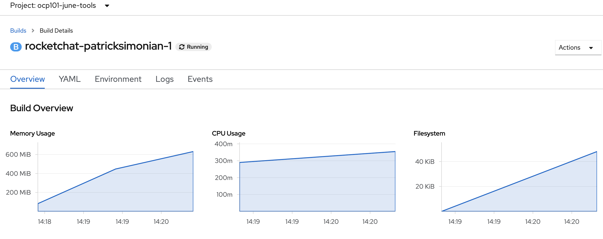
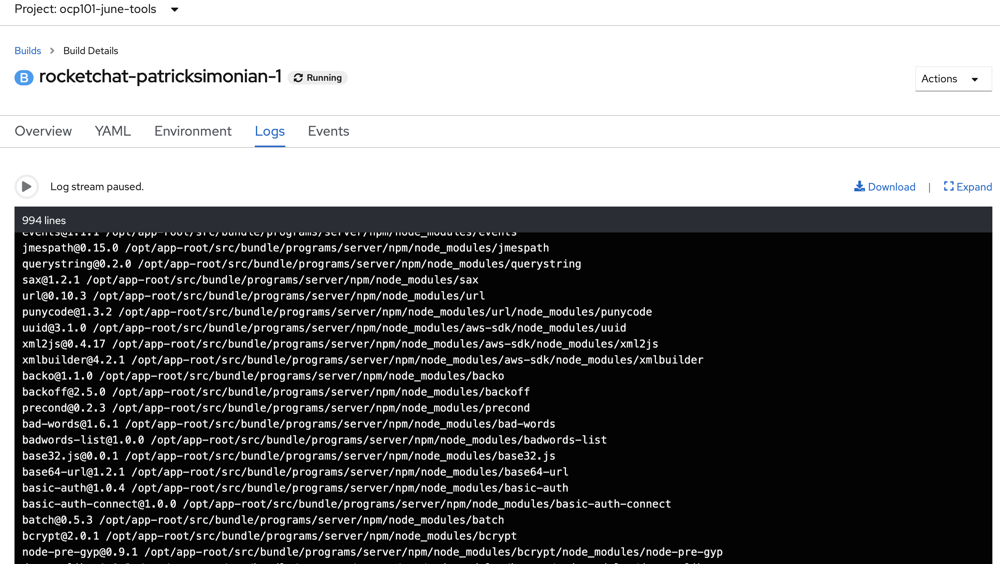

# Builds
In this lab, you will create a simple Docker based build for the Rocket Chat application.

## The Tools Project
The tools project is what will hold various support tools for the application. In this case, all builds will run in this project.

## Creating a Docker-Based Build
The Rocket.Chat application build will be based off a minimal Dockerfile in a [public repository](https://github.com/BCDevOps/devops-platform-workshops-labs/tree/master/apps/rocketchat). 
Leveraging the commandline, you can use the `oc new-build` command to create all of the necessary 
OpenShift build components. 

Ensure that all team members have edit rights into the project. Once complete, 
each member can create their own Rocket.Chat docker build. 

- To start, switch to the __Tools Project__

```
oc project [-tools]
```

- With the `oc` cli, create the build

```oc:cli
oc -n [-tools] new-build https://github.com/BCDevOps/devops-platform-workshops-labs/ --context-dir=apps/rocketchat --name=rocketchat-[username]
```

- The output of the previous command should be similar to the following: 

```

--> Found image 8431f8b (21 hours old) in image stream "ocp101a-tools/rocketchat" under tag "latest" for "rocketchat"

    Node.js 8 
    --------- 
    Node.js 8 available as container is a base platform for building and running various Node.js 8 applications and frameworks. Node.js is a platform built on Chrome's JavaScript runtime for easily building fast, scalable network applications. Node.js uses an event-driven, non-blocking I/O model that makes it lightweight and efficient, perfect for data-intensive real-time applications that run across distributed devices.

    Tags: builder, nodejs, nodejs8

    * A Docker build using source code from https://github.com/BCDevOps/devops-platform-workshops-labs/ will be created
      * The resulting image will be pushed to image stream "rocketchat-[username]:latest"
      * Use 'start-build' to trigger a new build

--> Creating resources with label build=rocketchat-[username] ...
    imagestream "rocketchat-[username]" created
    buildconfig "rocketchat-[username]" created
--> Success
    Build configuration "rocketchat-[username]" created and build triggered.
    Run 'oc logs -f bc/rocketchat-[username]' to stream the build progress.
```

- The build will take between a couple of minutes to about 15 minutes
```oc:cli
# Watch and wait for build
oc -n [-tools] logs -f bc/rocketchat-[username]
```
- You can now explore the Web Console to watch the build status from `Builds`
*note* you will see multiple builds from each team member



- Or this can be done on the CLI

```
oc -n [-tools] get bc
oc -n [-tools] status
```

- The build status can be monitored from the Web Console by selecting  the `Logs` link




