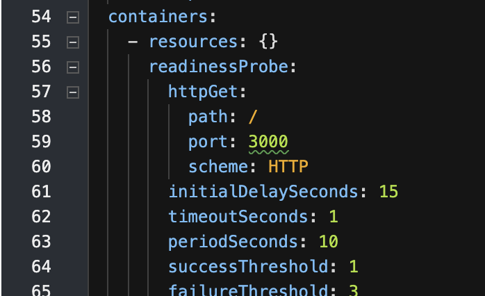
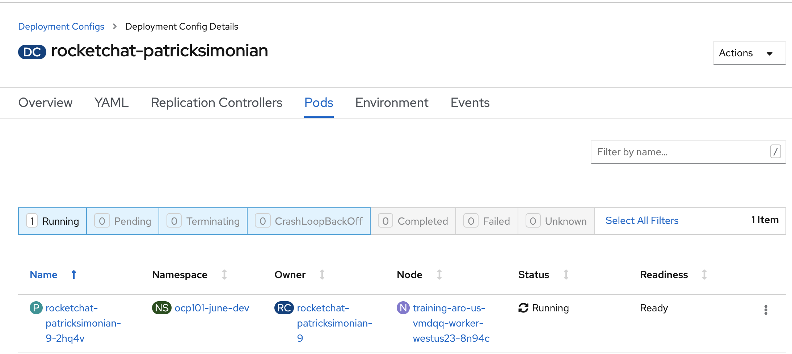
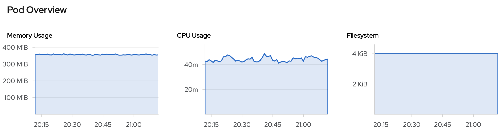

# Resource Requests and Limits
Tuning the resources assigned to a pod will have a direct effect on the performance of the application. 

Many templates include reasonable CPU and Memory resource configurations, however, new apps simply are deployed with the platform default. 

> Platform Resource Request defaults are maintained by platform services
it is a measurement based on the average cpu/memory utilization and serves as a great starting point for your pods horsepower

## Explore Default Resource Configurations
Since the Rocket Chat application was built from scratch and not deployed from a template, explore the current resources allocated to the pods: 

- Navigate to your rocketchat deploymentconfig and select `Yaml`
- Take a look a the resources spec under `.spec.template.spec.containers.resources`
  it should be `{}`. This identifies that it is using the default resource allocation.




- Review the current metrics of your `rocketchat-[username]` pod by navigating to it from the DeploymentConfig and then selecting `Pods`




- Reduce the CPU (request and limit) to `50 millicores` and Memory (request and limits) to `100 Megabytes` and monitor the startup time of the pod
  ```oc:cli
  oc -n [-dev] set resources dc/rocketchat-[username] --requests=cpu=50m,memory=100Mi --limits=cpu=50m,memory=100Mi
  ```
- Monitor the startup events of your pod and measure the time it takes to start
  ```oc:cli
  # Start new deployment; and
  oc -n [-dev] rollout latest dc/rocketchat-[username]

  # Wait for deployment to finish
  time oc -n [-dev] rollout latest dc/rocketchat-[username]
  ```
- Remove the limits previously imposed, and set your pod to `1 core` (or `1000 millicores`) for the request and limit
  ```oc:cli
  oc -n [-dev] set resources dc/rocketchat-[username] --requests=cpu=1000m,memory=512Mi --limits=cpu=1000m,memory=1024Mi
  ```

- Monitor the status and speed of the new deployment
  ```oc:cli
  # Start new deployment; and
  oc -n [-dev] rollout latest dc/rocketchat-[username]

  # Wait for deployment to finish
  time oc -n [-dev] rollout latest dc/rocketchat-[username]
  ```

## Sharing Resources

If there are many team members (and therefor workloads) working together in the same namespace there is a chance that requesting 1 core of cpu and 1 core of memory will not work. Why could that be?