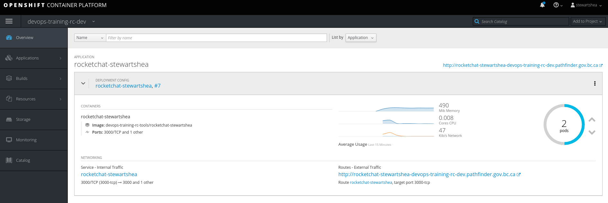

# Application Availability
Prior to beginning this lab, nagivate to the public route you created and finish the initial setup of your application. 
Ensure to select `Keep standlone` on the last page of the initial Rocket.Chat application setup. 

### Single Pod Applications
Single pod applications are not highly-available and can be abruptly terminated if the pod crashes or due to regularly 
scheduled platform maintenance. In order to simulate the effect on an application: 

- Navigate to the pod, select `Actions` and `Delete`
    - Select `Delete pod immediately`


- Refresh URL of application


### Scaling Pods
To increase the availability of an application and defend against unplanned outages or planned maintenance tasks, an 
application must have multiple pods/instance running. For this reason, stateless applications are desirable as they 
do not require custom clustering configurations. 

**Note** Stateful applications do not support "scaling pods" as a form of high availability. Such a stateful example 
would be the mongodb database. For this reason, this lab focuses on the rocketchat application which will function 
with multiple pods. Please refer to specific application documentaion for details on scalability support. 

- Navigate to `Overview` or `Deployments` in the Web Console and increase the pod count to 2




- Or from the CLI

```
oc scale dc/rocketchat-[username] --replicas=2
```
- Notice the balancing across nodes by exploring the details of each pod


- Or from the CLI notice the hosts the pod runs on (in the last field)

```
oc get pods -o wide  | grep rocketchat-[username]
```
    - The output should look similar to this: 
    ```
    $ oc get pods -o wide  | grep rocketchat-stewartshea
    rocketchat-stewartshea-7-k6kcc    1/1       Running   0          16m       172.51.68.135   ociopf-p-186.dmz
    rocketchat-stewartshea-7-k82w2    0/1       Running   0          1m        172.51.76.32    ociopf-p-187.dmz
    ```

- Delete single pod, refresh the URL of application and notice that the application is served by the surviving pods


- Perform deployment, refresh the URL of application and notice that the application is served by the surviving pods