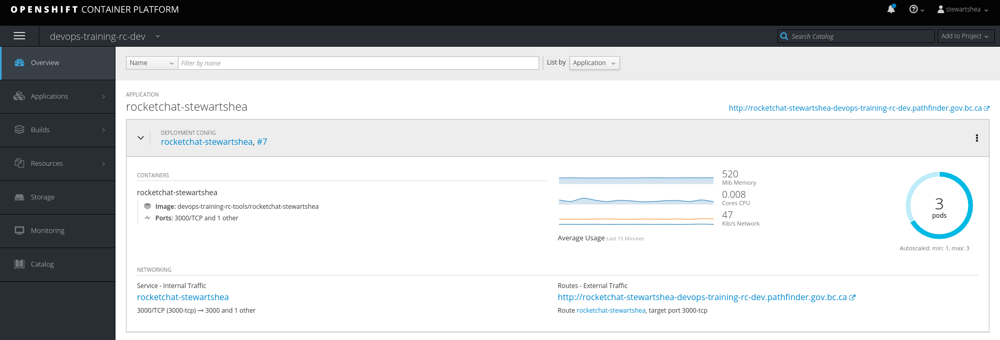

# Autoscaling
Autoscaling can be configured on pods to enable OpenShift to add or remove pods as load varies. In general, 
the Horizonal Pod Autoscaler sets: 
    - Upper limit of pods
    - Lower limit of pods
    - Metric threshold to use for scaling tasks

Currently CPU and memory metrics are supported, with additional arbitrary metrics support intended for the future. 

### Autoscaling Pods
This lab will provide a simple demonstration of autoscaling based on CPU, as this is configurable in the 
Web Console. 

- Navigate to your rocketchat deployment and select the `Actions` dropdown
- Select `Add Autoscaler`
- Configure an upper and lower limit of pods
- Configure a very low CPU Request Target (such as 1 or 2%) so that you can test it easily by browsing the web application
    - In a production environment you would taget something like 70-80%

- Browse to the application to generate some load and monitor the behavior of the pods
    - Generate some activity such as creating messages, channels, etc. 

- Review the deployment configuraiton and try to add or remove replicas

- Remove the autoscaler

