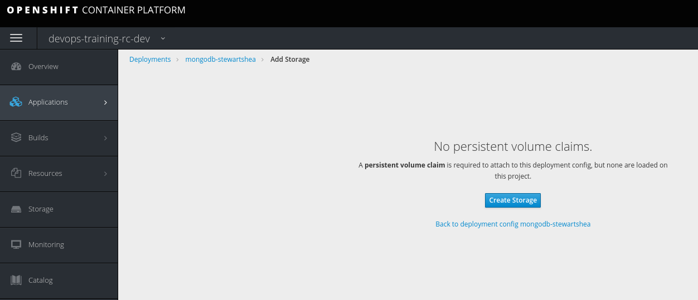
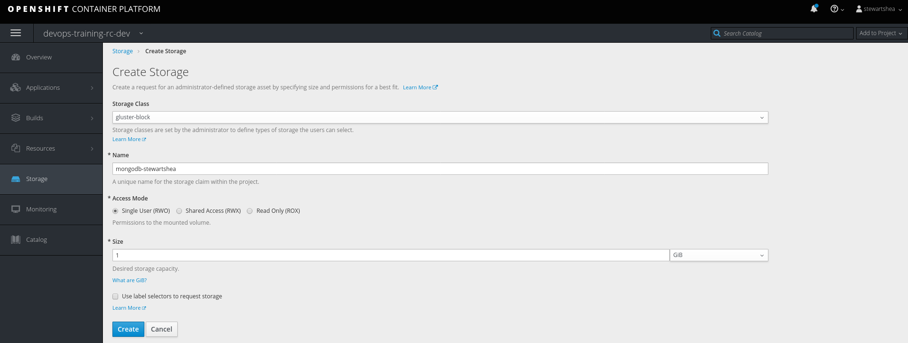
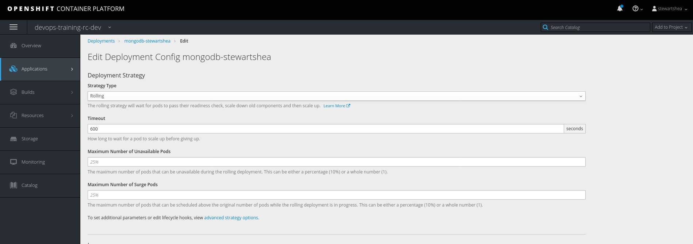
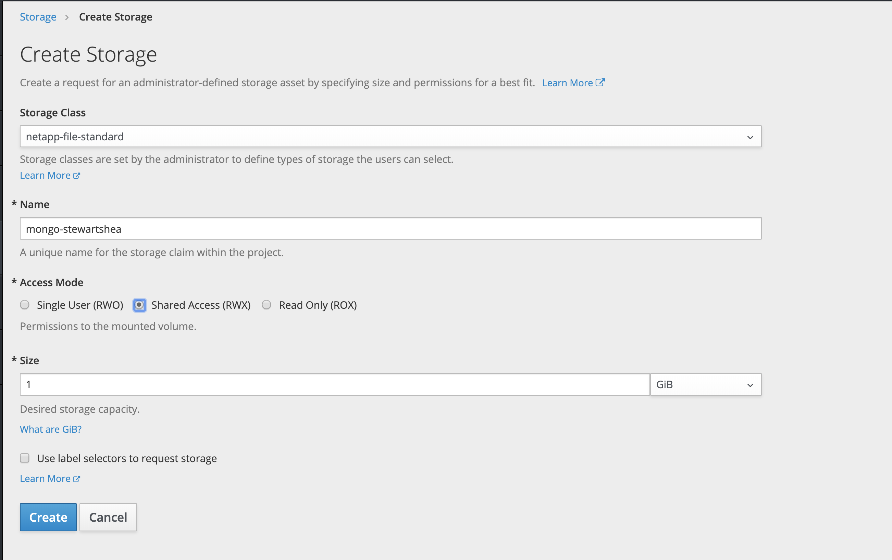

# Persistent Storage
Up to this point you have leveraged a single mongodb pod with ephemeral storage. In order to maintain the 
appliation data, persistent storage is required.  

- Let's first take a look at our application prior to this lab

### Deleting Pods with Ephemeral Storage
To understand what will happen when a pod with ehemeral storage is removed, 
- Scale down both the rocketchat and mongo applications to 0 pods
- Scale back up each application pod to 1 replica

### Adding Storage to Existing Deployment Configurations
Now that we notice all messages and configuaration is gone, let's add persistent storage to the mongodb pod. 
- Scale down both the rocketchat and mongo applications to 0 pods
- Edit the `mongodb-[username]` configuration 
    - Remove the `emptyDir` volume
    - Add a new volume by selecting `Add Storage`

> you will notice that there options to select `gluster-file/gluster-file-db`. Provisioning for __gluster__ type storage has been disabled in favor of our new storage solution __netapp__
- Select the `net-app-block-standard` storage class, set the type to RWO (which is block storage), and the size to 1GB, with a name of `mongodb-[username]`
**note** Each application will have a preferred storage type. This is NOT the recommended storageclass for 
mongo, but is useful in an upcoming lab. 

> PLEASE NOTE: 

- Scale up `mongodb-[username]` instance to 1 pod
- When mongo is running, scale `rocketchat-[username]` to 1 pod
- Access the RocketChat URL and complete the Setup Wizard again
- Scale down and scale back up both the database and the rocketchat app
- Verify that data was persisted by accessing RocketCHat URL and observing that it doesn't show the Setup Wizard.

#### RWO Storage
RWO storage (which was selected above) can only be attached to a single pod at a time, which causes issues in certain deployment stategies. 

- Ensure your `mongodb-[username]` deployment is set to rolling

- Redeploy with Rolling Deployment

- Notice and investigate the issue
> rolling deployments will start up a new version of your application pod before killing the previous one. There is a brief moment where two pods for the mongo application exist at the same time. Because the storage type is __RWO__ it is unable to mount to two pods at the same time. This will cause the rolling deployment to hang and eventually time out. 

- Switch to recreate

### RWX Storage
RWX storage allows muliple pods to access the same PV at the same time. 

- Scale down `mongodb-[username]` to 0 pods

- Remove the previous storage volume and recreate as `netapp-file-standard` with type RWX

- Scale up `mongodb-[username]` to 1 pods

- Redeploy with Rolling deployment

### Fixing it
After using the `netapp-file-standard` storage class with rolling deployment, you got to a point where your mongodb is now corrupted. That happens because MongoDB does NOT support multiple processes/pods reading/writing to the same location/mount (`/var/lib/mongodb/data`) of single/shared pvc.

To fix that we will need to replace `netapp-file-standard` with `netapp-block-standard` and change the deployment strategy from `Rolling` to `Recreate`
- Create a new PVC using block storage with RWO
- Scale down `rocketchat-[username]` to 0 pods
- Scale down `mongodb-[username]` to 0 pods
- Go to the `mongodb-[username]` DeploymentConfig and `Pause Rollouts` (under `Actions` menu on the top right side)
- Change the deployment strategy to use `Recreate` deployment strategy
- Remove the mount to the file storage class
- Add a mount to the new block storage class to the same path (`/var/lib/mongodb/data`)
- Go to the `mongodb-[username]` DeploymentConfig and `Resume Rollouts` (under `Actions` menu on the top right side)
  Check a new deployment is being rollout. If not, please do a manual deployment by cliclig on `Deploy`
- Scale up `mongodb-[username]` to 1 pod, and wait for the pod to become ready
- Scale up `rocketchat-[username]` to 1 pod, and wait for the pod to become ready
- Access RocketChat URL and go over the Setup Wizard again

