# Persistent Configurations
In cases where configurations need to change frequently or common configurations should be shared across deployments or pods, it is not ideal to build said configurations into the container image or maintain multiple copies of the configuration. OpenShift supports `configMaps` which can be a standalone object that is easily mounted into pods. In cases where the configuration file or data is sensitive in nature, OpenShift supports `secrets` to handle this sensitive data. 

### ConfigMaps

#### Creating a Config Map and Adding it to a Deployment
Create a configMap with arbitrary data and mount it inside of your `rocketchat-[username]` pod: 

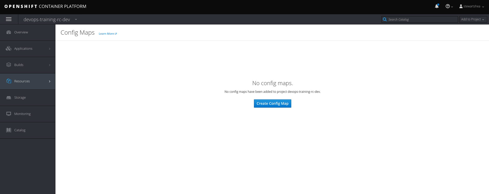
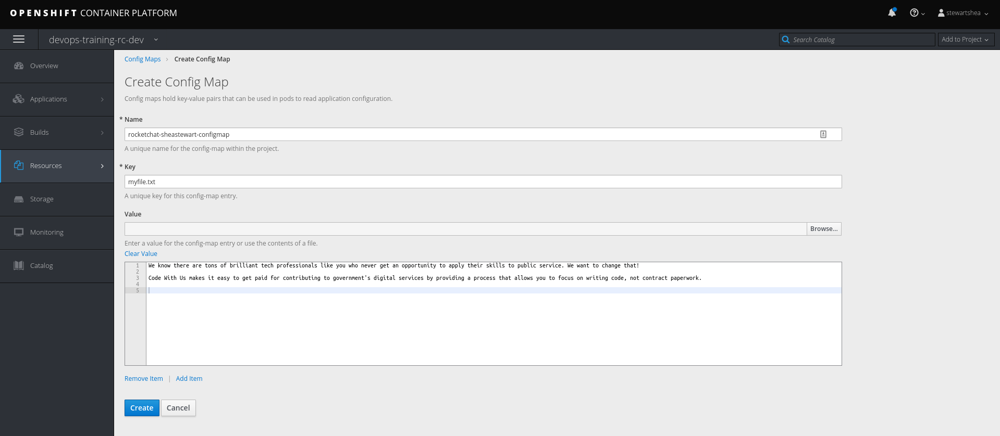

- In the Web Console, go to `+Add` and select `YAML`
- Paste in the following ConfigMap Code and save 
```yaml
apiVersion: v1
data:
  myfile.txt: Hello world
kind: ConfigMap
metadata:
  name: rocketchat-[username]-configmap
```

- Attach the `configMap` to your `rocketchat-[username]` deployment by navigating to the `YAML` tab in your Rocket Chat DeploymentConfig and pasting in the following code
  1. You will first need to create a `volume`. This is located under `.spec.template.spec.volumes`
  ```yaml
    - configMap:
        name: rocketchat-[username]-configmap
      name: rocketchat-[username]-volume
  ```

  2. Then create a `volumeMount` under `.spec.template.spec.containers.volumeMounts`
  ```yaml
    - name: rocketchat-[username]-volume
      mountPath: /opt/configs
  ```
> pro tip: if you are not sure what fields are available you can always use oc explain! `oc explain dc.spec.template.spec.containers.volumeMounts`

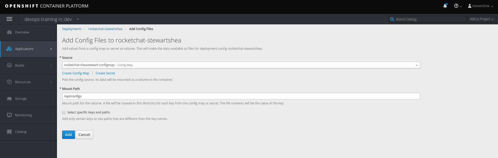
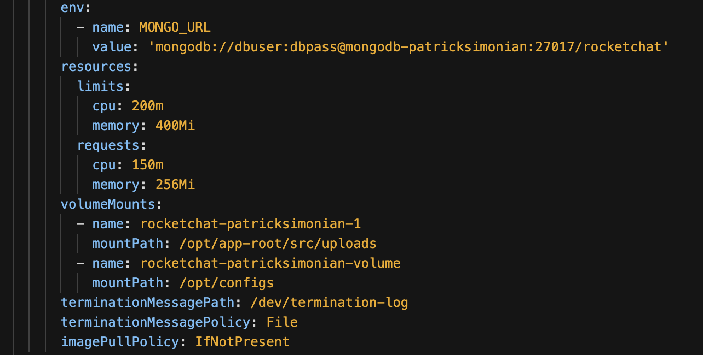

> it should like similar to this
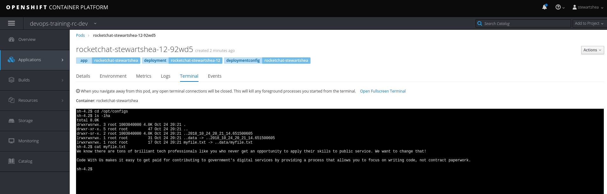


- Save the changes which will trigger a new deployment of your `rocketchat-[username]` pod

- Using the pod terminal in the Web Console or `oc rsh`, explore the path of the mounted configMap

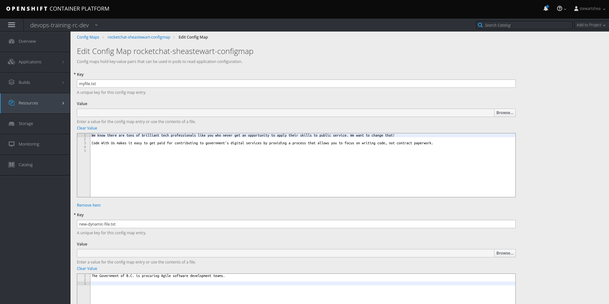

#### Changing Config Map Content
The content in your `configMap` can be changed and in most cases it's NOT dynamically updated in the pod. With that said, a new deployment will be required for the changes to be picked up.

- Edit your `configMap` to add a new key-value pair that represents another file

Navigate to `Administrator View -> Workloads -> Configmaps` from the console and select your ConfigMap from the list


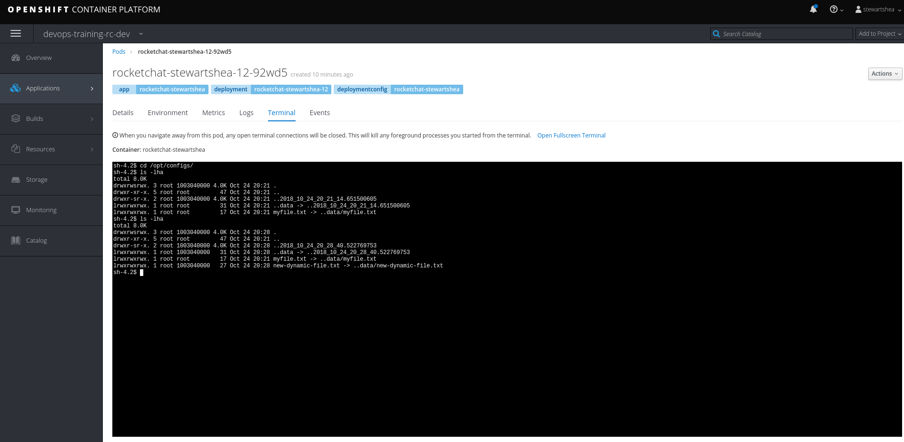

- Using the pod terminal in the Web Console or `oc rsh`, explore the path of the mounted configMap

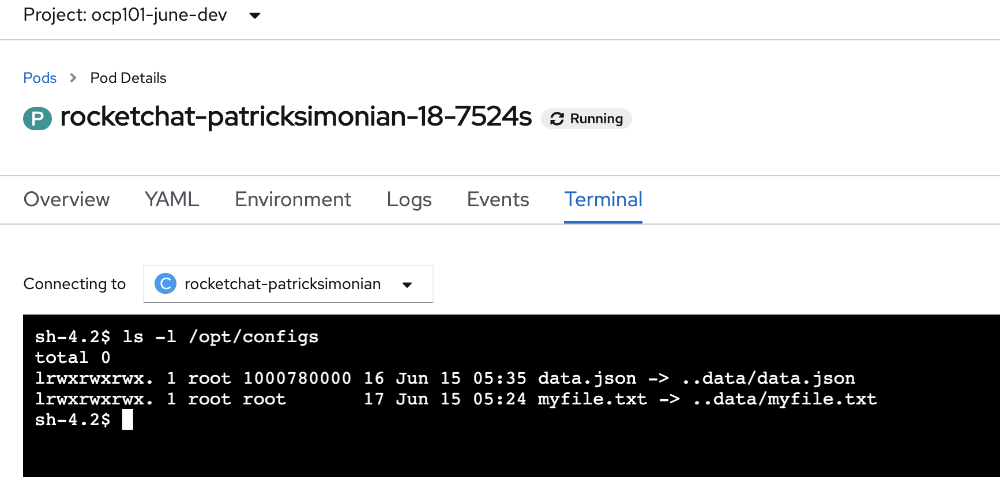


### Secrets
Secrets can be added in a similar way as config maps but are geared towards the management of sensitive information. In OpenShift, these are base64 encoded, and encrypted on disk when stored in the cluster. In Pods, they never live on disk (unlike configmaps) and are only in memory.
Secrets, from the Web Console, are focused on supporting: 
- Username/Passwords
- SSH Keys
- SSL Certificates
- Git config files

"Opaque" secrets are supported and can contain any type of data, however, these must be configured on the command line with the `oc` cli. 

### Creating Secrets
- In the Web Console, go to `+Add` and select `YAML`
- Paste in the following Secret Code and save 
```yaml
apiVersion: v1
stringData:
  SECRET_API_KEY: "I'm ULTRA SECRET"
kind: Secret
metadata:
  creationTimestamp: null
  name: rocketchat-[username]-secret
```

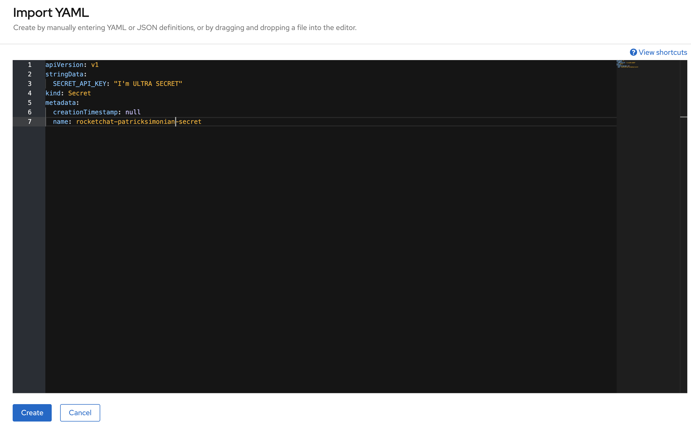

- Explore the other mongo secrets to see different variations of secret data by navigating to `Administrator View -> Workloads -> Secrets`


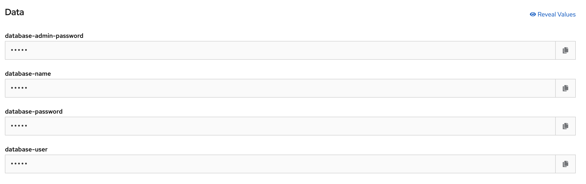

- Navigate back to your `rocketchat-[username]-secret` and attach the `secret` to your `rocketchat-[username]` DeploymentConfig by navigating to the `Add Secret to Workload`

- Attach the secret as an environment variable

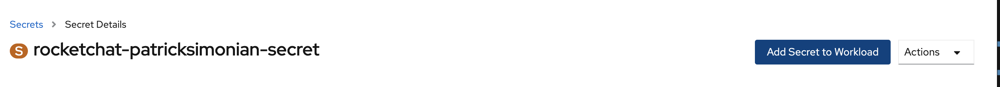
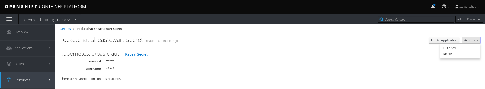


- This change will trigger a new deployment of your `rocketchat-[username]` pod
- Once the pods have been redeployed the environment variable should be available for them to use. This is a very common pattern that applications can use to hold sensitive information like api keys in memory. You can verify that the environment variable exists by accessing the pod terminal or using `oc rsh` and outputting its value with a simple `echo $SECRET_API_KEY`


- From the cli, review the secret with `oc describe secret rocketchat-[username]-secret`

```
oc describe secret rocketchat-[username]-secret
Name:         rocketchat-[username]-secret
Namespace:    [namespace]
Labels:       <none>
Annotations:  <none>

Type:  Opaque

Data
====
SECRET_API_KEY:  16 bytes
```

- Export the secret to view the contents with `oc get --export secret rocketchat-[username]-secret -o yaml`

```
oc get --export secret rocketchat-[username]-secret -o yaml
apiVersion: v1
data:
  SECRET_API_KEY: SSdtIFVMVFJBIFNFQ1JFVA==
kind: Secret
metadata:
  creationTimestamp: null
  name: rocketchat-[username]-secret
  selfLink: /api/v1/namespaces/[namespace]/secrets/rocketchat-[username]-secret
type: Opaque
```
> on Mac's and Linux machines that have the base64 binary, you can decode the value as a reference
```
echo "c2hlYXN0ZXdhcnQ=" | base64 -d
```

- To edit an existing secret, from the webconsole you can navigate to the secret and select the `YAML` tab or `oc edit secret rocketchat-[username]-secret` from the cli. Secrets are base64 encoded. If adding new values or editing existing values of a Secret it is often easier to
edit in plain text and have it b64 encoded for you. To do this you will need to modify the `data` field and change it to
`stringData` prior to adding or editing values.

- Add another secret value but this time as a sensitive configuration file such as an ssh key

From the web console
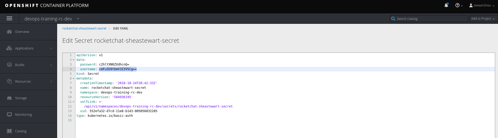
With `oc edit`
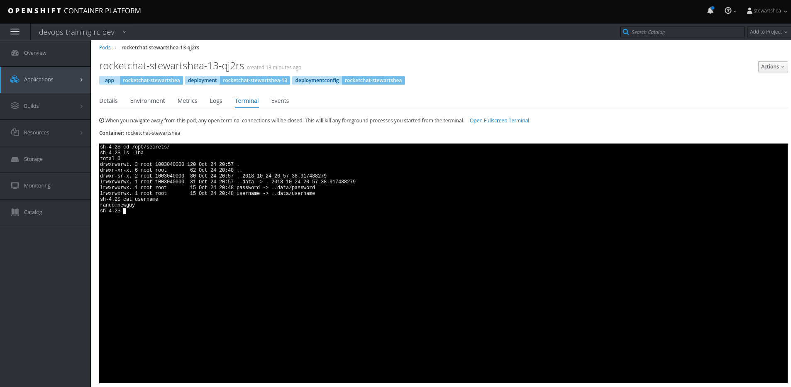

> take note that you were adding a new value `id_rsa` under a field called `stringData`. Openshift will automatically, encode that as base64 and place it in the `data` field upon saving. You can confirm this with `oc get secret rocketchat-[username]-secret -o yaml` after saving. 

 
- Redeploy the application after secret changes
