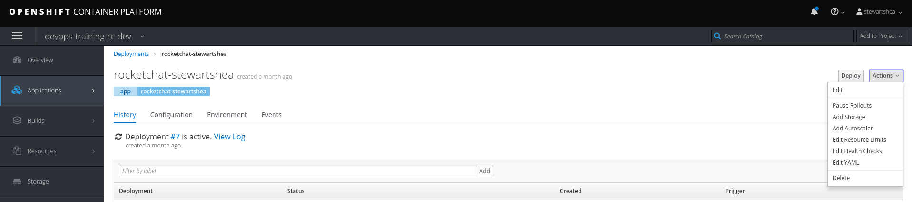
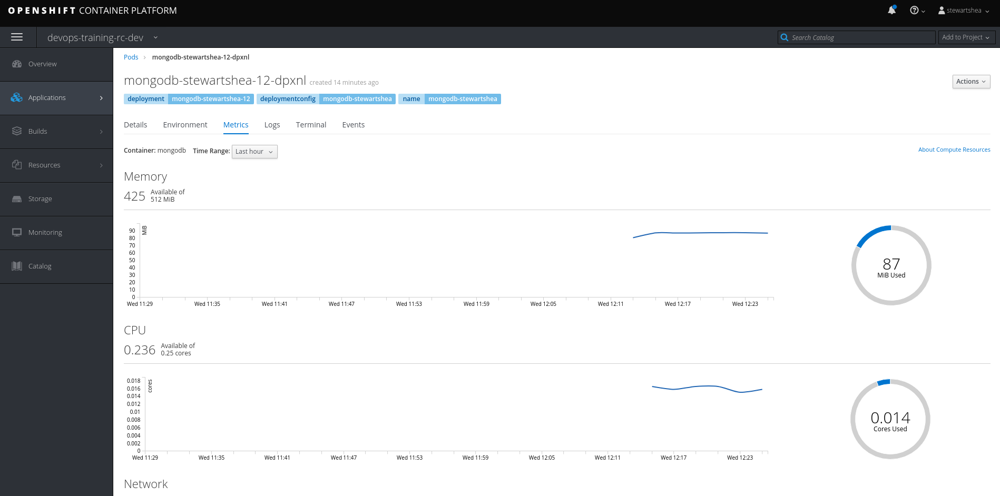

## Resource Requests and Limits
Tuning the resources assigned to a pod will have a direct effect on the performance of the application. 
Many templates include reasonable CPU and Memory resource configurations, however, new apps simply are deployed with the platform default. 

### Explore Default Resource Configurations
Since the Rocket Chat application was built from scratch and not deployed from a template, explore the current resources allocated to the pods: 

- Navigate to your rocketchat deployment and select `Actions -> Edit Resource Limits`

- Notice the defaults that are applied (in a light grey to indicate they are automatically set)

- Review the current metrics of your `rocketchat-<username>` pod

- Reduce the CPU request and limit to `50 millicores` and `100 Megabytes` and monitor the startup time of the pod

- Monitor the startup events of your pod and measure the time it takes to start

- Remove the limits previously imposed, and set your pod to 4 cores for the request and limit

- Monitor the status and speed of the new deployment

- Work with the rest of the class to determine why some pods may have succeeded, and others are failing. 

- Remove the requests/limits previously set