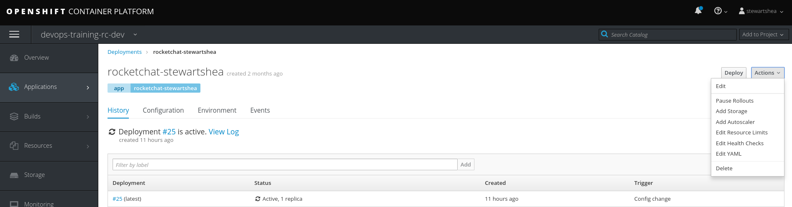
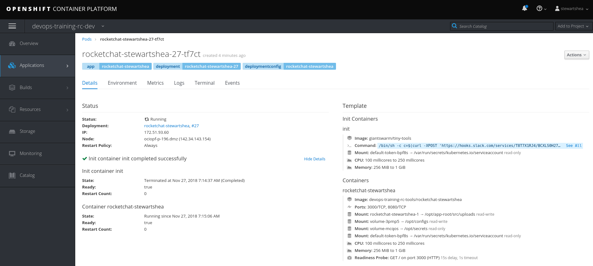

## Pod Lifecycle Customization
A Pod can be extended beyond the normal operation of the container by allowing developers to: 
- add `init` containers
- add `pre` and `post` lifecycle hooks
- modify the default `entrypoint` of a container

### Init Containers
Init containers are best used to prepare the pod for normal operation. In this lab, you will add a simple init container that posts a message to rocketchat with your pod hostname.

- From the Web Console, navigate to `Applications -> Deployments` and select your `rocketchat-[username]` deploymentconfig
    - If you wish to perform this from the cli with the `oc` tool, type `oc edit dc/rocketchat-[username]`
- Select `Actions -> Edit YAML`



- Add the following section of code under `spec: -> template: -> spec:`

```
      initContainers:
      - name: init
        image: giantswarm/tiny-tools
        command: ["/bin/sh", "-c", "c=$(curl -X POST -H 'Content-Type: application/json' --data '{\"text\":\"Say Hello\"}' https://chat.pathfinder.gov.bc.ca/hooks/xxx/xxx)"]
```

- Select Save
- Ask the instructor to ensure the rocketchat instance is displayed to the class
- Explore the `Pod Details` to notice the differente with the Init Container 



In order to obtain logs from the init container, the `oc` command can be used by specifying `-c init`: 

```
oc logs rocketchat-[username]-[pod-id] -c init
```

### Lifecycle Hooks
Lifecycle hooks can be configured to start and stop a container properly. The lifecycle hook is tied directly to each container. Add a similar pre and post hook as the `initContainer` to demonstrate when it executes in your rocketchat deployment. 

- From the Web Console, navigate to `Applications -> Deployments` and select your `rocketchat-[username]` deploymentconfig
    - If you wish to perform this from the cli with the `oc` tool, type `oc edit dc/rocketchat-[username]`
- Select `Actions -> Edit YAML`

- Add the following section of code under `spec: -> template: -> spec: -> containers`

```
          lifecycle:
            postStart:
              exec:
                command:  ["/bin/sh", "-c", "c=$(curl -X POST -H 'Content-Type: application/json' --data '{\"text\": \"'\"$HOSTNAME\"' is at the postStart phase, huzzah! \"}' https://chat.pathfinder.gov.bc.ca/hooks/xxx/xxx)"]
            preStop:
              exec:
                command:  ["/bin/sh", "-c", "c=$(curl -X POST -H 'Content-Type: application/json' --data '{\"text\": \"'\"$HOSTNAME\"' is just about to STOPPPPPP! \"}' https://chat.pathfinder.gov.bc.ca/hooks/xxx/xxx)"]
```

- Select Save
- Ask the instructor to ensure the rocketchat instance is displayed to the class


### Overriding the Entrypoint 
It may be necessary, from time to time, to override the intitial command/entrypoint of a container image. Generally this is used for troubleshooting purposes, or to override a vendor provided image. 


- From the Web Console, navigate to `Applications -> Deployments` and select your `rocketchat-[username]` deploymentconfig
    - If you wish to perform this from the cli with the `oc` tool, type `oc edit dc/rocketchat-[username]`
- Select `Actions -> Edit YAML`
- Add the following section of code under `spec: -> template: -> spec: -> containers`

```
          command:  ["/bin/sh", "-c", "c=$(curl -X POST -H 'Content-Type: application/json' --data '{\"text\": \"'\"$HOSTNAME\"' is AN OVERRIDING COMMAND! \"}' https://chat.pathfinder.gov.bc.ca/hooks/xxx/xxx)"]
```
- Take note of the pattern that will happen in the rocketchat notification screen
- Remove the previous command to enable the rocketchat instance to start properly again

### References
- https://blog.openshift.com/kubernetes-pods-life/

