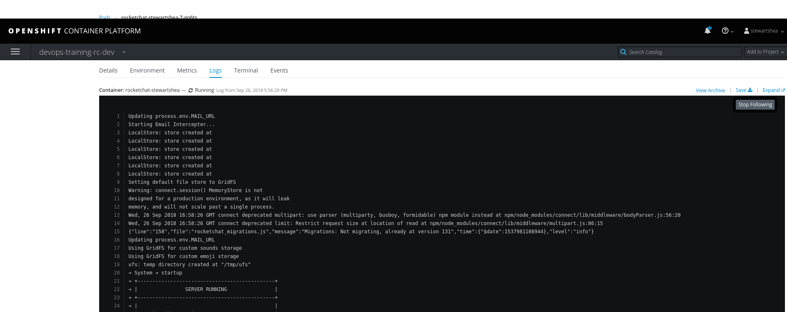
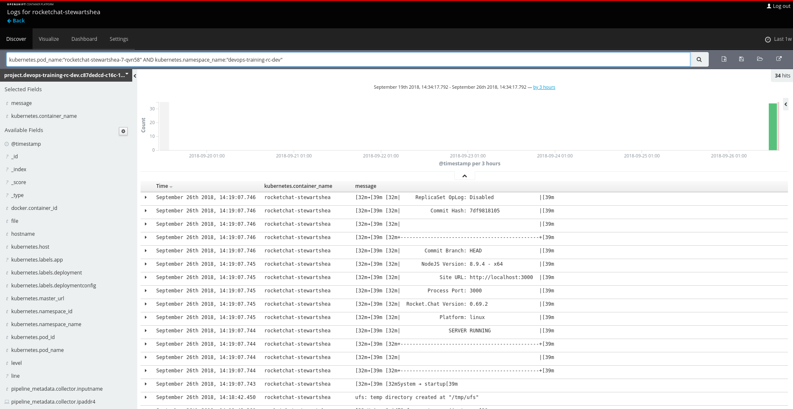
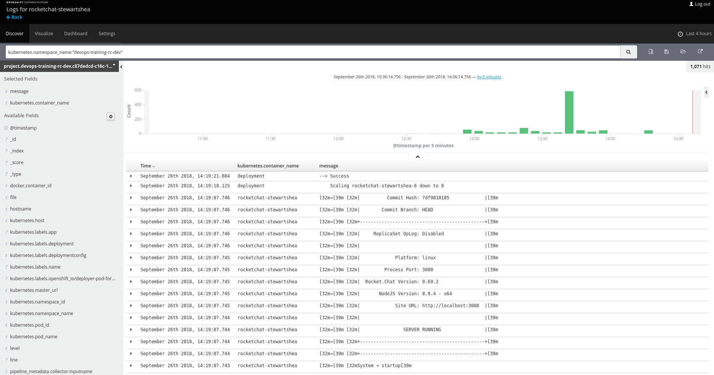
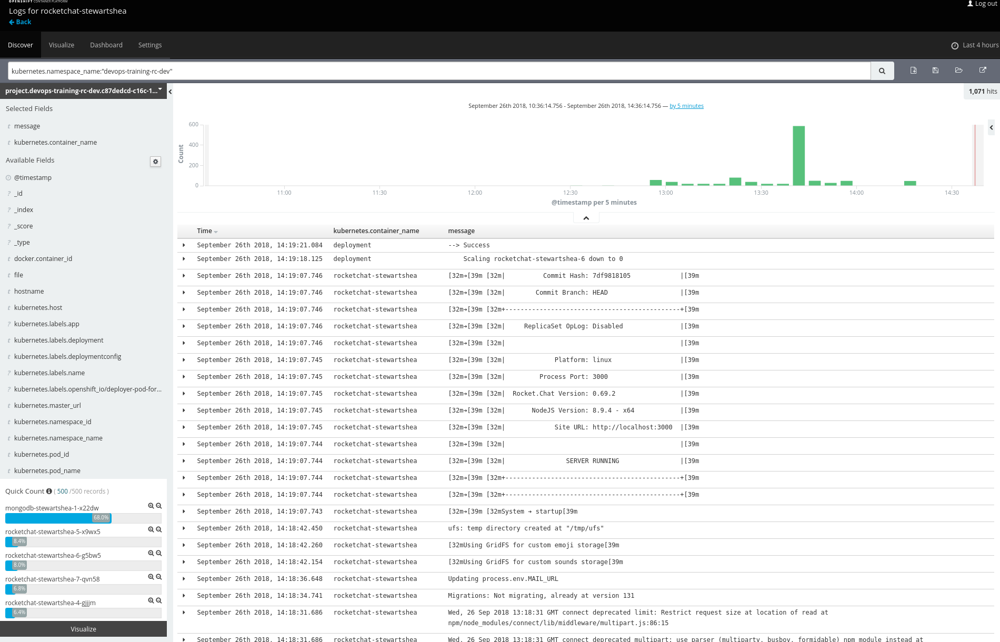

# Logging and Visualizations

> Logging in the Openshift Azure Training Cluster does not leverage Kibana for log surfacing and aggregation. For reference these exercises are available so that you can reference it incase you are using Kibana in the 3.11 production cluster. 

### EFK for Aggregated Logs
The OpenShift platform provides an aggregated logging stack that is automatically configured to centralize and store logs from application pods. These logs are only retained for a short period of time, currently about 14 days, but can be used to help identify issues with appliation pods. 

Kibana is the primary interface for viewing and querying logs. 

#### Access the archive link from a pod
The shortcut towards accessing the Kibana is from the `Logs` tab of a running pod. 

- Select the runing `rocketchat-[username]` pod and select the Logs tab

- Select the view archive link to be taken to Kibana

- Review the logging interface and the query that has been automatically populated

- Modify the query and time picker to select the entire namespace within the last few hours

- Review how Kibana surfaces key information about the log sources in the left panel

- Create a simple visualization of the information surfaced by Kibana

#### Access the kibana interface directly 
Kibana can also be accessed directly at the url: 
- [https://kibana.pathfinder.gov.bc.ca](https://kibana.pathfinder.gov.bc.ca)

The namespaces you have access to view will be directly related to your project permissions. 