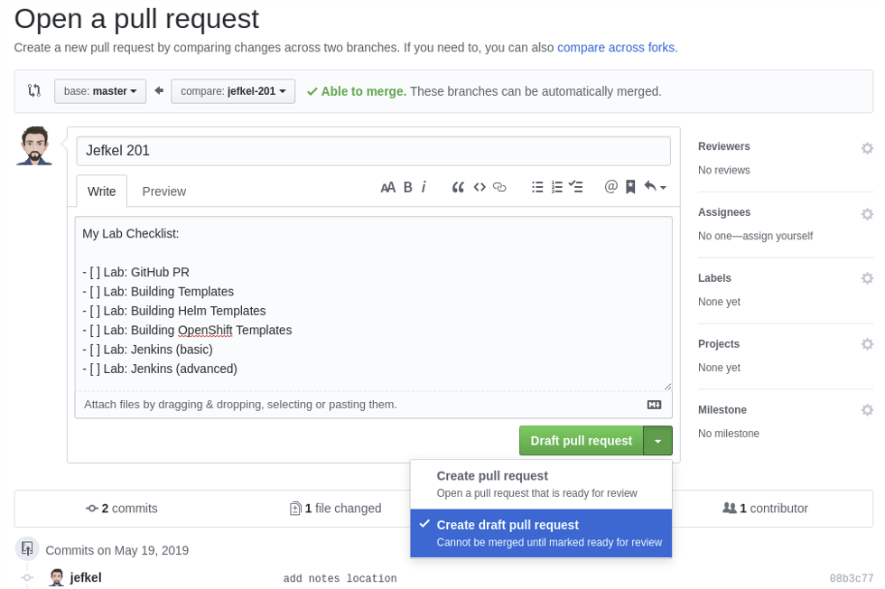

# Git Setup
In this lab, you will create your own fork of the https://github.com/bcdevops/devops-platform-workshops-labs repository, add a branch for your work, and create a draft PR for your feature work.

### Fork the lab repository
Navigate to the <https://github.com/bcdevops/devops-platform-workshops-labs> repository and click the "fork" button in the upper right corner.  Choose your personal account as the location to fork the repository to.


### Create your branch with the CLI
Clone the repository and create your branch locally

``` bash
git clone https://github.com/[username]/devops-platform-workshops-labs.git
cd devops-platform-workshops-labs
git branch [username]-201
git checkout [username]-201
```

Push your local branch to the upstream project

``` bash
git push --set-upstream origin [username]-201
```


### Create your branch with the GUI

Navigate to the public repository (<https://github.com/[username]/devops-platform-workshops-labs)>

- Click "Branch:" and add you [username]-201 as the branch name.
- Click "Create branch [username]-201"

Follow the above instructions to "Create your branch with the CLI" but exclude the `git branch` and `git push` commands to clone a local copy and switch to the already created [username]-201 branch

### Create a draft pull request
You won't be able to create a pull request until you have committed changes in your branch, so start off by creating a notes.md file and committing it to your branch:

``` bash
echo "# My personal notes message" >> notes.md
git add notes.md
git commit -m "add notes location"
git push
```

- In your browser, navigate to the "branches" tab

`quick tip: click on the "yours" link to filter out everyone else's branches`

- Click on the "New Pull Request" button beside your branch.


- Update the title and add a message (you can use Markdown, creativity is great!)

**IMPORTANT** Change the base repository to be {admin}/devops-platform-workshops-labs from the default of the parent (forked) repository.  (We don't need to go creating a bunch of PR's against the main repo just now)


`you can cut and paste the following into the comment section to start a Lab checklist.  Add more as you go!`

```
My Lab Checklist:

- [ ] Lab: GitHub PR
- [ ] Lab: Building Templates
- [ ] Lab: Building Helm Templates
- [ ] Lab: Building OpenShift Templates
- [ ] Lab: Jenkins (basic)
- [ ] Lab: Jenkins (advanced)
```

We are not ready for a code review just yet, so let's make sure we open a draft pull request and not the default pull request that's ready for review.


Click the green "Draft PR" button and you'll soon see your PR details.

Looking to the right, you should see an "Assignees" section.  To quickly assign yourself click on the "assign yourself" link.

Now you have a place to get feedback on your work, and track your changes in an easily accessible location!

