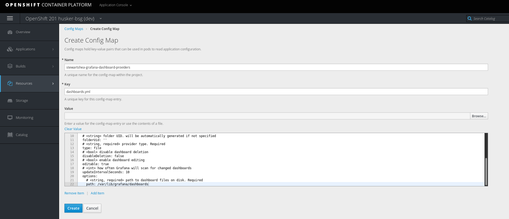

# Building OpenShift Templates
Up to this point you should have 2 apps running inside of your dev namespace, each deployed using the helm client `template` feature.
In this lab, deploy additional components with the traditional OpenShift tools and then create the appropriate templates and store them in your `tools` project. 


## Deploy Grafana Using OpenShift Tools
- Deploy Grafana into the dev namespace using `new-app` and the existing Grafana docker image

```
oc new-app grafana/grafana:6.2.0 --name [username]-grafana
```

- Explore the output of the `new-app` command 
- Explore the objects generated from the utility

```
oc get all -l app=[username]-grafana
```

- Expose the Grafana service

```
oc expose service [username]-grafana --name [username]-grafana
```

- Login to the interface with the default admin password (admin/admin)
- Create 2 datasources and a sample dashboard


- Export the dashbaord configuration for later use


- Rollout a new version from the commandline 

```
oc rollout latest [[username]]-grafana
```

- Explore the UI again, noticing all configuration changes removed
    - The ephemeral state of this pod loses all configuration changes on redeploy
    - Ideally you don't want to use persistent storage for configuration data

## Configure Grafana Without State (ala. configMaps)
This section focuses on using a configMaps to define the configuration of Grafana. Once complete, Grafana instances can scale past 1 pod and will be deemed "stateless". 

- Add a configMap to the grafana app for configuring the dashboard provider


- Use the following content for the configMap

```
apiVersion: 1

providers:
  # <string> provider name
- name: 'default'
  # <int> org id. will default to orgId 1 if not specified
  orgId: 1
  # <string, required> name of the dashboard folder. Required
  folder: ''
  # <string> folder UID. will be automatically generated if not specified
  folderUid: ''
  # <string, required> provider type. Required
  type: file
  # <bool> disable dashboard deletion
  disableDeletion: false
  # <bool> enable dashboard editing
  editable: true
  # <int> how often Grafana will scan for changed dashboards
  updateIntervalSeconds: 10  
  options:
    # <string, required> path to dashboard files on disk. Required
    path: /var/lib/grafana/dashboards

```



- Mount the configMap at `/etc/grafana/provisioning/dashboards`


- Add a label to the configMap to easily associate this with the app


- Repeat the previous tasks for the **datasources** and **dashboards** configMaps
    - **datasources** mount path: `/etc/grafana/provisioning/datasources/`
    - **datasources** key: `datasources.yml`
    - **datasources content**: 
        ```
        # config file version
        apiVersion: 1

        datasources:
        - name: Prometheus
          type: prometheus
          access: proxy
          orgId: 1
          url: http://prometheus:80  
          isDefault: true
          version: 1
          editable: true
        - name: Loki
          type: loki
          orgId: 1
          access: proxy
          url: http://loki:3100  
          jsonData:
              maxLines: 1000
        ```
    - **dashboards** mount path: `/var/lib/grafana/dashboards/`
    - **dashboard** key: `simple_dashboard.json`
    - **dashboard content**: json content from the dashboard export 

**Note** Remember to add the appropriate labels to all configMaps
- When complete, the grafana deployment config should have 3 configmaps similar to the following: 


- Redeploy the grafana pod, log in with default admin credentials, and validate that the dashboard and datasources are present


## Create an OpenShift Deployment Artifact for Grafana
While the `new-app` command was quick and helpful to get an app deployed, it doesn't help in the management of the associated application components. In this section, create an OpenShift artifact (similar to the Helm lab), which can be used for easier management of the components. 

- Review all artifacts associated with Grafana

```
oc get all -l app=[username]-grafana
```

- Expand the search to additional resources

```
oc get all,configmap -l app=[username]-grafana
```

- Export the components into a yaml file that works with `oc apply`

```
oc get all,configmap -l app=[username]-grafana --export -o yaml > grafana_template.yaml
```

- Verify that the file works by removing all objects and deploying from the manifest

```
oc delete all,configmap -l app=[username]-grafana
```

- Attempt to reapply the object list

```
oc apply -f grafana_template.yaml
```
- Identify the types of objects that shouldn't belong in the template
- Remove the undesired objects from the template and reapply

```
oc apply -f grafana_template.yaml
```

- Continue to reapply the same file and review the output; it's clear there is still too much "specific" detail in the manfest
- Edit the manifest to make it more "generic"
    - Remove any references to: 
        - last applied configuration annotations (just to keep the file clean)
        - creationTimestamp
        - generation
        - clusterIP
        - namespace
        - resourceVersion
        - selflink
        - uid 
        - status

- Remove the objects again and apply the manifest more than once  (this should succeeed with `unchanged` showing up when no changes are made)

```
oc delete all,configmap -l app=[username]-grafana
oc apply -f grafana_template.yaml
oc apply -f grafana_template.yaml
```

## Create a Template for Grafana
With the above content added to a manifest with all items in a list, it can be parameterized into a template object. 
Using an existing template for reference (such as the one explored in previous labs), build a template for Grafana. 

The following code can be used as an example: 

```
apiVersion: template.openshift.io/v1
kind: Template
labels:
  template: grafana-template
message: |-
  The following service(s) have been created in your project: ${GRAFANA_SERVICE_NAME}.
  For more information about using this template, including OpenShift considerations, contact the rocketchat community.
metadata:
  annotations:
    description: |-
      Grafana Template for use in OpenShift 201 lab without persistent storage. 

      WARNING: Any configuration stored will be lost upon pod destruction. ConfigMaps should be used for codified configuration. 
    iconClass: icon-other-unknown
    openshift.io/display-name: grafana-openshift201
    openshift.io/documentation-url: https://github.com/bcdevops/devops-platform-workshops
    openshift.io/long-description: This template provides a sample Grafana configuration for lab purposes.
    openshift.io/provider-display-name: BCDevOps
    openshift.io/support-url: https://github.com/bcdevops/
    tags: monitoring,grafana
  name: grafana-template
objects: 
- apiVersion: v1
  kind: Service
  metadata:
    annotations:
      openshift.io/generated-by: OpenShiftNewApp
    labels:
      app: ${GRAFANA_SERVICE_NAME}
    name: ${GRAFANA_SERVICE_NAME}
  spec:
    ports:
    - name: 3000-tcp
      port: 3000
      protocol: TCP
      targetPort: 3000
    selector:
      app: ${GRAFANA_SERVICE_NAME}
      deploymentconfig: ${GRAFANA_SERVICE_NAME}
    sessionAffinity: None
    type: ClusterIP
- apiVersion: apps.openshift.io/v1
  kind: DeploymentConfig
  metadata:
    annotations:
      openshift.io/generated-by: OpenShiftNewApp
    labels:
      app: ${GRAFANA_SERVICE_NAME}
    name: ${GRAFANA_SERVICE_NAME}
  spec:
    replicas: 1
    revisionHistoryLimit: 10
    selector:
      app: ${GRAFANA_SERVICE_NAME}
      deploymentconfig: ${GRAFANA_SERVICE_NAME}
    strategy:
      activeDeadlineSeconds: 21600
      resources: {}
      rollingParams:
        intervalSeconds: 1
        maxSurge: 25%
        maxUnavailable: 25%
        timeoutSeconds: 600
        updatePeriodSeconds: 1
      type: Rolling
    template:
      metadata:
        annotations:
          openshift.io/generated-by: OpenShiftNewApp
        labels:
          app: ${GRAFANA_SERVICE_NAME}
          deploymentconfig: ${GRAFANA_SERVICE_NAME}
      spec:
        containers:
        - image: grafana/grafana:v6.2.0
          imagePullPolicy: IfNotPresent
          name: ${GRAFANA_SERVICE_NAME}
          ports:
          - containerPort: 3000
            protocol: TCP
          resources: {}
          terminationMessagePath: /dev/termination-log
          terminationMessagePolicy: File
          volumeMounts:
          - mountPath: /etc/grafana/provisioning/dashboards/
            name: volume-bfku7
          - mountPath: /etc/grafana/provisioning/datasources/
            name: volume-ttg2w
          - mountPath: /var/lib/grafana/dashboards/
            name: volume-y3co5
        dnsPolicy: ClusterFirst
        restartPolicy: Always
        schedulerName: default-scheduler
        securityContext: {}
        terminationGracePeriodSeconds: 30
        volumes:
        - configMap:
            defaultMode: 420
            name: ${GRAFANA_SERVICE_NAME}-dashboard-providers
          name: volume-bfku7
        - configMap:
            defaultMode: 420
            name: ${GRAFANA_SERVICE_NAME}-datasources
          name: volume-ttg2w
        - configMap:
            defaultMode: 420
            name: ${GRAFANA_SERVICE_NAME}-dashboards
          name: volume-y3co5
    test: false
    triggers:
    - type: ConfigChange
    - imageChangeParams:
        automatic: true
        containerNames:
        - ${GRAFANA_SERVICE_NAME}
        from:
          kind: ImageStreamTag
          name: ${GRAFANA_SERVICE_NAME}:6.2.0
          namespace: ${NAMESPACE}
      type: ImageChange
- apiVersion: image.openshift.io/v1
  kind: ImageStream
  metadata:
    annotations:
      openshift.io/generated-by: OpenShiftNewApp
      openshift.io/image.dockerRepositoryCheck: 2019-05-26T17:34:32Z
    generation: 2
    labels:
      app: ${GRAFANA_SERVICE_NAME}
    name: ${GRAFANA_SERVICE_NAME}
  spec:
    lookupPolicy:
      local: false
    tags:
    - annotations:
        openshift.io/imported-from: grafana/grafana:6.2.0
      from:
        kind: DockerImage
        name: grafana/grafana:6.2.0
      generation: 2
      importPolicy: {}
      name: 6.2.0
      referencePolicy:
        type: Source
- apiVersion: route.openshift.io/v1
  kind: Route
  metadata:
    annotations:
      openshift.io/host.generated: "true"
    labels:
      app: ${GRAFANA_SERVICE_NAME}
    name: ${GRAFANA_SERVICE_NAME}
  spec:
    host: ${GRAFANA_SERVICE_NAME}-${NAMESPACE}.${ROUTE_SUBDOMAIN}
    port:
      targetPort: 3000-tcp
    to:
      kind: Service
      name: ${GRAFANA_SERVICE_NAME}
      weight: 100
    wildcardPolicy: None
- apiVersion: v1
  data:
    dashboards.yml: "apiVersion: 1\n\nproviders:\n  # <string> provider name\n- name:
      'default'\n  # <int> org id. will default to orgId 1 if not specified\n  orgId:
      1\n  # <string, required> name of the dashboard folder. Required\n  folder:
      ''\n  # <string> folder UID. will be automatically generated if not specified\n
      \ folderUid: ''\n  # <string, required> provider type. Required\n  type: file\n
      \ # <bool> disable dashboard deletion\n  disableDeletion: false\n  # <bool>
      enable dashboard editing\n  editable: true\n  # <int> how often Grafana will
      scan for changed dashboards\n  updateIntervalSeconds: 10  \n  options:\n    #
      <string, required> path to dashboard files on disk. Required\n    path: /var/lib/grafana/dashboards"
  kind: ConfigMap
  metadata:
    labels:
      app: ${GRAFANA_SERVICE_NAME}
    name: ${GRAFANA_SERVICE_NAME}-dashboard-providers
- apiVersion: v1
  data:
    simple_dashboard.json: |-
      {
        "annotations": {
          "list": [
            {
              "builtIn": 1,
              "datasource": "-- Grafana --",
              "enable": true,
              "hide": true,
              "iconColor": "rgba(0, 211, 255, 1)",
              "name": "Annotations & Alerts",
              "type": "dashboard"
            }
          ]
        },
        "editable": true,
        "gnetId": null,
        "graphTooltip": 0,
        "id": 1,
        "links": [],
        "panels": [
          {
            "cacheTimeout": null,
            "colorBackground": false,
            "colorValue": false,
            "colors": [
              "#299c46",
              "rgba(237, 129, 40, 0.89)",
              "#d44a3a"
            ],
            "format": "none",
            "gauge": {
              "maxValue": 100,
              "minValue": 0,
              "show": false,
              "thresholdLabels": false,
              "thresholdMarkers": true
            },
            "gridPos": {
              "h": 9,
              "w": 12,
              "x": 0,
              "y": 0
            },
            "id": 2,
            "interval": null,
            "links": [],
            "mappingType": 1,
            "mappingTypes": [
              {
                "name": "value to text",
                "value": 1
              },
              {
                "name": "range to text",
                "value": 2
              }
            ],
            "maxDataPoints": 100,
            "nullPointMode": "connected",
            "nullText": null,
            "options": {},
            "postfix": "",
            "postfixFontSize": "50%",
            "prefix": "",
            "prefixFontSize": "50%",
            "rangeMaps": [
              {
                "from": "null",
                "text": "N/A",
                "to": "null"
              }
            ],
            "sparkline": {
              "fillColor": "rgba(31, 118, 189, 0.18)",
              "full": false,
              "lineColor": "rgb(31, 120, 193)",
              "show": false
            },
            "tableColumn": "",
            "targets": [
              {
                "expr": "sum(up)\n",
                "format": "time_series",
                "intervalFactor": 1,
                "refId": "A"
              }
            ],
            "thresholds": "",
            "timeFrom": null,
            "timeShift": null,
            "title": "Simple Panel",
            "type": "singlestat",
            "valueFontSize": "80%",
            "valueMaps": [
              {
                "op": "=",
                "text": "N/A",
                "value": "null"
              }
            ],
            "valueName": "current"
          }
        ],
        "schemaVersion": 18,
        "style": "dark",
        "tags": [],
        "templating": {
          "list": []
        },
        "time": {
          "from": "now-6h",
          "to": "now"
        },
        "timepicker": {
          "refresh_intervals": [
            "5s",
            "10s",
            "30s",
            "1m",
            "5m",
            "15m",
            "30m",
            "1h",
            "2h",
            "1d"
          ],
          "time_options": [
            "5m",
            "15m",
            "1h",
            "6h",
            "12h",
            "24h",
            "2d",
            "7d",
            "30d"
          ]
        },
        "timezone": "",
        "title": "Simple Dashboard",
        "uid": "ybk9TjWZk",
        "version": 1
      }
  kind: ConfigMap
  metadata:
    labels:
      app: ${GRAFANA_SERVICE_NAME}
    name: ${GRAFANA_SERVICE_NAME}-dashboards
- apiVersion: v1
  data:
    datasource.yml: "# config file version\napiVersion: 1\n\ndatasources:\n- name:
      Prometheus\n  type: prometheus\n  access: proxy\n  orgId: 1\n  url: http://${PROMETHEUS_SERVICE_NAME}:80
      \n  isDefault: true\n  version: 1\n  editable: true\n- name: Loki\n  type: loki\n
      \ orgId: 1\n  access: proxy\n  url: http://${LOKI_SERVICE_NAME}:3100 \n  jsonData:\n
      \     maxLines: 1000"
  kind: ConfigMap
  metadata:
    labels:
      app: ${GRAFANA_SERVICE_NAME}
    name: ${GRAFANA_SERVICE_NAME}-datasources
parameters:
- description: Maximum amount of memory the container can use.
  displayName: Memory Limit
  name: MEMORY_LIMIT
  required: true
  value: 512Mi
- description: The namespace this templated is deployed into.
  displayName: Namespace
  name: NAMESPACE
  value: openshift
- description: The name of the OpenShift Service exposed for the database.
  displayName: Grafana Service Name
  name: GRAFANA_SERVICE_NAME
  required: true
  value: grafana
- description: The name of the Loki service to connect to.
  displayName: Loki Service Name
  name: LOKI_SERVICE_NAME
  required: true
  value: loki
- description: The name of the Prometheus service to connect to.
  displayName: Prometheus Service Name
  name: PROMETHEUS_SERVICE_NAME
  required: true
  value: prometheus
- description: Default route subdomain
  displayName: Route subdomain
  name: ROUTE_SUBDOMAIN
  required: true
  value: pathfinder.gov.bc.ca
```
- Install the template in the `dev` namespace

```
oc create -f [openshift_grafana_template_filename].yaml
```

- Deploy another version of Grafana with a different service name to validate functionality

```
oc process grafana-template \
    -p GRAFANA_SERVICE_NAME=[grafana app name] \
    -p LOKI_SERVICE_NAME=[loki-service] \
    -p PROMETHEUS_SERVICE_NAME=[prometheus-service] \
    -p ROUTE_SUBDOMAIN=pathfinder.gov.bc.ca \
    -p NAMESPACE=[dev namespace] \
    | oc apply -f -
```

## Create a Template for Prometheus and Loki
Using the experience gained above, create 2 additional templates for Prometheus and Loki. This should not require any GUI/UI driven changes since the you already have the configuration artifacts from the `Helm` lab. 

- Test each template in the dev namespace by passing a separate name for the service and ensuring the resources come up properly

```
oc process -f openshift_template_prometheus.yaml -p PROMETHEUS_SERVICE_NAME=prom2 -p PROMETHEUS_PVC_SIZE=2Gi -p NAMESPACE=[namespace] | oc apply -f -
```

## Commiting The Templates to SCM
Copy all template files into a `templates` directory in your forked repo and commit the changes to your branch. 


