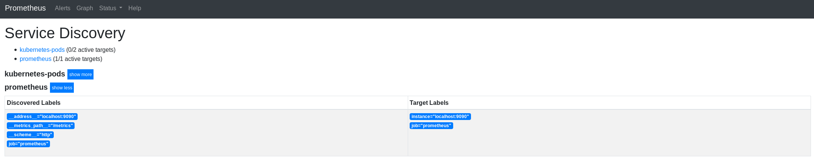
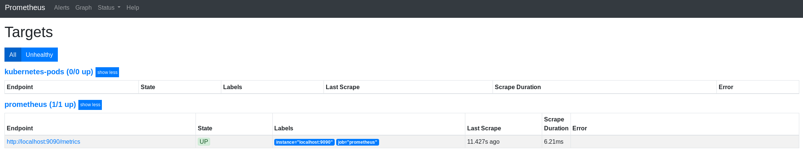

# Using Helm Templates
The OpenShift cluster is not running Tiller, but Helm can still be used to help deploy packaged applications to projects/namespaces. 

## Obtain Helm
- Navigate to GitHub to obtain the appropriate version of Helm for your Operating System: 
    - [https://github.com/helm/helm/releases/latest](https://github.com/helm/helm/releases/latest)
- Initialize helm in client-only mode
```
    helm init --client-only
```
- Update repositories (Necessary if you already have helm installed)

```
helm repo update
```

## Deploy Prometheus into Dev Namespace


- Review the list of chart repositories and validate `https://kubernetes-charts.storage.googleapis.com` is available
    
```
helm repo  list
```
- Search for prometheus

```
helm search prometheus
```
- Fetch the prometheus chart and verify the tgz package is downloaded

```
helm fetch stable/prometheus --version=8.11.1
ls -lha  | grep prometheus
```

- Navitage to GitHub and review the available vales for this chart
    - [https://github.com/helm/charts/tree/master/stable/prometheus#configuration](https://github.com/helm/charts/tree/master/stable/prometheus)
    - The prometheus chart has a lot of components enabled; this lab only requires the server component
- Use the helm client to generate the OpenShift artifacts in a file, only installing the `server` component


```
helm template ./prometheus-8.11.1.tgz \
  --name [username]-prometheus \
  --set \
server.persistentVolume.size=1Gi,\
server.name=[username]-prometheus,\
alertmanager.enabled=false,\
pushgateway.enabled=false,\
kubeStateMetrics.enabled=false,\
nodeExporter.enabled=false,\
serviceAccounts.server.create=false,\
rbac.create=false \
> [username]-prometheus.yaml
```
- Deploy the artifacts with `oc`

```
oc apply -f [username]-prometheus.yaml
```
- Review the logs and notice that prometheus is trying to scrape every OpenShift project/namespace
- Adjust the configMap 
    - disable the full cluster scraping configuration by editing the manifest and **commenting out or deleteing lines 30 to 156**
    - edit the `kubernetes-pod` job to add only the current project/namespace; such as


    - job_name: kubernetes-pods
      kubernetes_sd_configs:
      - role: pod
        namespaces:
            names:
              - [ PROJECT NAME]
      relabel_configs:
      - action: keep
        regex: true
        source_labels:
        - __meta_kubernetes_pod_annotation_prometheus_io_scrape
      - action: replace
        regex: (.+)
        source_labels:
        - __meta_kubernetes_pod_annotation_prometheus_io_path
        target_label: __metrics_path__
      - action: replace
        regex: ([^:]+)(?::\d+)?;(\d+)
        replacement: $1:$2
        source_labels:
        - __address__
        - __meta_kubernetes_pod_annotation_prometheus_io_port
        target_label: __address__
      - action: labelmap
        regex: __meta_kubernetes_pod_label_(.+)
      - action: replace
        source_labels:
        - __meta_kubernetes_namespace
        target_label: kubernetes_namespace
      - action: replace
        source_labels:
        - __meta_kubernetes_pod_name
        target_label: kubernetes_pod_name


- Apply the manifest with the changes

```
oc apply -f [username]-prometheus.yaml
```

- Add a route to your prometheus service

```
oc get service
oc expose service [service name] --name prometheus -l app=prometheus

# OR
oc expose service "$(oc get service -l app=prometheus -o custom-columns=NAME:.metadata.name --no-headers)" --name prometheus -l app=prometheus
```
- Monitor the pod for the config change


```
caller=web.go:416 component=web msg="Start listening for connections" address=0.0.0.0:9090
caller=main.go:655 msg="TSDB started"
caller=main.go:724 msg="Loading configuration file" filename=/etc/config/prometheus.yml
caller=kubernetes.go:192 component="discovery manager scrape" discovery=k8s msg="Using pod service account via in-cluster config"
caller=main.go:751 msg="Completed loading of configuration file" filename=/etc/config/prometheus.yml
caller=main.go:609 msg="Server is ready to receive web requests."
caller=klog.go:86 component=k8s_client_runtime func=Warningf msg="/app/discovery/kubernetes/kubernetes.go:283: watch of *v1.Pod ended with: too old resource version: 793031384 (793038695)"
caller=klog.go:86 component=k8s_client_runtime func=Warningf msg="/app/discovery/kubernetes/kubernetes.go:283: watch of *v1.Pod ended with: too old resource version: 793044753 (793047516)"
```
- Validate that the prometheus target itself is available



### Cleanup

```
oc delete all,configmap,pvc -l app=prometheus
```

## Deploy Another App with Helm
In this section, deploy [Loki](https://grafana.com/loki) using the same process as the above.
In this deployment, only deploy loki and no other components. 

- Using Helm, create the OpenShift artifacts to deploy Loki with a minimal configuration
```
helm repo add loki https://grafana.github.io/loki/charts
helm fetch loki/loki
helm template ./loki-0.8.3.tgz --name=[username]-loki \
  --set rbac.create=false,rbac.pspEnabled=false,serviceAccount.create=false \
  > loki_template.yaml
oc apply -f loki_template.yaml
```

- Monitor the deployment of loki
- Identify and fix the deployment issue with the current template
- Explore the objects created by the loki helm chart

```
oc get all -l app=loki
```
