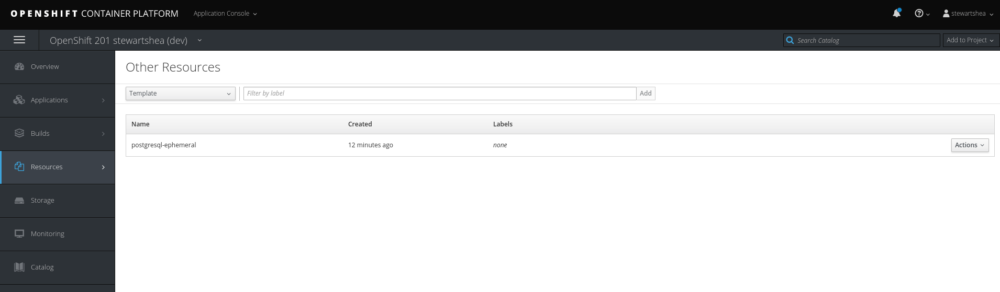

# OpenShift Templates 
In this lab, explore existing template structures. 

## Exploring Templates
Templates can exist within a dedicated project or in a shared project space. The OpenShift catalog us one such example where shared templates are surfaced for use by any platform user.

- Log into the workshop `dev` namespace

```
oc login https://console.pathfinder.gov.bc.ca:8443 --token=[token]
oc project [workshop_project_set_name]-dev
```
- List any templates within your namespace

```
oc get templates
```
- List any templates within the OpenShift namespace, taking note of the number of parameters and objects

```
oc get templates -n openshift
```
- Pick a template and examine it's contents [feel free to choose any template that is interesting]

```
oc describe template postgresql-ephemeral -n openshift 
```

## Exporting a Template
- Export the template to examine the yaml structure

```
oc get template postgresql-ephemeral -n openshift  --export=true -o yaml > template_contents.yaml
cat template_contents.yaml
```

## Adding a Template 
- Create the template inside of the dev namespace

```
oc apply -f template_contents.yaml
```

- Validate that the template exists in your namespace

```
oc get templates
```

## Deploying from a Template
- Pass parameters to the template and review the objects  

```
oc process postgresql-ephemeral DATABASE_SERVICE_NAME=myawesomedb -o yaml 
```
- Using an extended version of that command, create the objects in the dev namespace

```
oc process postgresql-ephemeral DATABASE_SERVICE_NAME=myawesomedb -o yaml | oc apply -f -
```

- Monitor the status of the object creation

```
oc status 
```

- From the CLI, the template can also be viewed



## Cleanup
- Remove all objects, including the template

```
oc get all,templates
oc delete all,templates --all
```
