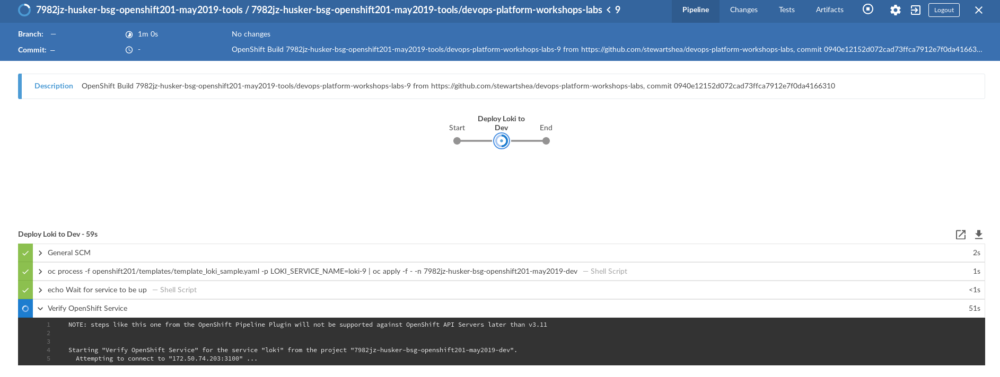

# Jenkins and Basic Pipeline Integration
In this lab you will create a basic Jenkins pipeline that is integrated with OpenShift. 

## Preparation
- Clean up all artifacts that were created in the dev namespace
*Note* Repeat this command as necessary for each `app` name that was deployed

```
oc delete all,configmaps,templates,pvc,secrets -l [labels]
```

# Creating the Initial Pipeline and Folder Structure
Create a simple folder structure in your forked repo for the openshift201 material,  similar to the following: 

```
├── apps
├── LICENSE
├── notes.md
├── openshift201
└── README.md
```

- Create a templates folder and add in the previously created templates, similar to the following: 

```
├── openshift201
│   └── templates
│       ├── template_grafana_sample.yaml
│       ├── template_loki_sample.yaml
│       ├── template_prometheus_sample.yaml
│       └── template_sample_postgres_ephemeral.yaml
└── README.md
```

- Create a `.pipeline` folder and `Jenkinsfile` under the openshift201 folder

- Place the following contents into the Jenkinsfile, changing the definitions to your specific environment names

```
#!/usr/bin/env groovy

//ENV Vars
def TOOLS_NAMESPACE = "[project_name]-tools"
def DEV_NAMESPACE = "[project_name]-dev"
def PROD_NAMESPACE = "[project_name]-prod"


//Pipeline
node {
            stage ('Build Stage'){
                dir ('simple_pipeline') {
                    checkout scm
                    sh "echo HELLO WORLD! "
                    sh "ls -lha openshift201/templates"
                }
            }
    }
```

# Building and Integrating the Initial Pipeline
- From the `tools` project, create the Pipeline style buildConfig

```
oc new-build https://github.com/[github_id]/devops-platform-workshops-labs#[branch-name] --context-dir=openshift201/.pipeline
```
- Notice that Jenkins will automatically start up if it wasn't previously available
- In the OpenShift web console, navigate to `Builds -> Pipelines`


- Obtain the OpenShift supplied webhook and configure it on your forked repository


- Test the webhook by pushing adding any file and commit/push to the repo


# Exploring Jenkins Integration Capabilities
- Modify the pipeline in a `shell` step to explore the capabilities wtih `oc`
    - List all projects that Jenkins can operate upon with `oc get projects`

```
//Pipeline
node {
            stage ('Build Stage'){
                dir ('simple_pipeline') {
                    checkout scm
                    sh "oc get projects"
                }
            }
    }
```
- Review the log output from the job


- Jenkins also provides a `Pipeline Syntax` tool with a Snippet Generator to assist in generating pipeline code


# Deploy the Loki Template to Dev
- Modify the Jenkinsfile to deploy the Loki template to dev
    - Use environment variables as parameters into the templates

```
#!/usr/bin/env groovy

//ENV Vars
def TOOLS_NAMESPACE = "[namespace]-tools"
def DEV_NAMESPACE = "[namespace]-dev"
def PROD_NAMESPACE = "[namespace]-prod"
def LOKI_SERVICE  = "loki"


//Pipeline
node {
            stage ('Deploy Loki to Dev'){
                dir ('simple_pipeline') {
                    checkout scm
                    sh "oc process -f openshift201/templates/template_loki_sample.yaml -p  LOKI_SERVICE_NAME=${LOKI_SERVICE} | oc apply -f - -n ${DEV_NAMESPACE}"

                }
            }
    }

```
- Explore the `-tools` project and notice that no other jenkins agent pods are leveraged
- Add in functionality to verify the service in the deployment

```
                    sh "echo Wait for service to be up"
                    openshiftVerifyService apiURL: '', authToken: '', namespace: "${DEV_NAMESPACE}", svcName: "${LOKI_SERVICE}", verbose: 'false'

```



- Pause and discuss this function with the class
- Kill the Jenkins Pod 
- Wrap that function with a timeout and run the job again

```
                    sh "echo Wait for service to be up"
                    timeout (time: 60, unit: "SECONDS"){
                    openshiftVerifyService apiURL: '', authToken: '', namespace: "${DEV_NAMESPACE}", svcName: "${LOKI_SERVICE}", verbose: 'false'
                    }
```
- The openshiftVerifyService won't work in our case, use one of the more advanced OpenShift DSL functions to verify status

```
#!/usr/bin/env groovy

//ENV Vars
def TOOLS_NAMESPACE = "[namespace]-tools"
def DEV_NAMESPACE = "[namespace]-dev"
def PROD_NAMESPACE = "[namespace]-prod"
def LOKI_SERVICE  = "loki"


//Pipeline
node {
            stage ('Deploy Loki to Dev'){
                dir ('simple_pipeline') {
                    checkout scm
                    sh "oc process -f openshift201/templates/template_loki_sample.yaml -p  LOKI_SERVICE_NAME=${LOKI_SERVICE} | oc apply -f - -n ${DEV_NAMESPACE}"
                    sh "echo Wait for service to be up"
                    timeout (time: 180, unit: 'SECONDS'){
                        openshift.withCluster() {
                        openshift.withProject("${DEV_NAMESPACE}") {
                            def dc = openshift.selector('deployment', "${LOKI_SERVICE}")
                            // this will wait until the desired replicas are available
                            dc.rollout().status()
                        }
                        }
                    }

             }
        }
    }

```

- Clean out the existing deployment and run the pipeline again with the new verification


- Modify the Loki deployment template with **arbitrary metadata on the container** which will trigger a new deployment

```
- apiVersion: apps/v1
  kind: Deployment
  metadata:
    name: ${LOKI_SERVICE_NAME}
    labels:
      app: ${LOKI_SERVICE_NAME}
    annotations:
      {}
  spec:
    replicas: 1
    minReadySeconds: 0
    selector:
      matchLabels:
        app: ${LOKI_SERVICE_NAME}
    strategy:
      type: RollingUpdate
    template:
      metadata:
        labels:
          app: ${LOKI_SERVICE_NAME}
        annotations:
          prometheus.io/port: http-metrics
          prometheus.io/scrape: "true"
          our-awesome-metadata: "nothing to see here"
```


- Deploy Loki across all namespaces with an input stage for approval; it should resemble the following


