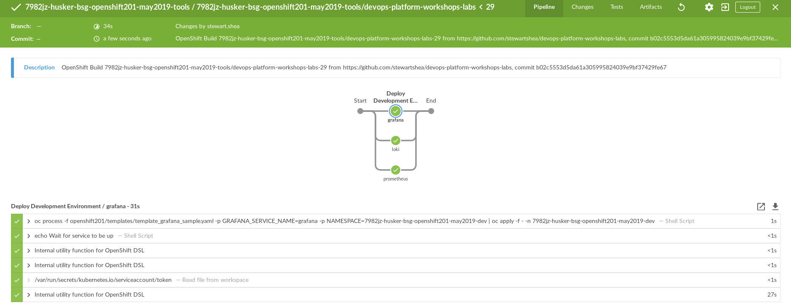
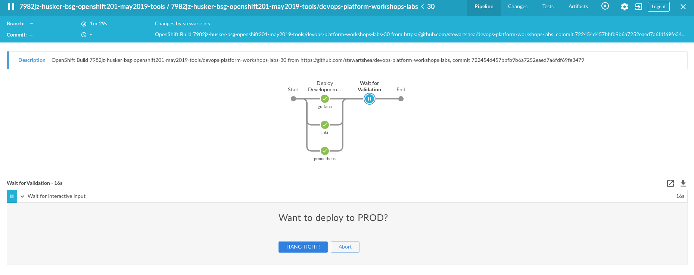
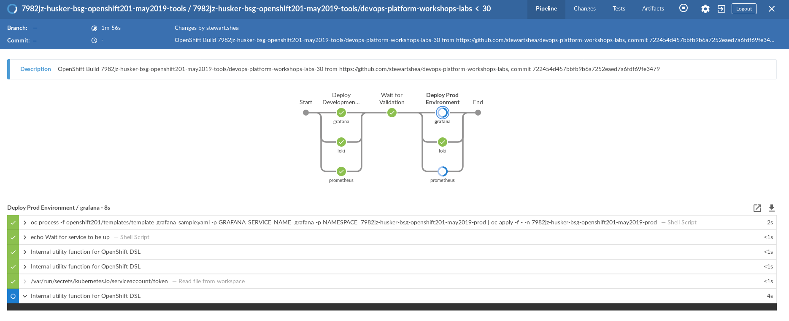
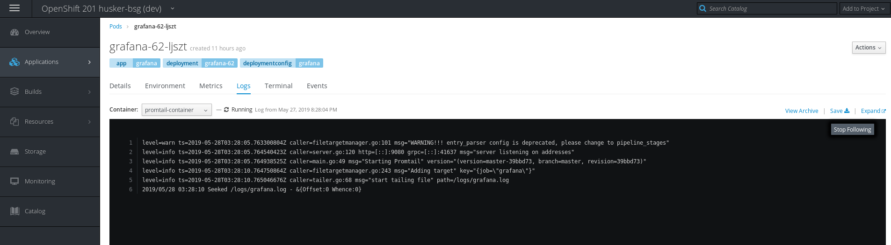
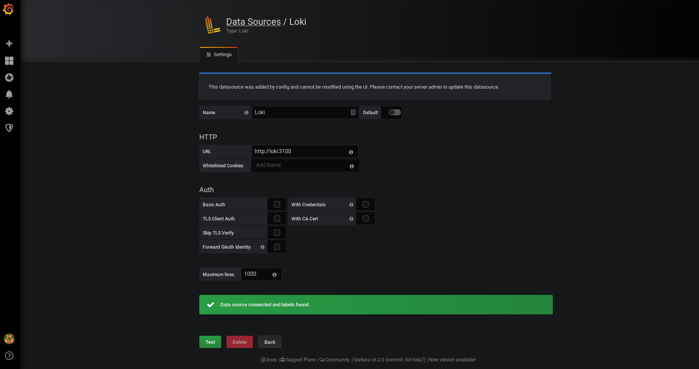
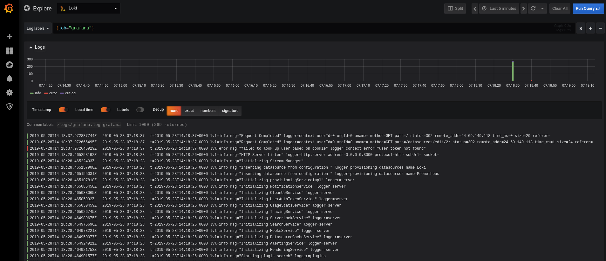

# Parallelize the Deployment of Prometheus/Loki/Grafana
In this next stage, deploy all *three* components to the `dev` project with parallelization. This following code snippet is an example of how parallelization is achieved: 

```
            stage('Testing Stage'){
                
                parallel (
                    'load test': {
                        sh "echo load test"
                    },
                    'security test': {
                        sh "echo security test"
                    },
                    'e2e test': {
                        echo "e2e test"
                    }
                )

            }
```

*Note* All troubleshooting of the templates should be done in code and commited to your repository, automatically starting a new pipeline run. 

- Similar to the previous lab, extend the pipeline to deploy to prod



# Modify Grafana and with Automated Deployment
With the pipeline fully configured, make changes to Grafana to perform the following tasks: 
- Set ENV variables to configure logging
    - output to `/logs/`
    - mode set to `file`

```
## deployment
          env: 
            - name: GF_PATHS_LOGS
              value: /logs
            - name: GF_LOG_MODE
              value: file
```


- Configure an `emptyDir` mount for `/logs`

```
## deployment

          - mountPath: /logs
            name: logs
```
- Add a promtail container to read from `/logs`

```
## deployment
        - name: promtail-container
          image: grafana/promtail:latest
          args:
          - -config.file=/etc/promtail/promtail.yaml
          volumeMounts:
          - name: logs
            mountPath: /logs
          - name: promtail-config
            mountPath: /etc/promtail
```

- Add a config map for promtail

```
## deployment
        volumes:
        - configMap: 
            defaultMode: 420
            name: ${GRAFANA_SERVICE_NAME}-promtail-config
          name: promtail-config

## configmap
- apiVersion: v1
  kind: ConfigMap
  metadata:
    name: ${GRAFANA_SERVICE_NAME}-promtail-config
    labels: 
      app: ${GRAFANA_SERVICE_NAME}
  data:
    promtail.yaml: |
      server:
        http_listen_port: 9080
        grpc_listen_port: 0
      positions:
        filename: /tmp/positions.yaml
      clients:
        - url: http://${LOKI_SERVICE_NAME}:3100/api/prom/push
      scrape_configs:
        - job_name: system 
          entry_parser: raw 
          static_configs: 
            - targets: 
                - localhost 
              labels: 
                job: grafana
                __path__: /logs/grafana.log
```

- Push the changes and monitor the deployment
- Validate the datasource and explore the Loki interface in Grafana






