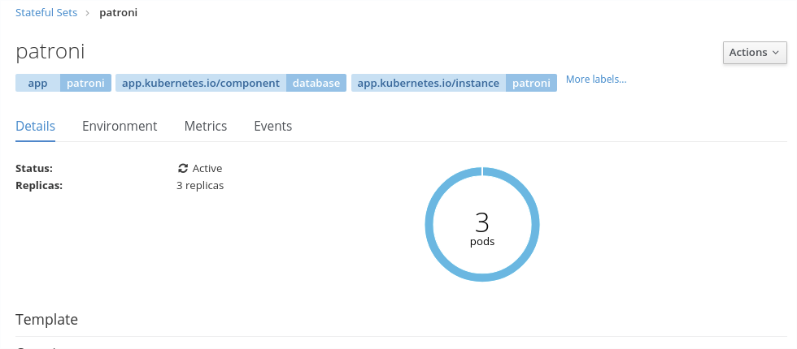
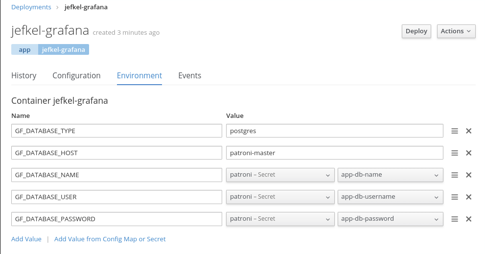

# Patroni Setup

In this lab we are building a back-end database for our grafana application.  Grafana will use this DB
for managing any configuration not covered by the configmaps, as well as user session state.  The database
tool we will be using is postgresql with patroni operating as a cluster manager.

## Create your image
Generate an image in your project space to use for the lab.

- Check that you are logged into the workshop -tools namespace

``` bash
oc login https://console.pathfinder.gov.bc.ca:8443 --token=[token]
oc project [workshop_project_set_name]-tools
```

- clone and examine the [https://github.com/bcdevops/platform-services](https://github.com/bcdevops/platform-services) repository and look at the patroni templates
( /apps/pgsql/patroni/ )

- process the build template into your -tools environment with appropriate parameters

Shortcut: instead of cloning this repository locally, you can process a raw github link directly:
```
oc process -f \
  https://raw.githubusercontent.com/BCDevOps/platform-services/master/apps/pgsql/patroni/openshift/build.yaml \
  --param-file=./patroni-build.env | oc apply -f -
```

- tag your latest successful build with a tag for the environment you want to deploy to: "v10-dev" for example.

``` bash
oc tag [your-patroni-imageStream]:v10-latest patroni:v10-dev \
-n [workshop_project_set_name]-tools
```

## Create the deployment pre-requisites

The patroni template uses a pre-created secret.

- Examine parameters in the included patroni pre-requisite template (secret object)

- Create a parameter file for your deployment environment with settings needed for both the pre-requisite secret and the deployment.

``` bash
cat << EOT > dev.env
NAME=[your-patroni]
IMAGE_STREAM_NAMESPACE=[workshop_project_set_name]-tools
IMAGE_STREAM_TAG=[your-patroni-imageStream]:v10-dev
PVC_SIZE=1Gi
APP_DB_NAME=grafana
APP_DB_USERNAME=grafana
EOT
```

- process the prereq file

``` bash
oc project [workshop_project_set_name]-dev
oc process -f openshift/deployment-prereq.yaml --param-file=./dev.env
```

*Tip: add --ignore-unknown-parameters=true to skip this error message and combine the application templates into a single env file*

- Re-process and apply the pre-req to your dev environment

``` bash
oc process -f openshift/deployment-prereq.yaml \
  --param-file=./dev.env --ignore-unknown-parameters=true \
  | oc apply -f -
```

## Create the stateful set
Have a look at the objects created by the deployment.yaml as this OpenShift Template will be creating a few things that you'll want to keep track of, and the statefulSet itself will be creating additional objects afterwards.

``` bash
oc process -f openshift/deployment.yaml \
  --param-file=./dev.env --ignore-unknown-parameters=true \
  | oc apply -f - -n [workshop_project_set_name]-dev
```

- Watch the deployment spin up the stateful set



## Configure grafana
Configure the grafana app to use patroni postgres DB instead of it's sqlite DB for session caching and anything not in a configMap.

- Update the grafana deploymentConfig with the following environment variables

``` bash
GF_DATABASE_TYPE=postgres
GF_DATABASE_HOST=[your-patroni]-master
GF_DATABASE_NAME=(secret:your-patroni/app-db-name)
GF_DATABASE_USER=(secret:your-patroni/app-db-username)
GF_DATABASE_PASSWORD=(secret:your-patroni/app-db-password)
```



Now you can scale up the grafana deployment and both state configuration as well as user sessions will be highly available via the database.

*Don't forget to export your changes*
