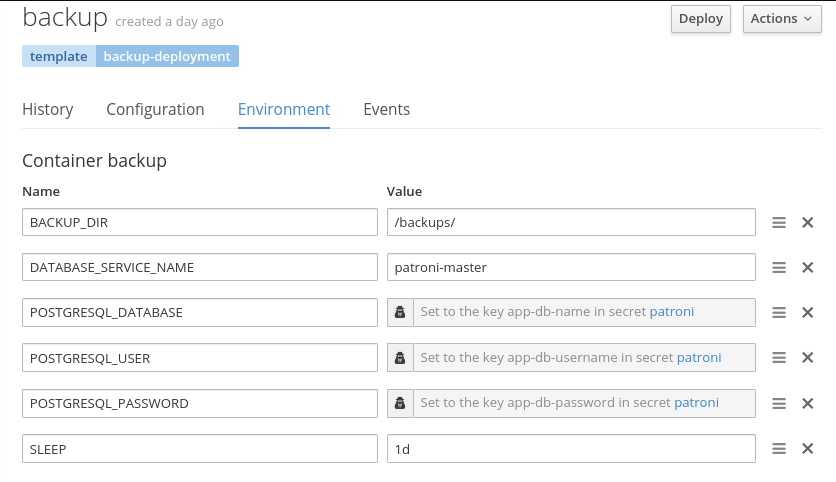

# Postgres backup and recovery

In this lab we will create and test a backup system for our postgres DB.  If time is short, you can use the provided json templates in your forked repository.

- Build a backup image.  You can find the backup-simple.sh script in the forked repository if you would like to have the deployed pod stay up without running from a debug pod.  If you choose to ignore that file, you will need to run as a debug pod in order to have a shell to run the backup commands.

Dockerfile:
``` bash
# This image provides a postgres installation from which to run backups 
FROM registry.access.redhat.com/rhscl/postgresql-10-rhel7

# Set the workdir to be root
WORKDIR /

# Load the backup script into the container (must be executable).
COPY backup-simple.sh /

# Set the default CMD.
CMD sh /backup-simple.sh
```

- Create a deploymentConfig using that image

- Create 2 PVC's and attach to your deploymentConfig
  - backup-pvc - attach to /backups
  - validation-pvc - attach to /var/lib/pgsql/data

- Add the following environment variables to your deploymentConfig



- rsh to your backup container for the rest of these steps.

*If you did not add the `backup-simple.sh` to your image, your deployment will not start.  Simply run a debug pod and proceed with the lab using the debug pod instead.*

- Have a quick sanity check on the environment variables, and then run your backup.

``` bash
env | grep -e "BACK" -e "POSTGRESQL" -e "DATABASE"

PGPASSWORD=${POSTGRESQL_PASSWORD} pg_dump -Fp \
  -h "${DATABASE_SERVICE_NAME}" -p "${PATRONI_MASTER_SERVICE_PORT}" \
  -U $POSTGRESQL_USER $POSTGRESQL_DATABASE \
  | gzip > "${BACKUP_DIR}/${DATABASE_SERVICE_NAME}.dmp-`date +\%Y-\%m-\%d_%H-%M-%S`.gz"
```

### Restore Process

- Start a DB in the backup pod

``` bash
run-postgresql &
```

- Restore the DB

``` bash
gunzip -c "${BACKUP_DIR}/[backup file]" \
  | psql -v ON_ERROR_STOP=1 -x -h localhost -d "${POSTGRESQL_DATABASE}"
```

- Connect and verify the data

```
psql -d "${POSTGRESQL_DATABASE}" -c "\d"
```

- Stop the DB and clean up files.

``` bash
pg_ctl stop -D /var/lib/pgsql/data/userdata
rm -rf /var/lib/pgsql/data/userdata
```

# Next Steps
You've just completed a backup/validation cycle

- created a generic postgres:v10 container (possibly with a simple "pause" entry script)
- backed up a live database
- recovered that backup into a temporary database for validation
- validated the temporary data
- cleaned up the temporary database and data

That is how quick and easy it is to setup a rudimentary backup and backup verification environment.  For advanced scheduling and a more complex automation utilities, have a look at <https://github.com/BCDevOps/backup-container>
