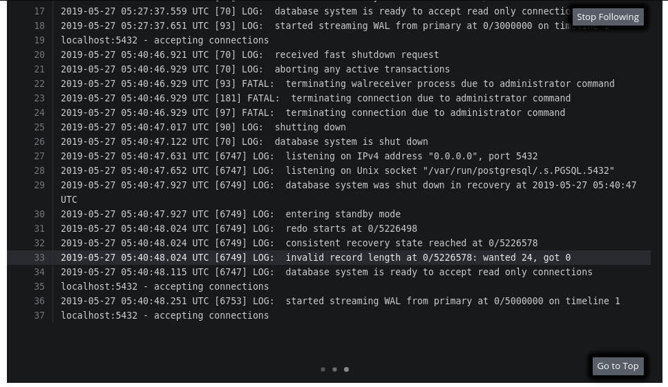
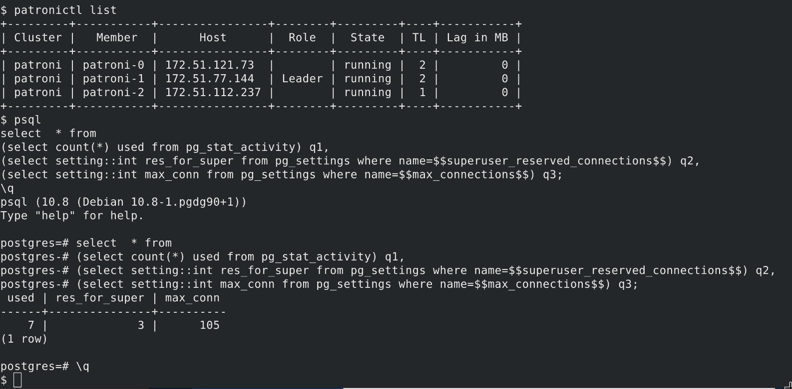

# Postgres configuration

In this lab we will look at a simple change to the postgres configuration through the different Patroni methods.  For additional reading and reference: <https://patroni.readthedocs.io/en/latest/>

## Change number of connections
Modifying the postgres configuration will require changing the DCS (Distributed Configuration Store)
which is held in a generated configMap [clustername]-config.

#### Option 1: export/modify/re-apply

- Export the patroni-config configMap
- Change config by stripping out non-essential entries (resourceVersion, selfLink, etc)
  - The annotations that you don't care about can be safely removed from your export
- Apply new configmap

#### Option 2: Use Patroni API from within a pod

The configuration section has examples on how to access the patroni API using the curl command.  Once you make the change using the curl command, have a look at the configMap to see the changes added there.

 - example curl command:

``` bash
curl -s -XPATCH -d \
        '{"postgresql":{"parameters":{"max_connections":"101"}}}' \
        http://localhost:8008/config | jq .
```

### Check configuration status

- rsh to one of the patroni pods
- use the patroni api to check the configuration

```
curl -s http://localhost:8008/config | jq .

curl -s http://localhost:8008/patroni | jq .
```
*notice the "Pending restart"*

- Alternatively, run the following to get a quick status of all members

```
patronictl list
```

*notice the "Pending restart" column*

### Restart to apply the new configuration
Patroni has only flagged the pods for a restart, but will allow you to coordinate any operational activities for pushing that change.  The StatefulSet update strategy is not triggered by this configMap change.

- Using the `patronictl` tool within one of the containers, restart one (or both) of the replicas.



- once your replicas are available and sync'd, rsh to a restarted replica and check it's configuration to confirm the settings have been applied.

```
curl -s http://localhost:8008/patroni | jq .
```

You can check the active postgres settings with the following:
```
psql
select  * from
(select count(*) used from pg_stat_activity) q1,
(select setting::int res_for_super from pg_settings where name=$$superuser_reserved_connections$$) q2,
(select setting::int max_conn from pg_settings where name=$$max_connections$$) q3;
\q
```

- switch the master to the replica with the updated configuration either by using the patronictl tool (`switchover` or `failover` are both valid options) or through another method of your choice.

- Confirm confguration has changed on all pods



## Update base image

The `/home/postgres/patroni.yml` file is the default base configuration for your cluster when it is first initialized.  There are some settings that can be managed in this file with environment variables in the buildConfig.  Not all options have been exposed yet, so for more complex changes you may need to replace the `entrypoint.sh` with your own customizations.

- Add the following to the buildConfig's environment variables and rebuild your image.

```
POSTGRESQL_MAX_CONNECTIONS=200
```

- To see if your pods are using the new image, check the patroni.yml file found in the container.
- Kill a replica pod and see which image it uses on a restart.
- Create a new tag, and update the statefulSet to use the new image tag.

These steps illustrate when the rollingUpdate is triggered, as well as when it's not.

*Notice that the active postgres configuration did not change even after the patroni.yml was changed*
